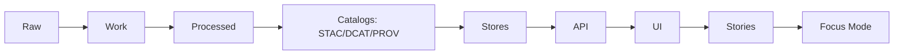

# Catalogs (STAC / DCAT / PROV) — Pipeline Layer


> **Module home:** `src/pipelines/catalogs/`  
> **Purpose:** Generate + validate **machine-readable catalogs** (DCAT/STAC/PROV) that make KFM datasets discoverable, auditable, and safe to publish.

---

## Why this exists (the contract, not the vibes)

KFM treats **catalogs as runtime-critical contracts**, not documentation:
- **DCAT** answers: _What is this dataset? What are the rights? Where is it? How do I access it?_
- **STAC** answers: _What spatiotemporal assets exist for map/time rendering and reproducible geospatial access?_
- **PROV** answers: _How was this produced? From what inputs? With what code? Under what approvals?_

**Fail-closed invariant:** datasets are *not promotable* unless required catalogs exist and validate.

---

## Truth path and invariants (KFM-NG)

KFM’s governed “truth path” is:



**Zone rules**
- **Raw**: immutable source drops / fetch manifests; referenced by lineage only.
- **Work**: intermediate artifacts (QA, profiling, validation reports); can be regenerated.
- **Processed**: the only publishable artifacts; must ship with checksums + catalogs.
- **Catalogs**: DCAT/STAC/PROV entries that runtime services consume.

---

## What this folder is responsible for

### ✅ Responsibilities
- Emit **DCAT dataset records** for every promoted dataset.
- Emit **STAC collections/items** for spatiotemporal geospatial assets (layers, rasters, vectors, tiles, etc.).
- Emit **PROV bundles** linking Raw → Work → Processed, including agents/approvals where required.
- Enforce **KFM profiles** (“minimums”) per standard via validators.
- Produce/consume run evidence:
  - `run_record.json` (or run receipt/manifest)
  - `validation_report.json`
  - checksums / digests
- Provide **linking rules** between DCAT ↔ STAC ↔ PROV.

### ❌ Non-goals (keep boundaries clean)
- Not the API layer (no direct serving; UI must go through API).
- Not the graph build layer (PROV→graph mapping belongs in `src/graph/`).
- Not a data lake / storage adapter layer (write artifacts only to governed paths).

---

## Artifact outputs (what must exist after “promotion”)

| Artifact | What it’s for | Minimum expectation |
|---|---|---|
| **DCAT Dataset** | dataset identity, rights, access URLs, cadence | license + publisher + spatial/temporal + distributions + PROV link |
| **STAC Collection** | map/timeline-ready collection for a dataset | license + extent + providers + link to DCAT |
| **STAC Items** | item-level spatiotemporal indexing | geometry/bbox/datetime + assets + lineage links |
| **PROV bundle/record** | auditable lineage of inputs→outputs | entities + activities + agents + relations + checksums |
| **Checksums / digests** | tamper detection + immutable references | sha256 for promoted artifacts |
| **Run record + validation report** | promotion evidence + CI gating | required fields present; “promotion blocked if missing” |

---

## Where catalog outputs live (expected repository layout)

> 📌 **Note:** catalog generation lives in `src/pipelines/` and validators may live in `tools/`. Schemas are canonical under `schemas/`.  

```text
data/
  stac/
    collections/             # STAC Collection JSON
    items/                   # STAC Item JSON
  catalog/
    dcat/                    # DCAT outputs (typically JSON-LD)
  prov/                      # PROV bundles/records (per run and/or dataset)
  <domain>/
    raw/                     # immutable drops/manifests
    work/                    # validation + QA artifacts
    processed/               # publishable data products
schemas/
  stac/
  dcat/
  prov/
tools/
  ... (standalone validators, linters, CI harness wrappers)
```

---

## KFM “profiles” (minimums + linking invariants)

KFM-NG recommends defining a small **KFM profile** for each standard so validators can enforce consistency:
- Every **STAC Collection** must include **license**, **spatial/temporal extent**, and a **link to the DCAT dataset entry**.
- Every **DCAT Dataset** must reference a **PROV activity** for publication.

### Cross-linking invariants (must hold)
1. **DCAT → PROV**: DCAT dataset record references the run/provenance activity that generated the current distribution.
2. **STAC → DCAT**: STAC collection links “via” (or equivalent) to the DCAT dataset identity.
3. **STAC Item → PROV**: STAC items include a lineage link (e.g., `derived_from`) to PROV entities/activities.
4. **Checksums everywhere**: promoted artifacts have sha256 (and optionally content-addressed digests) recorded in PROV and/or run records.

---

## Minimum required fields (implementation checklist)

### DCAT (minimum fields)
- `dct:title`, `dct:description`
- `dct:publisher` (org id)
- `dct:license` (SPDX id or URL)
- `dct:spatial` (bbox or admin coverage)
- `dct:temporal` (start/end)
- `dct:accrualPeriodicity` (update cadence)
- `dcat:distribution` (download/API endpoints)
- `prov:wasGeneratedBy` (link to PROV activity)

### STAC (minimum fields)
**Collection**
- `id`, `title`, `description`, `license`
- `extent.spatial` (bbox), `extent.temporal` (interval)
- `keywords`, `providers`

**Item**
- `id`, `geometry`, `bbox`, `datetime`
- `assets` (at least `{ data, metadata }` as applicable) with roles + hrefs
- `links` including: `self`, `collection`, and lineage link(s)

### PROV (minimum fields)
- **Entity**: raw_asset, normalized_table, derived_tile, ocr_text, processed artifact, etc.
- **Activity**: ingest_run, transform_job, redaction_job
- **Agent**: connector/service, steward approval
- Relations: `wasGeneratedBy`, `used`, `wasDerivedFrom`, `wasAssociatedWith`

---

## Run records (receipt/manifest) and validation reports

Each pipeline job should emit:
- a **run record JSON** (run receipt / run manifest), and
- a **validation report JSON**

…and **promotion is blocked unless both exist and are complete**.

Suggested run record shape (illustrative):

```json
{
  "run_id": "run_YYYYMMDDTHHMMSSZ__dataset__vN",
  "dataset_id": "example_dataset",
  "inputs": [{"uri": "data/<domain>/raw/<...>", "sha256": "<...>"}],
  "code": {"git_sha": "<...>", "image": "<pipeline-image-ref>"},
  "outputs": [{"uri": "data/<domain>/processed/<...>", "sha256": "<...>"}],
  "validation_report": "data/<domain>/work/<...>/validation_report.json",
  "prov_ref": "data/prov/<dataset>/<run_id>.json"
}
```

---

## Promotion gate checklist (CI-enforced, deny-by-default)

To promote to **processed/public**, the following must be true:

- [ ] License present  
- [ ] Sensitivity classification present  
- [ ] Schema + geospatial checks pass  
- [ ] Checksums computed  
- [ ] STAC/DCAT/PROV artifacts exist and validate  
- [ ] Audit event recorded  
- [ ] Human approval if sensitive  

> **Rule of thumb:** if any required catalog is invalid → **promotion fails**.

---

## Validation gates (minimum set)

These checks are *required* before promotion:
- Row-level schema validation (required fields, type coercion rules documented)
- Geometry validity + bounds (no self-intersections; within expected extent where applicable)
- Temporal consistency (no future dates for historic archives; no negative durations)
- License + attribution captured in DCAT; restrictions encoded in policy
- Provenance completeness: every promoted artifact has a PROV chain + deterministic checksum

---

## How to add a new dataset (cataloging steps)

> This is the “golden path” for wiring catalogs into a new pipeline.

1. **Define dataset identity**
   - Choose/derive `dataset_id` and record upstream IDs.
2. **Ensure Raw/Work/Processed discipline**
   - Raw manifests/drops are immutable; Work holds QA; Processed is publishable only.
3. **Emit required evidence**
   - Run record (receipt/manifest)
   - Validation report (machine-readable JSON)
   - Checksums (sha256) for promoted artifacts
4. **Generate catalogs**
   - DCAT dataset entry (always)
   - PROV record linking raw→processed (always for promoted artifacts)
   - STAC collection/items when dataset has spatiotemporal geospatial assets
5. **Validate catalogs**
   - Validate against JSON Schemas + KFM profile rules
   - Ensure cross-links resolve (DCAT↔STAC↔PROV)
6. **Promotion gate**
   - Block merge/promotion unless validations + policy checks pass
7. **Trigger downstream refresh**
   - On publish, trigger index refresh (search/graph) as part of publish step.

---

## CI / governance integration (recommended)

This module is designed to plug into a merge-blocking CI loop:
- Validate STAC/DCAT/PROV
- Run policy checks (OPA/Rego via Conftest or equivalent)
- Verify signatures/attestations if required by your promotion contract
- Enforce deterministic hashing rules (e.g., spec_hash) for reproducibility

> If you don’t have this wired yet: treat it as required work to achieve “fail-closed” publishing.

---

## Test strategy (CI-ready)

Minimum recommended tests:
- **Unit:** schema mapping/type coercion; geometry validity helpers; incremental window logic
- **Integration:** run connector on a fixed small slice; assert stable checksums + counts
- **Contract:** API response includes provenance bundle and respects policy redaction
- **Regression:** profiling metrics stable (null rates, min/max, distinct keys) or explainably versioned

---

## Governance notes (sensitivity, rights, and redaction)

- **License + attribution are mandatory** and must be captured in DCAT.
- Restrictions must be **encoded as policy**, not “tribal knowledge”.
- Some datasets require **human approval** before publish (especially sensitive locations).
- Redaction rules must be applied consistently and validated (no UI “zoom leak” behavior).

---

## Troubleshooting (common failures)

- **Missing license** → DCAT invalid → promotion blocked.
- **Extent mismatch** (STAC bbox/interval missing or wrong) → STAC invalid → promotion blocked.
- **Broken cross-links** (DCAT doesn’t reference PROV, STAC doesn’t link to DCAT) → profile violation.
- **Checksums missing** for processed artifacts → promotion blocked.
- **PROV incomplete** (no activities/agents/relations) → provenance guard should deny promotion.

---

## Glossary (local)

- **DCAT**: dataset catalog metadata (identity/rights/access).
- **STAC**: spatiotemporal asset catalog (geospatial discoverability + map/time support).
- **PROV**: provenance/lineage model (auditable derivation graph).
- **Run record / receipt / manifest**: machine-readable evidence of a pipeline run.
- **Promotion gate**: automated + stewarded checks required to publish to Processed.

---

## References (repo-local)

- `schemas/stac/`, `schemas/dcat/`, `schemas/prov/` — canonical schema sources
- `tools/` — standalone validators / CI harness wrappers
- `src/graph/` — PROV→graph mapping and constraints (if enabled)
- `src/server/` — API boundary (trust membrane; UI never reads storage directly)

