<div align="center">

# 🧠 **Kansas Frontier Matrix — AI & Data Enrichment Pipelines**  
`src/pipelines/enrich/README.md`

**NLP · Geocoding · Entity Linking · Summarization · Correlation**

[](../../../.github/workflows/site.yml)
[](../../../.github/workflows/stac-validate.yml)
[](../../../.github/workflows/codeql.yml)
[](../../../.github/workflows/trivy.yml)
[](../../../docs/)
[](../../../LICENSE)

</div>

---

```yaml
---
title: "Kansas Frontier Matrix — AI & Data Enrichment Pipelines"
version: "v1.7.0"
last_updated: "2025-10-17"
owners: ["@kfm-data", "@kfm-architecture"]
tags: ["etl","enrich","nlp","geocoding","entity-linking","summarization","correlation","mcp","ci","semver"]
status: "Stable"
license: "MIT"
semver_policy: "MAJOR.MINOR.PATCH"
ci_required_checks:
  - pre-commit
  - unit-tests
  - stac-validate
  - codeql
  - trivy
  - docs-validate
semantic_alignment:
  - CIDOC CRM
  - OWL-Time
  - PeriodO
  - DCAT 2.0
  - STAC 1.0
  - ISO 8601
  - GeoJSON
---
```

---

## 🎯 Purpose

The **`src/pipelines/enrich/`** module performs **AI/ML-driven semantic enrichment** on processed datasets for the **Kansas Frontier Matrix (KFM)**. It bridges transformed data and the **Knowledge Graph** by extracting, interpreting, geo-locating, linking, and correlating entities across text, maps, and tables — generating knowledge-ready assets with provenance.

---

## 🏗️ Role in the System

```mermaid
flowchart TD
    A["data/processed/<*.csv|.geojson|.tif>"] --> B["Enrichment Modules<br/>NLP · Geocoding · Linking · Summarization · Correlation"]
    B --> C["Semantic Facts<br/>entities · relationships · summaries · scores"]
    C --> D["Knowledge Graph (Neo4j / RDF Store)"]
    C --> E["Search Index / STAC Metadata"]
```


<!-- END OF MERMAID -->

Enrichment outputs:
- 🧭 **Geospatial context** — place names → coordinates (GNIS / OSM)  
- 👥 **Entity recognition** — people, organizations, places, events  
- 🕰 **Temporal normalization** — ISO 8601 + **OWL-Time** intervals, **PeriodO** tags  
- 🔗 **Cross-source linking** — deduplicate & align entities to canonical nodes  
- ✍️ **AI summaries** — concise text for popups/panels, stored with provenance  

---

## 📂 Directory Layout

```
src/pipelines/enrich/
├── __init__.py
├── nlp_entities.py        # NER & text tagging
├── summarizer.py          # Transformer-based summarization
├── entity_linker.py       # Fuzzy + contextual linking to graph nodes
├── correlate_sources.py   # Multi-source cross-validation & scoring
├── geocode_utils.py       # GNIS/OSM forward/reverse geocoding
└── README.md              # (this file)
```

Each module can run standalone, or orchestrated via `make enrich`.

---

## 🧩 Functional Overview

| Component                | Description                                                                                                   | Key Libraries                                         |
| :----------------------- | :------------------------------------------------------------------------------------------------------------ | :---------------------------------------------------- |
| **nlp_entities.py**      | Extracts `PERSON`, `PLACE`, `DATE`, `EVENT` and attaches metadata + confidence.                              | `spaCy`, `regex`, `transformers`                      |
| **summarizer.py**        | Generates human-readable summaries from OCR’d text or document sets.                                         | `HuggingFace Transformers` (`BART`, `T5`)             |
| **entity_linker.py**     | Matches entities to canonical graph nodes via fuzzy match + context scoring (temporal/geospatial clues).     | `rapidfuzz/fuzzywuzzy`, `sentence-transformers`, `neo4j-driver` |
| **correlate_sources.py** | Cross-validates facts (text + GIS + time series) to detect consensus/anomalies; outputs correlation matrix. | `pandas`, `scipy`, `networkx`                         |
| **geocode_utils.py**     | Forward/reverse geocoding (GNIS, Nominatim), normalizes to `place_id`, `lat`, `lon`.                         | `geopy`, `requests`                                   |

---

## 🧱 NLP Entity Extraction

### Named Entity Recognition (NER)

```python
import spacy
nlp = spacy.load("en_core_web_trf")
text = "In August 1867, a flood washed through the Arkansas River near Wichita."
for ent in nlp(text).ents:
    print(ent.text, ent.label_)
```

**Entity record (example)**

```json
{
  "entity": "Arkansas River",
  "type": "Place",
  "confidence": 0.98,
  "context": "flood event near Wichita",
  "source": "fema_floods_1867"
}
```

---

## 🌍 Geocoding & Location Normalization

- **Forward Geocoding:** GNIS / Nominatim → `lat`, `lon`, canonical `place_id`  
- **Reverse Geocoding:** enrich points w/ county, watershed, township  
- **Output:** appended to entity dictionaries, plus spatial joins as needed

```python
from geopy.geocoders import Nominatim
geo = Nominatim(user_agent="kansas_frontier_matrix")
loc = geo.geocode("Fort Larned, Kansas")
print(loc.latitude, loc.longitude)
```

---

## 🧠 AI Summarization

```python
from transformers import pipeline
summarizer = pipeline("summarization", model="facebook/bart-large-cnn")
text = open("data/processed/documents/diary_1867.txt").read()
print(summarizer(text, max_length=120, min_length=40, do_sample=False)[0]["summary_text"])
```

**Summary artifact:** saved as `.summary.txt` and referenced in STAC metadata and graph nodes.

---

## 🔗 Entity Linking & Cross-Referencing

Resolve extracted surface forms to canonical graph nodes (e.g., “Ft. Larned” → “Fort Larned”) using fuzzy string + temporal/spatial context:

```python
from rapidfuzz import process, fuzz
best = process.extractOne("Ft. Larned", ["Fort Larned", "Fort Scott", "Fort Riley"], scorer=fuzz.WRatio)
print(best)
```

**Link metadata:** `match_score`, `context_overlap`, `source_count`, `temporal_overlap`, `spatial_distance_km`  
Low-confidence links flagged for review in the admin UI.

---

## 🧮 Multi-Source Correlation

`correlate_sources.py` confirms/weights facts via cross-dataset checks:
- Event date agreement (text + NOAA rainfall + FEMA record)  
- Spatial overlap (text place + GIS layer)  
- Statistical correlation (e.g., drought reports vs. water tables)

Outputs **correlation matrices** and confidence scores with provenance.

---

## ⚙️ Example Workflow

```bash
# Run all enrichment tasks
make enrich

# Or run individually:
python src/pipelines/enrich/nlp_entities.py --input data/processed/texts/
python src/pipelines/enrich/geocode_utils.py --input data/processed/places.csv
python src/pipelines/enrich/entity_linker.py --input data/processed/enriched/entities.json
python src/pipelines/enrich/correlate_sources.py --input data/processed/
```

Appends to `logs/pipelines/enrich.log`:
```
[2025-10-05 14:20:05] nlp_entities      | 132 docs | 5,412 entities
[2025-10-05 14:22:14] geocode_utils     | 5,391 GNIS resolved
[2025-10-05 14:25:01] entity_linker     | 1,044 links | avg score=92%
[2025-10-05 14:27:33] correlate_sources | 612 pairs | consensus>=0.8
```

---

## 🧾 Output Artifacts

| Artifact                   | Description                                        | Destination                               |
| :------------------------- | :------------------------------------------------- | :---------------------------------------- |
| `*.entities.json`          | NER extracted entities + type + confidence         | `data/processed/enriched/entities/`       |
| `*.summary.txt`            | AI-generated summaries                             | `data/processed/enriched/summaries/`      |
| `*.links.json`             | Linking results (matches + scores + provenance)    | `data/processed/enriched/links/`          |
| `correlation_matrix.csv`   | Multi-source validation scores                     | `data/processed/enriched/correlation/`    |

---

## 🧰 Logging & QA

- **Logs:** `logs/pipelines/enrich.log` (rotated)  
- **Sidecars:** `.meta.json` for each artifact, with `source`, `processed`, `license`  
- **Checksums:** optional `.sha256` for large artifacts  
- **Schema validation:** JSON Schemas on entities/links/correlation outputs

---

## 🛠️ Makefile Targets (excerpt)

| Target          | Description                              |
| :-------------- | :-----------------------------------------|
| `make enrich`   | Run full enrichment pipeline              |
| `make enrich-nlp` | Run NER & tagging only                   |
| `make enrich-geo` | Run geocoding only                       |
| `make enrich-link`| Run entity linking only                  |
| `make enrich-corr`| Run correlation only                     |

---

## 🔌 Interfaces & Contracts

**CLI/ENV**  
- Required args: `--input`, optional `--output`  
- ENV: `KFM_LOG_LEVEL`, `KFM_GNIS_KEY` (if applicable), `KFM_TMPDIR`

**Data Contracts**  
- Inputs: `data/processed/**`  
- Outputs: `data/processed/enriched/**`, `logs/pipelines/enrich.log`  
- Sidecars: `.meta.json` (provenance), optional `.sha256` (integrity)

**Exit Codes**  
- `0=OK`, `1=usage`, `2=IO`, `3=validation`, `4=unexpected`

---

## 🧷 Acceptance Checklist (CI-gated)

- [ ] Entities conform to schema (type, confidence, offsets/contexts).  
- [ ] Geocoded places have `place_id`, `lat`, `lon` and valid CRS.  
- [ ] Links include scores + provenance; low-confidence flagged.  
- [ ] Correlation outputs include method & parameters in `.meta.json`.  
- [ ] Summaries < configured token limit; source references preserved.  
- [ ] Tests & docs updated; CI checks pass (unit, security, docs).

---

## 🛡️ Security & Compliance

- Respect provider rate limits & ToS (GNIS/OSM).  
- No PII persistence in enrichment outputs.  
- Trivy & CodeQL run in CI; dependency pins via lockfiles.  
- Licenses & attribution propagated to `.meta.json` and STAC `providers`.

---

## 🧾 Version History

| Version | Date       | Type     | Notes |
| :------ | :--------- | :------- | :---- |
| v1.7.0  | 2025-10-17 | Added    | Versioning/CI sections; Acceptance Checklist; Interfaces & Contracts; expanded outputs & logging. |
| v1.6.0  | 2025-10-16 | Improved | Stronger entity linking (context overlap), PeriodO tagging, correlation scoring schema. |
| v1.5.0  | 2025-10-15 | Added    | Initial enrichment README, NER/geocoding/summarization workflows. |

---

## 📚 References

- AI System Developer Docs — `../../../docs/ai-system.md`  
- MCP Templates — `../../../docs/templates/experiment.md`  
- CIDOC CRM & OWL-Time — https://www.cidoc-crm.org/  
- Scientific Modeling & Simulation — `../../../docs/standards/README.md`

---

<div align="center">

**Kansas Frontier Matrix © 2025**  
*Historical AI · Spatial Intelligence · Open Reproducibility*

</div>
```