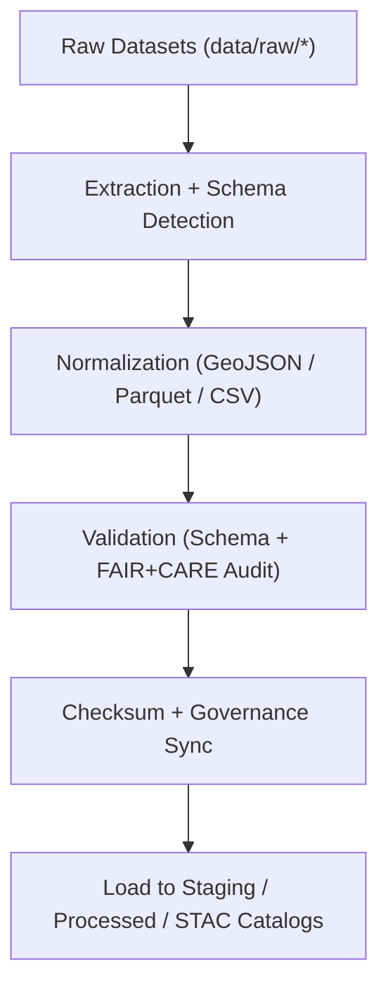

<div align="center">

# ⚙️ **Kansas Frontier Matrix — ETL Pipelines (Extract · Transform · Load)**
`src/pipelines/etl/README.md`

**Purpose:**  
Operate FAIR+CARE-certified **ingestion, transformation, and loading** pipelines that power the Kansas Frontier Matrix (KFM) knowledge ecosystem.  
All ETL processes are checksum-locked, governance-synced, and sustainability-tracked to guarantee transparent, reproducible open science.

[](../../../../docs/standards/faircare-validation.md)
[](../../../../LICENSE)
[]()
[]()

</div>

---

## 📘 Overview

KFM’s ETL layer is the **foundation of reproducible data engineering**.  
Pipelines automate extraction, normalization, and loading for climate, hazards, hydrology, terrain, text/OCR, and tabular sources—embedding FAIR+CARE and governance hooks at every stage.

---

### Core Responsibilities
- Extract open environmental and historical datasets from authoritative sources.  
- Transform records into FAIR+CARE-compliant structures (GeoJSON, Parquet, CSV).  
- Validate schemas and register SHA-256 checksums for lineage integrity.  
- Load outputs to `data/work/staging`, `data/processed`, and STAC catalogs.  
- Append provenance and ethics results to the Governance Ledger and telemetry.

---

## 🗂️ Directory Layout

```plaintext
src/pipelines/etl/
├── README.md
│
├── climate_etl.py            # NOAA, NIDIS, Daymet harmonization
├── hazards_etl.py            # FEMA, NOAA, USGS multi-hazard integration
├── hydrology_etl.py          # Streamflow, aquifer, watershed pipelines
├── tabular_etl.py            # Normalized tabular & statistical records
├── terrain_etl.py            # DEM, slope, elevation rasters
├── text_etl.py               # OCR + transcript ingestion and metadata linking
└── metadata.json             # ETL provenance + FAIR+CARE registry
```

---

## ⚙️ ETL Workflow



1. **Extract:** Acquire raw data from NOAA, USGS, FEMA, archives.  
2. **Normalize:** Apply standardized schemas and formats.  
3. **Validate:** Run FAIR+CARE + structural audits.  
4. **Verify:** Record checksums and provenance to ledger.  
5. **Load:** Publish to working, processed, and STAC layers.

---

## 🧾 Example ETL Metadata Record

```json
{
  "id": "etl_registry_v9.7.0",
  "pipelines": [
    "climate_etl.py",
    "hazards_etl.py",
    "hydrology_etl.py"
  ],
  "fairstatus": "certified",
  "schema_validated": true,
  "checksum_verified": true,
  "total_records_processed": 241203,
  "energy_usage_wh": 1.54,
  "carbon_output_gco2e": 0.18,
  "telemetry_logged": true,
  "governance_registered": true,
  "created": "2025-11-05T12:15:00Z",
  "validator": "@kfm-etl-ops",
  "governance_ref": "data/reports/audit/data_provenance_ledger.json"
}
```

---

## 🧠 FAIR+CARE Governance Matrix

| Principle | Implementation | Oversight |
|-----------|----------------|-----------|
| **Findable** | Outputs indexed in manifests with checksum lineage. | @kfm-data |
| **Accessible** | Open formats (CSV/Parquet/GeoJSON) with clear licensing. | @kfm-accessibility |
| **Interoperable** | STAC + DCAT 3.0 + ISO 19115 metadata alignment. | @kfm-architecture |
| **Reusable** | CC-BY data + reproducible ETL recipes. | @kfm-design |
| **Collective Benefit** | Transparent processing for environmental knowledge. | @faircare-council |
| **Authority to Control** | Council certifies pipeline updates and releases. | @kfm-governance |
| **Responsibility** | Engineers maintain checksum + provenance accuracy. | @kfm-sustainability |
| **Ethics** | Privacy/cultural ethics reviewed during validation. | @kfm-ethics |

Audit references:  
`../../../../data/reports/fair/data_care_assessment.json` · `../../../../data/reports/audit/data_provenance_ledger.json`

---

## ⚙️ ETL Pipelines Summary

| Pipeline | Description | FAIR+CARE Role | Sources |
|----------|-------------|----------------|---------|
| `climate_etl.py` | Normalize climate/weather feeds. | Environmental ethics + provenance. | NOAA, NIDIS, Daymet |
| `hazards_etl.py` | Assemble multi-hazard registries. | Risk transparency + equity. | FEMA, NOAA, USGS |
| `hydrology_etl.py` | Process water resources datasets. | Sustainable water stewardship. | USGS, EPA |
| `tabular_etl.py` | Load structured statistical tables. | Metadata governance. | Census, KSHS |
| `terrain_etl.py` | Ingest topography + rasters. | CF-compliant mapping. | USGS, NASA |
| `text_etl.py` | OCR + transcript integration. | Ethical textual access. | KHS, NARA |

---

## ⚖️ Retention & Provenance Policy

| Artifact | Retention | Policy |
|---------|-----------|-------|
| Raw Extraction Logs | 30 Days | Purged post-validation |
| Transform Records | 180 Days | Retained for audits |
| FAIR+CARE Reports | 365 Days | Archived in ledger |
| Processed Outputs | Permanent | Checksum-locked |

Automation via `etl_pipeline_sync.yml`.

---

## 🌱 Sustainability Metrics (v9.7.0)

| Metric | Value | Verified By |
|--------|-------|-------------|
| Avg Runtime | 2.4 minutes | @kfm-ops |
| Energy Usage | 1.54 Wh | @kfm-sustainability |
| Carbon Output | 0.18 gCO₂e | @kfm-security |
| Renewable Energy | 100% (RE100) | @kfm-infrastructure |
| FAIR+CARE Compliance | 100% | @faircare-council |

Telemetry:  
`../../../../releases/v9.7.0/focus-telemetry.json`

---

## 🧾 Internal Use Citation

```text
Kansas Frontier Matrix (2025). ETL Pipelines (v9.7.0).
FAIR+CARE-governed extraction, transformation, and loading system for sustainable, transparent open data processing.
```

---

## 🕰️ Version History

| Version | Date | Notes |
|--------|------|------|
| v9.7.0 | 2025-11-05 | Tuned energy footprint, improved schema audits, and expanded terrain/text ETL examples. |
| v9.6.0 | 2025-11-04 | Added terrain + text modules and checksum registry integration. |
| v9.5.0 | 2025-11-02 | Enhanced FAIR+CARE audit integration and provenance tracking. |

---

<div align="center">

**© 2025 Kansas Frontier Matrix — MIT License**  
*Reproducible Data Pipelines × FAIR+CARE Ethics × Sustainable Provenance*  
[Back to Pipelines](../README.md) • [Docs Portal](../../../../docs/) • [Governance Ledger](../../../../docs/standards/governance/DATA-GOVERNANCE.md)

</div>
