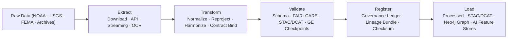

<div align="center">

# ⚙️ **KFM v11 — ETL Pipelines (Extract · Transform · Load)**  
`src/pipelines/etl/README.md`

### **Deterministic · FAIR+CARE Aligned · Lineage-Governed · Sustainability-Audited**

ETL pipelines are the **entry point** to KFM’s knowledge ecosystem.  
All ingest → normalize → validate → load operations run through:

- **LangGraph v11 Reliable Node Engine**  
- **Write-Ahead Logging (WAL)**  
- **Idempotency Keys + Advisory Locks**  
- **FAIR+CARE governance**  
- **STAC/DCAT metadata contracts**  
- **Schema and value gates (GE Checkpoints)**  
- **Energy & carbon telemetry recording**

</div>

---

## 📘 1. Overview — The ETL Layer in KFM v11

ETL pipelines convert raw environmental, cultural, geospatial, hydrologic, hazard, terrain, archival, and tabular datasets into:

- **FAIR+CARE–certified data products**  
- **STAC Items & Collections**  
- **DCAT Datasets**  
- **COGs, GeoParquets, NetCDFs**  
- **Neo4j graph entities & relations**  
- **AI-ready feature layers**  
- **Story Node v3 & Focus Mode v3 inputs**  

Each ETL run must be:

- Deterministic  
- Reproducible  
- Governed  
- Explainable  
- Energy-measured  
- Sovereignty safe  
- Provenance complete  

---

## 🗂 2. ETL Directory Layout (v11)

```text
src/pipelines/etl/
│
├── README.md                          # This file — ETL system overview
│
├── climate_etl.py                     # NOAA · PRISM · ERA5 harmonization
├── hazards_etl.py                     # FEMA · NOAA · USGS hazard integration
├── hydrology_etl.py                   # Flows · aquifers · reservoirs · watershed ETL
├── tabular_etl.py                     # Census · socioeconomic · statistical integration
├── terrain_etl.py                     # DEM · slope · curvature · hillshade
├── text_etl.py                        # OCR · NLP extraction · archival text ingestion
│
└── metadata.json                      # ETL model + dataset registry (STAC/DCAT/PROV-O)
```

---

## 🔧 3. ETL Architecture (v11)

### The ETL engine integrates:

- **LangGraph v11 DAG execution**  
- **Reliable Node Runner (WAL + retry + compensation)**  
- **Data Contracts v11**  
- **STAC / DCAT generation**  
- **GeoSPARQL + CIDOC-CRM graph alignment**  
- **FAIR+CARE sovereign governance filters**  
- **GE Checkpoints + OTel metrics**  
- **Energy/carbon telemetry**  
- **OpenLineage v2.5 + PROV-O lineage**  

---

## 🔄 4. ETL Workflow (v11)



---

## 🧠 5. Semantic Responsibilities

### ✔ Extraction
- External API ingest  
- File-based acquisition  
- OCR/text extraction for archives  
- Raw dataset retention policies  

### ✔ Transformation
- Reprojection → EPSG:4326  
- Raster alignment (GDAL 3.12+)  
- Attribute harmonization  
- Categorical normalization  
- Unit conversion  
- Temporal interpolation  

### ✔ Validation
- Schema-driven checks  
- FAIR+CARE screening  
- GE Checkpoints enforcement  
- Sovereignty/H3 masking  
- Contract compliance  
- Ethics filters (archival content)  

### ✔ Load
- STAC/DCAT publishing  
- COG/Parquet/NetCDF materialization  
- Neo4j ingestion (CIDOC-CRM + GeoSPARQL)  
- AI-ready dataset emission  

---

## 🔐 6. Required ETL Metadata (v11)

| Field | Required | Description |
|-------|----------|-------------|
| `etl_run_id` | ✔ | Deterministic operation hash |
| `sources` | ✔ | STAC/DCAT dataset IDs |
| `checksum` | ✔ | SHA-256 of final output |
| `runtime_sec` | ✔ | Execution duration |
| `energy_wh` | ✔ | Estimated energy use |
| `co2_g` | ✔ | Estimated carbon intensity |
| `care_label` | ✔ | CARE classification |
| `sovereignty_notes` | ✔ | Tribal/heritage rules applied |
| `lineage` | ✔ | PROV-O chain |
| `stac_item` | ☐ | Optional link to artifact |
| `error_budget_status` | ✔ | Green/Yellow/Red gating |

All ETL metadata must validate against:

```
schemas/telemetry/src-etl-v11.json
```

---

## 📦 7. ETL Pipelines Summary

| Pipeline | Description | FAIR+CARE Role | Key Sources |
|----------|-------------|----------------|-------------|
| `climate_etl.py` | Climate harmonization | Ecological benefit | NOAA · PRISM · ERA5 |
| `hazards_etl.py` | Multi-hazard ingestion | Risk ethics | FEMA · USGS |
| `hydrology_etl.py` | Water systems ETL | Sustainable water stewardship | USGS · EPA |
| `tabular_etl.py` | Census/statistical ingestion | Social transparency | Census Bureau |
| `terrain_etl.py` | DEM + terrain metrics | Geospatial compliance | USGS |
| `text_etl.py` | OCR + historical text | Ethical digitization | KSHS · NARA |

---

## ⚖️ 8. Governance: FAIR+CARE + Sovereignty

ETL pipelines must:

- Obey sovereignty restrictions on tribal datasets  
- Mask sensitive coordinates via **H3 R7 → R9**  
- Enforce CARE principles  
- Retain provenance auditability  
- Respect historical & cultural data ethics  

Governance events are recorded in:

```
docs/reports/audit/etl_governance_ledger.json
```

---

## 📊 9. Telemetry (OTel v11)

ETL pipelines **must** emit:

- `kfm.etl_latency_ms`  
- `kfm.etl_rows_processed`  
- `kfm.etl_energy_wh`  
- `kfm.etl_carbon_gco2e`  
- `kfm.etl_validation_failures`  
- `kfm.etl_care_violations`  
- `kfm.etl_error_budget_burn`  

---

## 🧯 10. Failure Modes & Recovery

### Typical Failures
- Schema drift  
- COG raster corruption  
- Temporal inconsistencies  
- FAIR+CARE flags  
- Coordinate leakage  
- Sovereignty restriction violation  

### Recovery Moves
- Replay via WAL  
- Rebuild STAC metadata  
- Re-run GE Checkpoints  
- Re-ingest raw dataset  
- Apply sovereignty filter patch  
- Governance-led review  

---

## 🕰 11. Version History

| Version | Date | Summary |
|--------:|------|---------|
| v11.0.0 | 2025-11-24 | Full KFM-MDP v11 rebuild with reliability, lineage, sovereignty, FAIR+CARE, telemetry, and deterministic DAG integration. |
| v10.1.0 | 2025-11-10 | Legacy v10 generation. |

---

<div align="center">

© 2025 Kansas Frontier Matrix  
FAIR+CARE · Diamond⁹ Ω / Crown∞Ω · MCP-DL v6.3  
Deterministic ETL × Ethical Stewardship × Provenance Safety

</div>