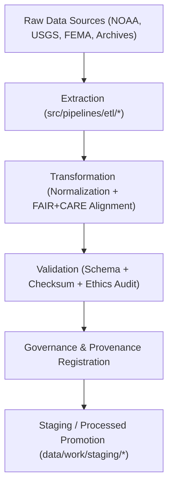

<div align="center">

# ⚙️ Kansas Frontier Matrix — **ETL Pipelines**
`src/pipelines/etl/README.md`

**Purpose:**  
The FAIR+CARE-certified ETL (Extract, Transform, Load) framework for the Kansas Frontier Matrix (KFM).  
These pipelines automate the ingestion, harmonization, and staging of all raw and derived datasets, ensuring reproducibility, ethics compliance, and provenance tracking under MCP-DL v6.3.

[](../../../../docs/standards/faircare-validation.md)
[](../../../../LICENSE)
[](../../../../docs/architecture/repo-focus.md)

</div>

---

## 📚 Overview

The `src/pipelines/etl/` directory contains the **core data ingestion and transformation logic** for the KFM ecosystem.  
Each ETL script handles one or more domain-specific datasets — processing them into schema-aligned, FAIR+CARE-governed formats suitable for validation, AI analysis, and catalog publication.

### Core Responsibilities
- Extract and clean raw datasets from external and internal sources.  
- Transform, normalize, and harmonize data for interoperability (FAIR standards).  
- Validate schema compliance and FAIR+CARE ethics prior to staging.  
- Log checksums, provenance metadata, and governance registration.  

---

## 🗂️ Directory Layout

```plaintext
src/pipelines/etl/
├── README.md                              # This file — ETL documentation and overview
│
├── climate_etl.py                         # Handles NOAA, NIDIS, and CPC climate data
├── hazards_etl.py                         # Processes FEMA, NOAA, and USGS hazard datasets
├── hydrology_etl.py                       # Harmonizes USGS and EPA water resource data
├── tabular_etl.py                         # Normalizes tabular historical and statistical data
├── landcover_etl.py                       # Processes satellite and land cover datasets
└── metadata.json                          # Governance and provenance metadata for ETL executions
```

---

## ⚙️ ETL Workflow



### Workflow Description
1. **Extraction:** Data retrieved from open APIs, archives, or STAC catalogs.  
2. **Transformation:** Cleaning, normalization, and harmonization for cross-domain interoperability.  
3. **Validation:** Schema checks and FAIR+CARE ethics certification performed automatically.  
4. **Governance:** Provenance and checksum data logged into blockchain-backed ledgers.  
5. **Promotion:** Validated datasets stored in staging and processed layers.  

---

## 🧩 Example ETL Metadata Record

```json
{
  "id": "src_etl_registry_v9.5.0_2025Q4",
  "pipelines_executed": [
    "climate_etl.py",
    "hazards_etl.py",
    "hydrology_etl.py"
  ],
  "records_processed": 845120,
  "schema_validated": true,
  "checksum_verified": true,
  "fairstatus": "certified",
  "ai_explainability_score": 0.989,
  "governance_registered": true,
  "telemetry_ref": "releases/v9.5.0/focus-telemetry.json",
  "governance_ref": "reports/audit/ai_src_etl_ledger.json",
  "created": "2025-11-02T23:59:00Z",
  "validator": "@kfm-etl"
}
```

---

## 🧠 FAIR+CARE Governance Matrix

| Principle | Implementation |
|------------|----------------|
| **Findable** | ETL jobs indexed in manifests with unique dataset and checksum IDs. |
| **Accessible** | Data outputs stored in open-access FAIR+CARE formats (CSV, Parquet, GeoJSON). |
| **Interoperable** | Pipelines aligned with STAC, DCAT, and ISO 19115 metadata standards. |
| **Reusable** | Reproducible transformations with documented schemas and provenance. |
| **Collective Benefit** | Promotes open, equitable access to Kansas scientific and historical data. |
| **Authority to Control** | FAIR+CARE Council oversees schema updates and governance policy. |
| **Responsibility** | ETL maintainers ensure ethical handling and reproducible transformations. |
| **Ethics** | All transformations certified for transparency and ethical governance. |

Audit results maintained in:  
`reports/audit/ai_src_etl_ledger.json` • `reports/fair/src_etl_summary.json`

---

## ⚙️ Domain Pipelines Summary

| Pipeline | Data Domain | Function | FAIR+CARE Focus |
|-----------|--------------|-----------|-----------------|
| `climate_etl.py` | Climate | Aggregates NOAA, NIDIS, and CPC datasets. | FAIR-compliant climate harmonization. |
| `hazards_etl.py` | Hazards | Processes FEMA, USGS, and NOAA hazard data. | FAIR+CARE-certified hazard integration. |
| `hydrology_etl.py` | Hydrology | Harmonizes surface and groundwater data. | Ethical water resource transparency. |
| `tabular_etl.py` | Tabular | Normalizes CSV/Parquet datasets. | FAIR+CARE schema consistency. |
| `landcover_etl.py` | Land Cover | Transforms raster and vegetation datasets. | FAIR+CARE environmental compliance. |

---

## 🧾 Retention Policy

| Asset Type | Retention Duration | Policy |
|-------------|--------------------|--------|
| ETL Scripts | Permanent | Version-controlled under Git with governance lineage. |
| Validation Reports | 365 days | Retained for audit and ethics review. |
| FAIR+CARE Records | Permanent | Maintained in blockchain-backed provenance ledger. |
| Metadata | Permanent | Stored for lineage, schema traceability, and checksum validation. |

Cleanup handled by `etl_pipelines_cleanup.yml`.

---

## 🧾 Internal Use Citation

```text
Kansas Frontier Matrix (2025). ETL Pipelines (v9.5.0).
FAIR+CARE-certified automation layer managing data extraction, transformation, and staging across domains.
Ensures reproducibility, transparency, and ethical governance under MCP-DL v6.3.
```

---

## 🧾 Version Notes

| Version | Date | Notes |
|----------|------|--------|
| v9.5.0 | 2025-11-02 | Added checksum registry integration and AI explainability metrics. |
| v9.3.2 | 2025-10-28 | Improved FAIR+CARE validation and governance synchronization. |
| v9.3.0 | 2025-10-26 | Established ETL pipelines for climate, hazards, and hydrology domains. |

---

<div align="center">

**Kansas Frontier Matrix** · *ETL Automation × FAIR+CARE Ethics × Provenance Governance*  
[🔗 Repository](https://github.com/bartytime4life/Kansas-Frontier-Matrix) • [🧭 Docs Portal](../../../../docs/) • [⚖️ Governance Ledger](../../../../docs/standards/governance/)

</div>

