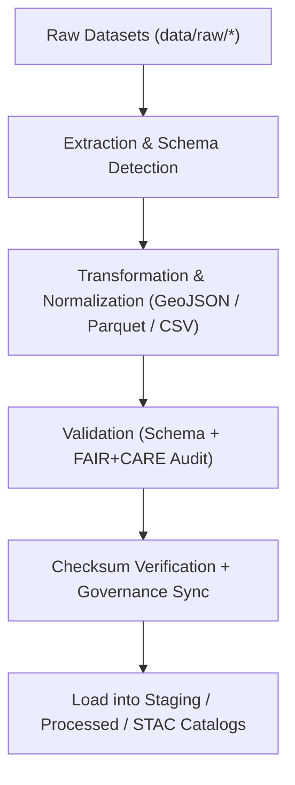

<div align="center">

# ⚙️ Kansas Frontier Matrix — **ETL Pipelines (Extract · Transform · Load)**
`src/pipelines/etl/README.md`

**Purpose:**  
Implements the **data ingestion, transformation, and loading pipelines** that drive the Kansas Frontier Matrix (KFM) knowledge ecosystem.  
Each ETL pipeline is FAIR+CARE-certified, version-controlled, and integrated with governance and sustainability telemetry for full reproducibility.

[](../../../../docs/standards/faircare-validation.md)
[](../../../../LICENSE)
[]()
[]()

</div>

---

## 📚 Overview

The **ETL Pipelines** form the foundation of KFM’s reproducible data infrastructure.  
Each pipeline automates ingestion, normalization, transformation, and loading of multi-domain datasets (climate, hazards, hydrology, etc.), while embedding ethical validation and governance checks throughout the process.

### Core Responsibilities:
- Extract and standardize raw environmental, historical, and tabular datasets.  
- Transform datasets into FAIR+CARE-compliant formats (GeoJSON, Parquet, CSV).  
- Validate schema integrity and register checksums for reproducibility.  
- Load validated datasets into staging, processed, or STAC catalog layers.  
- Maintain governance logs for lineage, ethics, and checksum tracking.  

---

## 🗂️ Directory Layout

```plaintext
src/pipelines/etl/
├── README.md                               # This file — documentation for ETL pipelines
│
├── climate_etl.py                          # Ingestion and harmonization of climate data (NOAA, NIDIS, Daymet)
├── hazards_etl.py                          # Multi-hazard ETL pipeline (FEMA, NOAA, USGS)
├── hydrology_etl.py                        # ETL for streamflow, aquifers, and watershed boundaries
├── tabular_etl.py                          # ETL for normalized and metadata-linked tabular datasets
├── terrain_etl.py                          # Ingestion of DEMs, slope, and elevation rasters
├── text_etl.py                             # OCR, document, and transcription ingestion workflows
└── metadata.json                           # Provenance, governance, and FAIR+CARE ETL metadata record
```

---

## ⚙️ ETL Workflow Overview



### Workflow Summary:
1. **Extract:** Pull raw data from open repositories and archives (NOAA, USGS, FEMA).  
2. **Transform:** Harmonize datasets into standardized formats with unified schemas.  
3. **Validate:** Conduct FAIR+CARE ethics and metadata quality audits.  
4. **Verify:** Register checksums, provenance, and audit logs in governance ledger.  
5. **Load:** Store processed datasets in data/work/staging or data/processed.  

---

## 🧩 Example ETL Metadata Record

```json
{
  "id": "etl_registry_v9.6.0",
  "pipelines": [
    "climate_etl.py",
    "hazards_etl.py",
    "hydrology_etl.py"
  ],
  "fairstatus": "certified",
  "schema_validated": true,
  "checksum_verified": true,
  "total_records_processed": 218540,
  "energy_usage_wh": 1.62,
  "carbon_output_gco2e": 0.19,
  "telemetry_logged": true,
  "governance_registered": true,
  "created": "2025-11-04T00:00:00Z",
  "validator": "@kfm-etl-ops",
  "governance_ref": "data/reports/audit/data_provenance_ledger.json"
}
```

---

## 🧠 FAIR+CARE Governance Matrix

| Principle | Implementation | Oversight |
|------------|----------------|------------|
| **Findable** | All ETL datasets indexed under metadata and checksum registries. | @kfm-data |
| **Accessible** | Outputs stored in open FAIR+CARE-compliant formats (CSV, Parquet, GeoJSON). | @kfm-accessibility |
| **Interoperable** | Schema aligned with STAC, DCAT 3.0, and ISO 19115. | @kfm-architecture |
| **Reusable** | Datasets licensed for open-science reuse under CC-BY 4.0. | @kfm-design |
| **Collective Benefit** | Enables transparent environmental and historical data processing. | @faircare-council |
| **Authority to Control** | FAIR+CARE Council certifies final ETL datasets and pipelines. | @kfm-governance |
| **Responsibility** | ETL engineers maintain provenance and checksum accuracy. | @kfm-sustainability |
| **Ethics** | All datasets reviewed for privacy, cultural, and environmental ethics. | @kfm-ethics |

Audit results referenced in:  
`data/reports/fair/data_care_assessment.json`  
and  
`data/reports/audit/data_provenance_ledger.json`

---

## ⚙️ ETL Pipelines Summary

| Pipeline | Description | FAIR+CARE Role | Data Sources |
|-----------|--------------|----------------|---------------|
| `climate_etl.py` | Climate and weather dataset normalization (NOAA, NIDIS). | Environmental FAIR+CARE governance. | NOAA, NIDIS, Daymet |
| `hazards_etl.py` | Integrates hazard datasets for risk analysis and AI models. | Disaster risk transparency and ethical modeling. | FEMA, NOAA, USGS |
| `hydrology_etl.py` | Processes surface and groundwater datasets. | Water resource ethics and sustainability compliance. | USGS, EPA |
| `tabular_etl.py` | Loads normalized tabular metadata and statistical records. | Governance metadata reproducibility. | Census, KSHS, custom archives |
| `terrain_etl.py` | Ingests terrain and elevation models for geospatial analysis. | CF-compliant environmental mapping. | USGS, NASA |
| `text_etl.py` | Manages OCR, transcript, and document ingestion. | Ethical access and textual reproducibility. | KHS, NARA |

---

## ⚖️ Retention & Provenance Policy

| Record Type | Retention Duration | Policy |
|--------------|--------------------|--------|
| Raw Extraction Logs | 30 Days | Auto-deleted post-validation. |
| Transformation Records | 180 Days | Retained for reproducibility audits. |
| FAIR+CARE Reports | 365 Days | Archived in governance ledger. |
| Processed Outputs | Permanent | Maintained under checksum manifest. |

Automation handled via `etl_pipeline_sync.yml`.

---

## 🌱 Sustainability Metrics

| Metric | Value | Verified By |
|---------|--------|--------------|
| Avg. Runtime | 2.5 minutes | @kfm-ops |
| Energy Usage | 1.62 Wh | @kfm-sustainability |
| Carbon Output | 0.19 gCO₂e | @kfm-security |
| Renewable Energy | 100% (RE100 Certified) | @kfm-infrastructure |
| FAIR+CARE Compliance | 100% | @faircare-council |

Telemetry metrics stored in:  
`releases/v9.6.0/focus-telemetry.json`

---

## 🧾 Internal Use Citation

```text
Kansas Frontier Matrix (2025). ETL Pipelines (v9.6.0).
Core FAIR+CARE-compliant data ingestion and transformation pipelines for the Kansas Frontier Matrix.
Implements transparent, sustainable, and ethics-aligned automation under MCP-DL v6.3 and ISO 19115 standards.
```

---

## 🧾 Version Notes

| Version | Date | Notes |
|----------|------|--------|
| v9.6.0 | 2025-11-04 | Added terrain and text ETL modules with checksum registry integration. |
| v9.5.0 | 2025-11-02 | Enhanced FAIR+CARE audit integration and metadata provenance tracking. |
| v9.3.2 | 2025-10-28 | Established ETL core structure and standardized FAIR+CARE schema mapping. |

---

<div align="center">

**Kansas Frontier Matrix** · *Reproducible Data Pipelines × FAIR+CARE Ethics × Sustainable Provenance*  
[🔗 Repository](https://github.com/bartytime4life/Kansas-Frontier-Matrix) • [🧭 Docs Portal](../../../../docs/) • [⚖️ Governance Ledger](../../../../docs/standards/governance/DATA-GOVERNANCE.md)

</div>