<div align="center">

# ⚙️ **Kansas Frontier Matrix — ETL Pipelines (Extract · Transform · Load)**
`src/pipelines/etl/README.md`

**Purpose:**  
Operate FAIR+CARE-certified **ingestion, transformation, and loading** pipelines that power the Kansas Frontier Matrix (KFM) knowledge ecosystem.  
Every ETL process is **checksum-locked**, **blockchain-synced**, and **sustainability-audited** to ensure transparent, reproducible, and ethical data stewardship.

[](../../../../docs/standards/)
[](../../../../docs/standards/faircare-validation.md)
[](../../../../LICENSE)
[]()
[]()

</div>

---

## 📘 Overview

The ETL layer forms the **foundation of KFM’s reproducible data engineering**.  
Pipelines automate extraction, normalization, and loading for **climate, hydrology, hazards, terrain, text, and tabular** data, embedding FAIR+CARE, checksum, and governance validations at each stage.

### Core Responsibilities
- Extract open-source environmental and historical datasets from trusted repositories.  
- Transform and harmonize into **FAIR+CARE-compliant formats** (GeoJSON, Parquet, CSV).  
- Validate schemas and append **SHA-256 lineage** for provenance tracking.  
- Load outputs into **staging**, **processed**, and **STAC/DCAT catalogs**.  
- Log ethics and sustainability metrics to **Focus Telemetry** and **Governance Ledgers**.  

---

## 🗂️ Directory Layout

```plaintext
src/pipelines/etl/
├── README.md
│
├── climate_etl.py            # NOAA, NASA Daymet, and NIDIS harmonization
├── hazards_etl.py            # FEMA, NOAA, USGS hazard integration
├── hydrology_etl.py          # Streamflow, aquifer, and watershed data pipelines
├── tabular_etl.py            # Normalized census, statistics, and tabular datasets
├── terrain_etl.py            # DEM, slope, and elevation rasters
├── text_etl.py               # OCR and archival text ingestion
└── metadata.json             # Provenance registry + FAIR+CARE metadata
```

---

## ⚙️ ETL Workflow

```mermaid
flowchart LR
    A["Raw Data (NOAA · USGS · FEMA · Archives)"] --> B["Extract + Schema Detection"]
    B --> C["Normalize (GeoJSON · Parquet · CSV)"]
    C --> D["Validate (Schema · FAIR+CARE · Checksum)"]
    D --> E["Register (Governance · Blockchain Proofs)"]
    E --> F["Load (Processed · STAC/DCAT Catalogs)"]
```



1. **Extract:** Download or stream data from open APIs and archives.  
2. **Transform:** Normalize using schema alignment and spatial projection (EPSG:4326).  
3. **Validate:** Run FAIR+CARE audits, checksum verification, and ethics checks.  
4. **Register:** Write lineage and proofs to governance ledgers (Neo4j/IPFS).  
5. **Load:** Publish cleaned datasets into STAC/DCAT catalog layers.  

---

## 🧾 Example ETL Metadata Record

```json
{
  "id": "etl_registry_v10.1.0",
  "pipelines": [
    "climate_etl.py",
    "hazards_etl.py",
    "hydrology_etl.py",
    "terrain_etl.py"
  ],
  "fairstatus": "certified",
  "schema_validated": true,
  "checksum_verified": true,
  "total_records_processed": 311245,
  "energy_usage_wh": 1.48,
  "carbon_output_gco2e": 0.17,
  "telemetry_logged": true,
  "governance_registered": true,
  "created": "2025-11-10T11:50:00Z",
  "validator": "@kfm-etl-ops"
}
```

---

## 🧠 FAIR+CARE Governance Matrix

| Principle | Implementation | Oversight |
|-----------|----------------|-----------|
| **Findable** | Outputs indexed in manifests and checksum registries. | @kfm-data |
| **Accessible** | Published under MIT/CC-BY with open endpoints. | @kfm-accessibility |
| **Interoperable** | ISO 19115, STAC 1.0, DCAT 3.0, OWL-Time alignment. | @kfm-architecture |
| **Reusable** | Modular ETL recipes reproducible with documented configs. | @kfm-design |
| **Collective Benefit** | Public environmental data processed transparently. | @faircare-council |
| **Authority to Control** | FAIR+CARE Council governs schema changes. | @kfm-governance |
| **Responsibility** | Teams uphold checksum accuracy and sustainability metrics. | @kfm-sustainability |
| **Ethics** | Pipeline code and datasets reviewed for cultural and privacy ethics. | @kfm-ethics |

Audit sources:  
`../../../../data/reports/fair/data_care_assessment.json` · `../../../../data/reports/audit/data_provenance_ledger.json`

---

## ⚙️ ETL Pipelines Summary

| Pipeline | Description | FAIR+CARE Role | Sources |
|----------|-------------|----------------|---------|
| `climate_etl.py` | Ingests and harmonizes climate feeds. | Environmental transparency | NOAA, NASA, NIDIS |
| `hazards_etl.py` | Merges multi-hazard datasets (floods, droughts, storms). | Risk & resilience ethics | FEMA, NOAA, USGS |
| `hydrology_etl.py` | Processes water resource datasets. | Sustainable water stewardship | USGS, EPA |
| `tabular_etl.py` | Integrates demographic & statistical data. | Inclusivity & transparency | U.S. Census, KSHS |
| `terrain_etl.py` | Loads topography & elevation rasters. | Geospatial compliance | USGS, NASA |
| `text_etl.py` | OCR + text normalization for archives. | Accessibility & ethical digitization | KHS, NARA |

---

## ⚖️ Retention & Provenance Policy

| Artifact | Retention | Policy |
|---------|-----------|--------|
| Extraction Logs | 30 Days | Auto-purge after checksum validation. |
| Transform Records | 180 Days | Retained for reproducibility audits. |
| FAIR+CARE Reports | 365 Days | Maintained in governance ledger. |
| Processed Outputs | Permanent | Immutable, checksum-locked storage. |

Retention managed via `etl_pipeline_sync.yml`.

---

## 🌱 Sustainability Metrics (v10.1.0)

| Metric | Value | Verified By |
|--------|-------|-------------|
| Avg Runtime | 2.3 minutes | @kfm-ops |
| Energy Usage | 1.48 Wh | @kfm-sustainability |
| Carbon Output | 0.17 g CO₂e | @kfm-security |
| Renewable Energy | 100% (RE100) | @kfm-infrastructure |
| FAIR+CARE Compliance | 100% | @faircare-council |

Telemetry source:  
`../../../../releases/v10.1.0/focus-telemetry.json`

---

## 🧾 Internal Citation

```text
Kansas Frontier Matrix (2025). ETL Pipelines (v10.1.0).
FAIR+CARE-certified Extract–Transform–Load framework ensuring transparent, sustainable, and reproducible data processing within the Kansas Frontier Matrix.
```

---

## 🕰️ Version History

| Version | Date | Notes |
|--------|------|------|
| **v10.1.0** | 2025-11-10 | Upgraded to streaming ETL integration; enhanced DCAT/STAC bridge and improved sustainability metrics. |
| **v10.0.0** | 2025-11-08 | Added schema self-healing, DCAT 3.0 compliance, and provenance hooks. |
| **v9.7.0** | 2025-11-05 | Improved schema audit coverage and hazard module performance. |

---

<div align="center">

**© 2025 Kansas Frontier Matrix — MIT License**  
*Reproducible Data Pipelines × FAIR+CARE Ethics × Sustainable Provenance*  
[Back to Pipelines](../README.md) · [Docs Portal](../../../../docs/) · [Governance Ledger](../../../../docs/standards/governance/DATA-GOVERNANCE.md)

</div>
