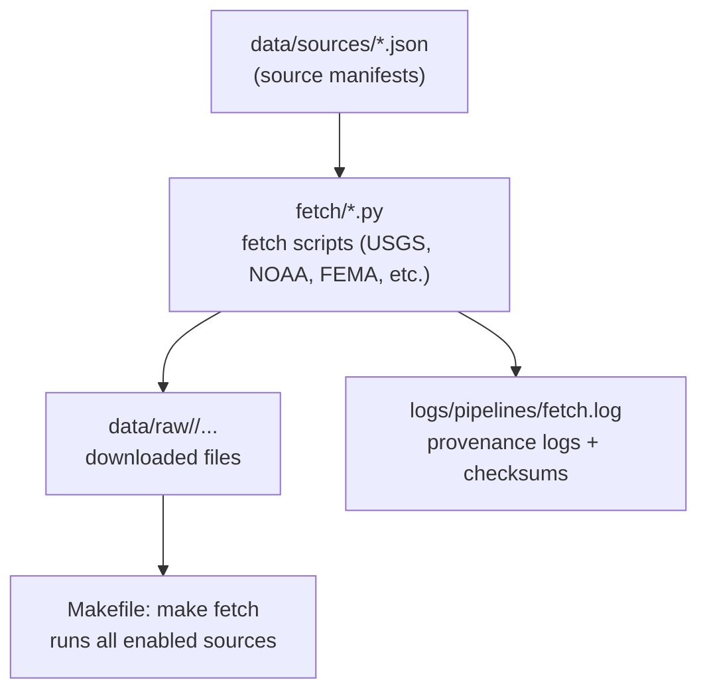

<div align="center">

# 🌐 **Kansas Frontier Matrix — Data Fetch Pipelines**  
`src/pipelines/fetch/README.md`

**Automated Data Acquisition · Provenance · Reproducibility**

[](../../../.github/workflows/site.yml)
[](../../../.github/workflows/stac-validate.yml)
[](../../../.github/workflows/codeql.yml)
[](../../../.github/workflows/trivy.yml)
[](../../../docs/)
[](../../../LICENSE)

</div>

---

```yaml
---
title: "Kansas Frontier Matrix — Data Fetch Pipelines"
version: "v1.7.0"
last_updated: "2025-10-17"
owners: ["@kfm-data", "@kfm-architecture"]
tags: ["etl","fetch","provenance","checksums","dasc","noaa","usgs","fema","newspapers","khs","stac","mcp","ci","semver"]
status: "Stable"
license: "MIT"
semver_policy: "MAJOR.MINOR.PATCH"
ci_required_checks:
  - pre-commit
  - unit-tests
  - stac-validate
  - codeql
  - trivy
  - docs-validate
semantic_alignment:
  - STAC 1.0
  - DCAT 2.0
  - ISO 8601
  - GeoJSON
---
```

---

## 🎯 Purpose

This directory contains all **data acquisition and source ingestion scripts** for the **Kansas Frontier Matrix (KFM)** project.  
Fetch pipelines automate retrieval of raw datasets from verified external sources — ensuring transparent provenance, repeatability, and traceable links between **`data/sources/`** manifests and the files produced in **`data/raw/`**.

Each fetch module is responsible for a specific provider/domain:
- 🌧 **NOAA** → climate & storm records  
- 🏞 **USGS** → topographic maps, DEM, hydrology, geology  
- 🌀 **FEMA** → disaster declarations and hazard maps  
- 🗺 **Kansas GIS / DASC** → statewide vector & raster datasets  
- 📰 **Kansas Memory & Newspapers** → archives, OCR, documents  
- ⚙️ **Custom sources** → one-off fetch scripts or experimental APIs  

All fetch scripts follow **MCP (Master Coder Protocol)** standards for:
- provenance logging (`sha256`, timestamps, URLs)  
- open data compliance (license tags)  
- reproducibility (config, Makefile integration, deterministic outputs)  

---

## 🏗 Architecture Overview


<!-- END OF MERMAID -->

---

## 📂 Directory Layout

```
src/pipelines/fetch/
├── __init__.py
├── noaa_ingest.py           # NOAA weather, storm events, climate normals
├── usgs_ingest.py           # USGS DEM, topographic maps, hydrology
├── fema_ingest.py           # FEMA disaster declarations
├── kansas_archive_ingest.py # Kansas GIS archive via ArcGIS REST
├── kansas_memory_ingest.py  # KHS / Kansas Memory items
├── newspapers_ingest.py     # Chronicling America / local OCR texts
├── blm_ingest.py            # Land patents & deeds (BLM GLO Records)
├── generic_fetch.py         # Common HTTP/API utilities + retries
└── README.md                # (this file)
```

Each module exports a function like:

```python
def fetch(config: dict) -> None:
    """Fetch data from the target source defined in its JSON manifest."""
```

---

## ⚙️ Configuration and Usage

Each fetch script references a corresponding manifest file under `data/sources/`.  
Manifests define where, when, and how to pull data.

**Example — `data/sources/noaa_storms.json`:**
```json
{
  "id": "noaa_storms",
  "title": "NOAA Storm Events Database (Kansas)",
  "endpoint": "https://www.ncei.noaa.gov/pub/data/swdi/stormevents/csvfiles/",
  "license": "Public Domain (US NOAA)",
  "temporal": {"start": "1950-01-01", "end": "2025-01-01"},
  "destination": "data/raw/noaa/storm_events/",
  "fetch": { "type": "http", "pattern": "StormEvents_details-*.csv.gz" }
}
```

### 🧮 Run Commands

```bash
# Run all fetch tasks
make fetch

# Call an individual source
python src/pipelines/fetch/noaa_ingest.py --year 2020

# Example: Fetch KS DEM tiles
python src/pipelines/fetch/usgs_ingest.py --bbox -102,36,-94,40 --resolution 1m
```

Each fetch creates:
- data files under `data/raw/<source>/`
- a `.sha256` checksum
- a structured entry in `logs/pipelines/fetch.log`

---

## 🧩 Script Template (for New Sources)

```python
#!/usr/bin/env python3
"""
@MCP-LOG Kansas Frontier Matrix – Data Fetch Script Template
Purpose: Retrieve and log external datasets for reproducibility.
"""
import os, json, hashlib, requests
from datetime import datetime

def fetch(config_path: str):
    cfg = json.load(open(config_path))
    url = cfg["endpoint"]; dest = cfg["destination"]
    os.makedirs(dest, exist_ok=True)
    fn = os.path.join(dest, os.path.basename(url))

    with requests.get(url, stream=True, timeout=60) as r:
        r.raise_for_status()
        with open(fn, "wb") as f:
            for chunk in r.iter_content(1 << 15):
                if chunk: f.write(chunk)

    checksum = hashlib.sha256(open(fn, "rb").read()).hexdigest()
    with open(fn + ".sha256", "w") as h: h.write(checksum)

    print(f"[{datetime.now().isoformat()}] ✅ Fetched {fn} | SHA256={checksum}")

if __name__ == "__main__":
    fetch("data/sources/new_source.json")
```

---

## 🧠 Data Provenance & Validation

Every fetched dataset must include:
- **Checksum** → `.sha256` file  
- **Source manifest** → `data/sources/*.json`  
- **License tag** → usage rights in manifest  
- **Validation** → run schema check:

```bash
make validate-sources
```

This validates all manifests (JSON Schema/STAC-style fields) and ensures metadata integrity.

---

## 🔒 Logging, Retries & Errors

All fetch scripts write to `logs/pipelines/fetch.log`:

```
[2025-10-05 13:44:22] NOAA | storm_events_2024.csv | 41.2MB | SHA256=ab19df... | OK
[2025-10-05 13:47:10] USGS | ks_dem_1m_tile.tif     | 850MB  | SHA256=cd892f... | OK
[2025-10-05 13:55:12] KHS  | kansas_memory_001.pdf  | 4.2MB  | SHA256=91efac... | RETRY(1)
```

Errors (timeouts, 404, checksum mismatch) auto-retry up to 3 times and log `FAIL` if unresolved.

---

## 🧾 Adding a New Fetch Module

1. Add a manifest in `data/sources/` (metadata + endpoints).  
2. Create a script in `src/pipelines/fetch/`.  
3. Register it in the Makefile under `FETCH_TARGETS`.  
4. Add tests: `tests/pipelines/test_fetch_<source>.py`.  
5. Run `make fetch && make validate`.  
6. Commit with:

```
feat(fetch): add <source> ingestion pipeline
```

---

## 🧪 Testing & CI

- **Unit tests** for each module (mock HTTP + sample artifacts).  
- **Golden files** for deterministic outputs.  
- **CI gates:** `stac-validate`, `unit-tests`, `codeql`, `trivy`, `docs-validate`.

---

## 🧾 Version History

| Version | Date       | Type     | Notes |
| :------ | :--------- | :------- | :---- |
| v1.7.0  | 2025-10-17 | Added    | CI-required checks, stronger badges, manifest validation target, improved template with timeouts and raise_for_status. |
| v1.6.0  | 2025-10-16 | Improved | Expanded provider coverage (BLM, newspapers), clearer logging schema, Makefile targets. |
| v1.5.0  | 2025-10-15 | Added    | Initial fetch README with architecture, layout, and examples. |

---

## 📚 References

- [📄 File & Data Architecture](../../../docs/architecture.md)  
- [🧠 AI System Developer Documentation](../../../docs/ai-system.md)  
- [🧮 MCP Templates](../../../docs/templates/experiment.md)  
- [🗺 Integrating Historical, Cartographic, and Geological Research](../../../docs/integration/README.md)

---

<div align="center">

**Kansas Frontier Matrix © 2025**  
*Open Source · Open Data · Reproducible Science*

</div>
```