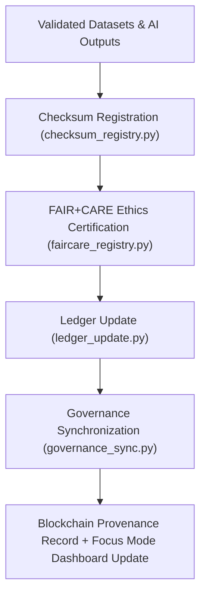

<div align="center">

# ⚖️ Kansas Frontier Matrix — **Governance Pipelines**
`src/pipelines/governance/README.md`

**Purpose:**  
The FAIR+CARE-certified governance automation framework that synchronizes **provenance records, checksum manifests, and ethics registries** across all Kansas Frontier Matrix (KFM) datasets and models.  
These pipelines ensure full transparency, accountability, and immutability for every validated asset within the KFM ecosystem.

[](../../../../docs/standards/faircare-validation.md)
[](../../../../LICENSE)
[](../../../../docs/architecture/repo-focus.md)

</div>

---

## 📚 Overview

The `src/pipelines/governance/` directory powers KFM’s **data lineage, ledger synchronization, and ethics certification** processes.  
It acts as the bridge between the data validation layer and the blockchain-backed provenance ledgers, enforcing FAIR+CARE, ISO, and MCP-DL v6.3 governance standards.

### Core Responsibilities
- Synchronize checksum and validation results with governance ledgers.  
- Update FAIR+CARE and ethics registries for certified datasets.  
- Maintain blockchain-integrated provenance chain across all workflows.  
- Generate transparency reports for audits and compliance reviews.  

---

## 🗂️ Directory Layout

```plaintext
src/pipelines/governance/
├── README.md                              # This file — documentation for governance pipelines
│
├── governance_sync.py                     # Synchronizes validation and ledger updates across domains
├── ledger_update.py                       # Appends checksum and ethics records to blockchain ledger
├── checksum_registry.py                   # Generates and manages checksum manifests for all data assets
├── faircare_registry.py                   # Maintains FAIR+CARE certification registry for validated data
└── metadata.json                          # Provenance and governance linkage metadata
```

---

## ⚙️ Governance Workflow



### Workflow Description
1. **Checksum Registration:** Computes SHA-256 hashes for all validated datasets.  
2. **FAIR+CARE Registry:** Records ethics certifications and audit results.  
3. **Ledger Update:** Appends checksum and ethics data to immutable blockchain ledgers.  
4. **Governance Sync:** Integrates all lineage and ethics data into FAIR+CARE dashboards.  
5. **Telemetry Update:** Broadcasts governance activity metrics to Focus Mode telemetry logs.  

---

## 🧩 Example Governance Metadata Record

```json
{
  "id": "src_governance_pipeline_v9.5.0_2025Q4",
  "modules_executed": [
    "checksum_registry.py",
    "faircare_registry.py",
    "ledger_update.py"
  ],
  "datasets_registered": 312,
  "checksums_verified": true,
  "fairstatus": "certified",
  "ledger_updated": true,
  "governance_registered": true,
  "telemetry_ref": "releases/v9.5.0/focus-telemetry.json",
  "governance_ref": "reports/audit/ai_src_governance_ledger.json",
  "created": "2025-11-02T23:59:00Z",
  "validator": "@kfm-governance"
}
```

---

## 🧠 FAIR+CARE Governance Matrix

| Principle | Implementation |
|------------|----------------|
| **Findable** | Governance entries indexed by checksum, dataset ID, and ledger record. |
| **Accessible** | Records stored in open JSON and blockchain-verified formats. |
| **Interoperable** | Compliant with FAIR+CARE, ISO 19115, and DCAT 3.0 lineage standards. |
| **Reusable** | Registry and ledger artifacts reusable for audits and compliance. |
| **Collective Benefit** | Strengthens trust through open, ethical governance automation. |
| **Authority to Control** | FAIR+CARE Council certifies all governance and ledger events. |
| **Responsibility** | Validators maintain ethical traceability across all pipelines. |
| **Ethics** | Immutable provenance ensures transparency and data equity. |

All audit records preserved in:  
`reports/audit/ai_src_governance_ledger.json` • `reports/fair/src_governance_summary.json`

---

## ⚙️ Governance Pipelines Summary

| Pipeline | Function | FAIR+CARE Role |
|-----------|-----------|----------------|
| `checksum_registry.py` | Computes and validates cryptographic hashes. | Ensures reproducibility and integrity. |
| `faircare_registry.py` | Records dataset FAIR+CARE certification results. | Ethical certification of validated data. |
| `ledger_update.py` | Synchronizes checksum and ethics results to blockchain ledger. | Immutable provenance governance. |
| `governance_sync.py` | Coordinates updates across registries and Focus Mode dashboards. | FAIR+CARE governance automation. |

Automation handled by `governance_pipelines_sync.yml`.

---

## ⚖️ Blockchain Provenance Record

```json
{
  "ledger_id": "governance-ledger-2025Q4",
  "datasets_registered": 312,
  "checksum_verified": true,
  "fair_care_certified": true,
  "blockchain_hash": "sha256:a96f2e4f9b8cc54a8fbaef37e81da9e72a1a3c45...",
  "verified_by": "@kfm-governance",
  "timestamp": "2025-11-02T23:59:00Z"
}
```

---

## 🧾 Retention Policy

| Asset Type | Retention Duration | Policy |
|-------------|--------------------|--------|
| Governance Logs | 365 days | Archived for ethics and provenance review. |
| Checksum Manifests | Permanent | Stored immutably for lineage verification. |
| FAIR+CARE Registries | Permanent | Retained for audit reproducibility. |
| Blockchain Records | Permanent | Maintained indefinitely for provenance assurance. |
| Metadata | Permanent | Preserved as part of global governance manifest. |

Cleanup handled via `governance_pipelines_cleanup.yml`.

---

## 🧾 Internal Use Citation

```text
Kansas Frontier Matrix (2025). Governance Pipelines (v9.5.0).
FAIR+CARE-certified governance automation system managing provenance, checksum verification, and blockchain-ledger synchronization.
Ensures transparency, accountability, and ethics compliance under MCP-DL v6.3 standards.
```

---

## 🧾 Version Notes

| Version | Date | Notes |
|----------|------|--------|
| v9.5.0 | 2025-11-02 | Added blockchain ledger synchronization and FAIR+CARE registry integration. |
| v9.3.2 | 2025-10-28 | Enhanced governance synchronization and checksum audit logging. |
| v9.3.0 | 2025-10-26 | Established governance pipelines for provenance and ethics certification. |

---

<div align="center">

**Kansas Frontier Matrix** · *Governance × FAIR+CARE Ethics × Provenance Certification*  
[🔗 Repository](https://github.com/bartytime4life/Kansas-Frontier-Matrix) • [🧭 Docs Portal](../../../../docs/) • [⚖️ Governance Ledger](../../../../docs/standards/governance/)

</div>

