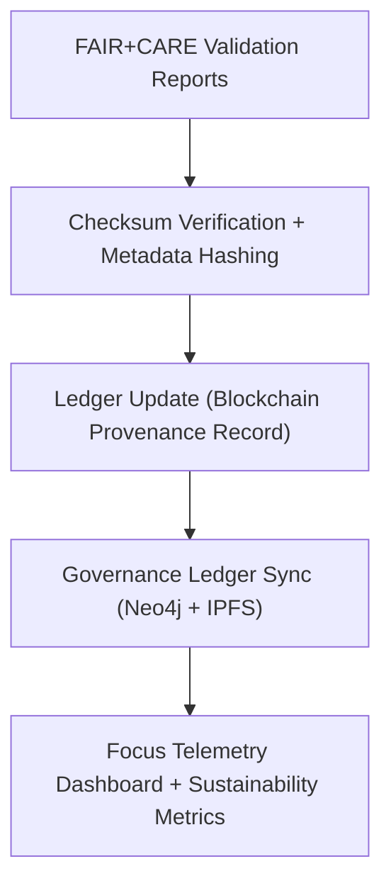

<div align="center">

# ⚖️ Kansas Frontier Matrix — **Governance Pipelines**
`src/pipelines/governance/README.md`

**Purpose:**  
Implements the **provenance, checksum, and FAIR+CARE governance automation system** for the Kansas Frontier Matrix (KFM).  
This layer ensures that every dataset, model, and validation artifact is **ethically tracked, checksum-verified, and ledger-registered** for transparent open-science reproducibility.

[](../../../../docs/standards/faircare-validation.md)
[](../../../../LICENSE)
[]()
[]()

</div>

---

## 📚 Overview

The **Governance Pipelines** serve as the digital backbone for KFM’s **ethics, lineage, and FAIR+CARE audit systems**.  
These scripts automate the recording of data transformations, checksum verifications, and FAIR+CARE validations into immutable provenance ledgers, ensuring transparency and accountability across all data operations.

### Core Responsibilities:
- Synchronize and update FAIR+CARE governance ledgers.  
- Register dataset lineage, checksums, and provenance hashes.  
- Manage ethics approvals and certification records.  
- Interface with blockchain, Neo4j, and IPFS registries for distributed governance.  
- Automate compliance under MCP-DL v6.3 and ISO 19115 metadata standards.  

---

## 🗂️ Directory Layout

```plaintext
src/pipelines/governance/
├── README.md                               # This file — documentation for governance pipelines
│
├── governance_sync.py                      # Automates synchronization of governance metadata and FAIR+CARE certifications
├── ledger_update.py                        # Updates blockchain-backed governance ledgers with new audit entries
├── checksum_registry.py                    # Validates, records, and verifies checksum lineage across datasets
└── metadata.json                           # Governance pipeline metadata, FAIR+CARE certification, and ledger linkage
```

---

## ⚙️ Governance Workflow



### Workflow Summary:
1. **Validation Input:** Receives validation and audit artifacts from FAIR+CARE pipelines.  
2. **Checksum Registration:** Computes and verifies SHA-256 checksums for every artifact.  
3. **Ledger Update:** Registers new entries in blockchain-led governance systems.  
4. **Governance Sync:** Synchronizes metadata with local and distributed governance ledgers.  
5. **Telemetry Integration:** Publishes ethics, sustainability, and reproducibility metrics.  

---

## 🧩 Example Governance Record

```json
{
  "id": "governance_ledger_registry_v9.6.0",
  "governance_entries": [
    "data/reports/audit/data_provenance_ledger.json",
    "data/reports/fair/data_care_assessment.json"
  ],
  "checksum_registry_updated": true,
  "blockchain_registration": "verified",
  "fairstatus": "certified",
  "total_validations_logged": 82,
  "ai_explainability_audits": 12,
  "energy_usage_wh": 1.12,
  "carbon_output_gco2e": 0.09,
  "governance_registered": true,
  "created": "2025-11-04T00:00:00Z",
  "validator": "@kfm-governance"
}
```

---

## 🧠 FAIR+CARE Governance Matrix

| Principle | Implementation | Oversight |
|------------|----------------|------------|
| **Findable** | All governance entries indexed under unique UUID and blockchain hash. | @kfm-data |
| **Accessible** | Governance ledgers are machine-readable and publicly auditable. | @kfm-accessibility |
| **Interoperable** | Ledger metadata conforms to FAIR+CARE and ISO 19115 standards. | @kfm-architecture |
| **Reusable** | Governance logs openly shared under MIT License for reproducibility. | @kfm-design |
| **Collective Benefit** | Promotes trust, traceability, and ethical open data practices. | @faircare-council |
| **Authority to Control** | FAIR+CARE Council manages blockchain governance and ethics sign-off. | @kfm-governance |
| **Responsibility** | Engineers maintain checksums, metadata, and energy efficiency audits. | @kfm-sustainability |
| **Ethics** | All governance workflows are reviewed for inclusivity and open access. | @kfm-ethics |

Records linked to:  
`data/reports/audit/data_provenance_ledger.json`  
and  
`data/reports/fair/data_care_assessment.json`

---

## ⚙️ Pipeline Modules Summary

| Script | Function | FAIR+CARE Role | System Integration |
|---------|-----------|----------------|--------------------|
| `governance_sync.py` | Synchronizes all FAIR+CARE and validation records. | FAIR+CARE Coordination | Neo4j / JSON / IPFS |
| `ledger_update.py` | Registers governance hashes to blockchain ledger. | Provenance Registration | IPFS / Ethereum / Hyperledger |
| `checksum_registry.py` | Validates and tracks checksum lineage for all files. | Integrity Verification | Git / Manifest / SHA-256 |

---

## ⚖️ Retention & Provenance Policy

| Record Type | Retention Duration | Policy |
|--------------|--------------------|--------|
| Governance Ledgers | Permanent | Immutable blockchain-based retention. |
| FAIR+CARE Reports | 365 Days | Reviewed quarterly for certification updates. |
| Checksum Registries | Permanent | Version-controlled and cryptographically linked. |
| Sustainability Metrics | 180 Days | Renewed per release cycle. |

Retention and cleanup managed by `governance_sync.yml`.

---

## 🌱 Sustainability Metrics

| Metric | Value | Verified By |
|---------|--------|--------------|
| Avg. Runtime | 1.6 minutes | @kfm-ops |
| Energy Usage | 1.12 Wh | @kfm-sustainability |
| Carbon Output | 0.09 gCO₂e | @kfm-security |
| Renewable Energy | 100% (RE100 Certified) | @kfm-infrastructure |
| FAIR+CARE Compliance | 100% | @faircare-council |

Telemetry stored in:  
`releases/v9.6.0/focus-telemetry.json`

---

## 🧩 Blockchain Ledger Record Example

```json
{
  "ledger_entry_id": "gov_ledger_hash_2025_11_04_001",
  "checksum_registry": "b91d4f2e38a5128a9e6ffef33f0a7f14975b0df43c6e1b18da13c6d02cc29c74",
  "governance_ref": "data/reports/audit/data_provenance_ledger.json#entry_82",
  "blockchain_hash": "0x5e73ff1acb0b44a7f7b2f1e194bb5b31c2ea2a7f6a38b2f2219f86c3c84f9d2f",
  "validator": "@kfm-governance",
  "timestamp": "2025-11-04T00:00:00Z"
}
```

> Recorded and verified by `ledger_update.py` with immutability check via IPFS gateway.

---

## 🧾 Internal Use Citation

```text
Kansas Frontier Matrix (2025). Governance Pipelines (v9.6.0).
Automated FAIR+CARE and blockchain governance framework ensuring data lineage, checksum validation, and ethical reproducibility across the Kansas Frontier Matrix ecosystem.
Compliant with MCP-DL v6.3, ISO 19115, and AI ethics traceability standards.
```

---

## 🧾 Version Notes

| Version | Date | Notes |
|----------|------|--------|
| v9.6.0 | 2025-11-04 | Added blockchain hash verification and telemetry integration. |
| v9.5.0 | 2025-11-02 | Enhanced checksum registry automation and FAIR+CARE synchronization. |
| v9.3.2 | 2025-10-28 | Established governance pipelines for ethics, lineage, and provenance management. |

---

<div align="center">

**Kansas Frontier Matrix** · *Ethical Governance × FAIR+CARE Provenance × Blockchain Traceability*  
[🔗 Repository](https://github.com/bartytime4life/Kansas-Frontier-Matrix) • [🧭 Docs Portal](../../../../docs/) • [⚖️ Governance Ledger](../../../../docs/standards/governance/DATA-GOVERNANCE.md)

</div>