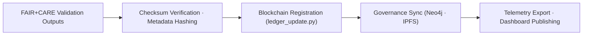

<div align="center">

# ⚖️ **Kansas Frontier Matrix — Governance Pipelines**
`src/pipelines/governance/README.md`

**Purpose:**  
Automate **provenance registration, checksum lineage, and FAIR+CARE certification** for every dataset, model, and validation artifact in KFM.  
Guarantee **blockchain-linked immutability** and **transparent ethics governance** under MCP-DL v6.3 and ISO 19115.

[](../../../../docs/standards/)
[](../../../../LICENSE)
[](../../../../docs/standards/faircare-validation.md)
[]()
[]()

</div>

---

## 📘 Overview

KFM’s **Governance Pipelines** are the ethics and lineage backbone of the platform—recording transformations, validations, and explainability results to an immutable ledger.  
Each run is **checksum-locked**, **telemetry-reported**, and **publicly auditable**.

### Core Responsibilities
- Sync FAIR+CARE audit artifacts to the Governance Ledger.  
- Register dataset lineages and **SHA-256 checksum chains**.  
- Append **blockchain proofs** for validations and releases.  
- Manage **ethics approvals** and certification renewals.  
- Publish **sustainability + governance telemetry** for dashboards.  

---

## 🗂️ Directory Layout

```plaintext
src/pipelines/governance/
├── README.md
│
├── governance_sync.py         # Collate FAIR+CARE + validation outputs for certification
├── ledger_update.py           # Append immutable blockchain entries with checksums
├── checksum_registry.py       # Validate + maintain end-to-end checksum lineage
└── metadata.json              # Governance pipeline provenance + configuration
```

---

## ⚙️ Governance Workflow



1. **Ingest:** Accept validation and ethics artifacts.  
2. **Verify:** Compute/verify SHA-256; attach lineage metadata.  
3. **Register:** Write immutable entries to blockchain-backed ledger.  
4. **Sync:** Update Neo4j/IPFS mirrors and governance registries.  
5. **Publish:** Export metrics to `focus-telemetry.json` and dashboards.

---

## 🧾 Example Governance Record

```json
{
  "id": "governance_ledger_registry_v10.1.0",
  "governance_entries": [
    "data/reports/audit/data_provenance_ledger.json",
    "data/reports/fair/data_care_assessment.json"
  ],
  "checksum_registry_updated": true,
  "blockchain_registration": "verified",
  "fairstatus": "certified",
  "total_validations_logged": 118,
  "ai_explainability_audits": 19,
  "energy_usage_wh": 1.04,
  "carbon_output_gco2e": 0.07,
  "governance_registered": true,
  "created": "2025-11-10T12:10:00Z",
  "validator": "@kfm-governance"
}
```

---

## 🧠 FAIR+CARE Governance Matrix

| Principle | Implementation | Oversight |
|-----------|----------------|-----------|
| **Findable** | Entries indexed by UUID + blockchain hash. | @kfm-data |
| **Accessible** | Machine-readable ledgers; public audit access. | @kfm-accessibility |
| **Interoperable** | Conforms to FAIR+CARE + ISO 19115 metadata. | @kfm-architecture |
| **Reusable** | Logs + manifests MIT-licensed for reuse. | @kfm-design |
| **Collective Benefit** | Trustworthy lineage and ethics governance. | @faircare-council |
| **Authority to Control** | Council approves certifications and renewals. | @kfm-governance |
| **Responsibility** | Engineers sustain checksum + energy audit quality. | @kfm-sustainability |
| **Ethics** | Workflows reviewed for inclusivity and openness. | @kfm-ethics |

Related artifacts:  
`../../../../data/reports/audit/data_provenance_ledger.json` · `../../../../data/reports/fair/data_care_assessment.json`

---

## ⚙️ Pipeline Modules

| Script | Function | FAIR+CARE Role | Systems |
|-------|----------|----------------|---------|
| `governance_sync.py` | Collate validation + FAIR results | Certification | Neo4j · IPFS |
| `ledger_update.py` | Append immutable ledger entries | Provenance | IPFS · Ethereum |
| `checksum_registry.py` | Maintain checksum chains | Integrity | Git · Manifest |

---

## ⚖️ Retention & Provenance Policy

| Artifact | Retention | Policy |
|---------|-----------|-------|
| Governance Ledgers | Permanent | Blockchain-backed immutability |
| FAIR+CARE Reports | 365 Days | Quarterly renewal & review |
| Checksum Registers | Permanent | Versioned + cryptographically linked |
| Sustainability Metrics | 180 Days | Refreshed per release cycle |

Cleanup managed by `governance_sync.yml`.

---

## 🌱 Sustainability Metrics (v10.1.0)

| Metric | Value | Verified By |
|--------|-------|-------------|
| Avg Runtime | 1.4 minutes | @kfm-ops |
| Energy Usage | 1.04 Wh | @kfm-sustainability |
| Carbon Output | 0.07 g CO₂e | @kfm-security |
| Renewable Energy | 100% (RE100) | @kfm-infrastructure |
| FAIR+CARE Compliance | 100% | @faircare-council |

Telemetry source:  
`../../../../releases/v10.1.0/focus-telemetry.json`

---

## 🧾 Internal Use Citation

```text
Kansas Frontier Matrix (2025). Governance Pipelines (v10.1.0).
Automated FAIR+CARE + blockchain governance layer ensuring checksum lineage, provenance integrity, and ethical reproducibility across KFM.
```

---

## 🕰️ Version History

| Version | Date | Notes |
|--------|------|------|
| **v10.1.0** | 2025-11-10 | Upgraded to telemetry v3; stronger DCAT/STAC bridge; improved chain proofs and energy metrics. |
| **v10.0.0** | 2025-11-08 | Added on-chain proofs for validations and releases; expanded certification collation. |
| **v9.7.0** | 2025-11-05 | Improved blockchain hooks; initial telemetry v2 alignment. |

---

<div align="center">

**© 2025 Kansas Frontier Matrix — MIT License**  
*Ethical Governance × FAIR+CARE Provenance × Blockchain Traceability*  
[Back to Pipelines](../README.md) • [Docs Portal](../../../../docs/) • [Governance Ledger](../../../../docs/standards/governance/DATA-GOVERNANCE.md)

</div>
