<div align="center">

# ⚖️ **KFM v11 — Governance Pipelines**  
`src/pipelines/governance/README.md`

### **Provenance · FAIR+CARE · Sovereignty · Immutable Ledger · Multi-Ledger Certification**

Governance Pipelines enforce **ethical, lineage-first, sovereign-aware data stewardship** across the entire Kansas Frontier Matrix.  
They ensure every dataset, model, validation result, narrative artifact, and pipeline output is:

**FAIR+CARE certified · Sovereignty compliant · Provenance-complete · Blockchain anchored · Telemetry audited · Publicly accountable**

</div>

---

## 📘 1. Overview

Governance pipelines:

- Register **lineage** for every dataset, model, experiment, SOP, and pipeline run  
- Verify **checksums + Merkle-chain integrity**  
- Perform **FAIR+CARE classification & sovereignty policy gating**  
- Produce immutable **ledger entries** (IPFS / Ethereum optional)  
- Update **Neo4j governance graph** (CIDOC-CRM alignment)  
- Export **telemetry**: ethics, energy, carbon, validation state  
- Provide **public transparency mechanisms** for KFM releases  

They are invoked:

- At the end of every ETL/AI pipeline  
- In release workflows  
- In FAIR+CARE quarterly audits  
- In autonomous governance refresh cycles  

---

## 🗂 2. Directory Structure (v11)

```text
src/pipelines/governance/
│
├── README.md                          # This document
│
├── governance_sync.py                 # Consolidates all validation + fairness + CARE outputs
├── ledger_update.py                   # Immutable ledger writer (IPFS · Ethereum optional)
├── checksum_registry.py               # End-to-end checksum chain manager
│
└── metadata.json                      # Governance pipeline configuration + provenance
```

---

## 🛠️ 3. Governance Pipeline Workflow (v11)

```mermaid
flowchart LR
    A["FAIR+CARE + Validation Outputs"] --> B["Checksum Verification"]
    B --> C["Metadata Harmonization (DCAT · STAC · CRM)"]
    C --> D["Immutable Ledger (IPFS/Ethereum)"]
    D --> E["Governance Sync (Neo4j CIDOC-CRM)"]
    E --> F["Telemetry Export · Energy · Carbon · Ethics"]
```



### Pipeline Responsibilities

- **Checksum lineage**: dataset → transform → output  
- **Governance bundle assembly**: FAIR+CARE, bias/drift, explainability, validation results  
- **Sovereignty enforcement**: H3 masking, tribal review flags  
- **Ethics evaluation** for narrative/text outputs  
- **Blockchain anchoring** for critical artifacts  
- **Governance graph updates** via CIDOC-CRM mappings  

---

## 🧬 4. Governance Metadata Model (v11)

Governance records include:

- `governance_id`  
- `checksum_chain`  
- `care_label`  
- `sovereignty_classification`  
- `validation_results`  
- `explainability_audits`  
- `bias_drift_assessment`  
- `blockchain_anchor` (CID)  
- `runtime_sec`  
- `energy_wh`, `carbon_gco2e`  
- `governance_decision` (approve / reject / escalate)  
- `ledger_ref`  

Stored in:

```
data/reports/audit/governance_ledger.json
```

---

## 🏛 5. FAIR+CARE & Sovereignty Enforcement

### CARE principles enforced:

- **Collective Benefit** → Transparent provenance  
- **Authority to Control** → Tribal review + sovereignty gating  
- **Responsibility** → Energy + carbon metrics  
- **Ethics** → No culturally harmful interpretations  

### Sovereignty rules:

- All sensitive spatial datasets masked (H3 R7→R9)  
- No publication of raw coordinates for sacred / tribal sites  
- Datasets touching sovereignty domains require Council approval  

### FAIR requirements:

- STAC/DCAT metadata alignment  
- JSON-LD contexts for governance bundles  
- Machine-actionable metadata for audits & dashboards  

---

## 📦 6. Core Modules

### ✔ `governance_sync.py`
Aggregates and normalizes:

- FAIR+CARE evaluations  
- Explainability artifacts (SHAP/LIME/etc.)  
- GE checkpoint results  
- Drift/bias metrics  
- Schema compliance reports  

Outputs:

- Governance bundle (`governance_<timestamp>.json`)  
- Neo4j governance graph updates  
- STAC/DCAT governance extensions  

---

### ✔ `ledger_update.py`
Features:

- Append immutable ledger entries  
- Generate IPFS CID  
- Optional Ethereum anchor  
- Maintain Merkle-chain integrity  
- Link entries to OpenLineage job + run IDs  
- Preserve historical lineage fully  

---

### ✔ `checksum_registry.py`
Maintains:

- Cross-run checksum chains  
- Per-dataset hash genealogy  
- Model training artifact hashes  
- Experiment + SOP hash lineage  

Used in:

- Releases  
- Data drift audits  
- Integrity investigations  
- SBOM/manifest verification  

---

## 📊 7. Telemetry (OTel v11)

Governance pipelines emit:

- `kfm.gov_latency_ms`  
- `kfm.gov_checksum_failures`  
- `kfm.gov_lineage_events`  
- `kfm.gov_energy_wh`  
- `kfm.gov_carbon_gco2e`  
- `kfm.gov_care_flags`  
- `kfm.gov_blockchain_anchor`  
- `kfm.gov_sovereignty_escalations`  

Telemetry conforms to:

```
schemas/telemetry/src-governance-v11.json
```

---

## 📑 8. Example Governance Record (v11)

```json
{
  "governance_id": "gov_2025_11_24_v11",
  "checksum_verified": true,
  "care_label": "public",
  "sovereignty_review": "pass",
  "blockchain_anchor": "cid:QmHashExample",
  "lineage_events_logged": 144,
  "validation_failures": 0,
  "energy_wh": 0.88,
  "carbon_gco2e": 0.04,
  "telemetry_emitted": true,
  "created": "2025-11-24T13:55:00Z",
  "validator": "@kfm-governance"
}
```

---

## 🧯 9. Failure Modes & Recovery

### Possible failures
- Checksum chain mismatch  
- IPFS anchor failure  
- CARE rule violation  
- Sovereignty policy conflict  
- Missing explainability proofs  
- Invalid STAC/DCAT governance extension  
- Ledger divergence  

### Recovery patterns
- Recompute checksum chain  
- Regenerate governance bundle  
- Trigger CARE Council review  
- Replay ledger operations via WAL  
- Freeze related pipelines  
- Regenerate STAC/DCAT governance metadata  

---

## 🕰 10. Version History

| Version | Date | Summary |
|--------:|------|---------|
| v11.0.0 | 2025-11-24 | Fully upgraded to KFM-MDP v11 with sovereignty, FAIR+CARE, checksum lineage, blockchain anchoring, reliability ties, and OTel v11 integration. |
| v10.1.0 | 2025-11-10 | Previous governance pipeline baseline. |

---

<div align="center">

© 2025 Kansas Frontier Matrix  
FAIR+CARE · Sovereignty Respect · Immutable Provenance · Diamond⁹ Ω / Crown∞Ω  
“Governance is the contract between the data, the people, and history.” 

</div>