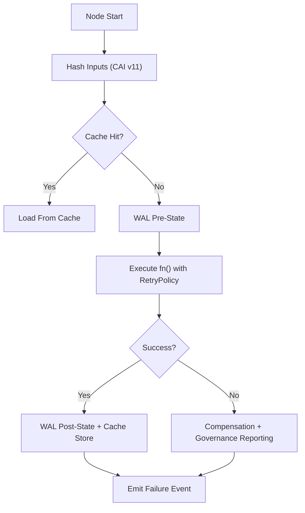

<div align="center">

# 🧭 **KFM v11 — LangGraph Pipeline Architecture**  
### **Autonomous DAGs · Reliable Nodes · WAL Replay · Provenance Integration**  
`src/pipelines/langgraph/README.md`

**Purpose:**  
Provide the **root architectural reference** for all LangGraph-powered pipelines in KFM v11 — including ETL, climate modeling, hydrology reconstruction, Story Node v3 generation, Focus Mode v3 context synthesis, metadata harmonization, and autonomous updates.

</div>

---

## 📘 1. Overview

LangGraph v11 is the **execution engine** behind all AI, ETL, metadata, and semantic-graph pipelines in the Kansas Frontier Matrix. It provides:

- Autonomous DAG execution  
- Reliability via WAL + Retry + Resume  
- Deterministic node identity  
- Per-node lineage (OpenLineage + PROV-O)  
- FAIR+CARE aware mutation controls  
- Sovereignty-enforced branching logic  
- Conditional ingestion behavior  
- SLO-aware throttling  
- Energy & carbon telemetry instrumentation  

LangGraph sits between:

```
Data → ETL/AI Pipelines → Neo4j Graph → APIs → Web Platform (MapLibre/Cesium) → Story Nodes & Focus Mode
```

Its reliability layer ensures all pipeline tasks are **consistent, replayable, lineage-safe, and governance-compliant**.

---

## 🧱 2. Directory Layout

```text
src/pipelines/langgraph/
│
├── README.md                                # This document
│
├── reliable-nodes/                           # Reliable node execution engine (WAL + Retry)
│   ├── node_runner.py
│   ├── wal_store.py
│   ├── cache_store.py
│   └── lineage.py
│
├── graphs/                                   # Domain DAG definitions (ETL, AI, metadata, Story Nodes)
│   ├── climate_graph.py
│   ├── hydrology_graph.py
│   ├── archives_graph.py
│   ├── storynode_graph.py
│   └── focusmode_graph.py
│
├── policies/                                 # Policy stacks used by DAGs
│   ├── retry_policy.py
│   ├── governance_policy.py
│   ├── validation_policy.py
│   └── energy_policy.py
│
├── io/                                       # Readers/writers for KFM data formats
│   ├── stac_reader.py
│   ├── parquet_reader.py
│   ├── neo4j_writer.py
│   └── provenance_builder.py
│
└── utils/                                    # Shared helpers
    ├── hashing.py
    ├── snapshot.py
    ├── lineage_helpers.py
    └── h3_masking.py
```

---

## 🧬 3. LangGraph v11 Execution Model (KFM Extensions)

LangGraph v11 in KFM is **not vanilla** — it is extended with:

### ✔ 3.1 **Content-Addressed Node Identity**
Each node is hashed as:

```
sha256(node_id + code_version + inputs_hash + data_contract_version)
```

Ensures caching, replay, and branch determinism.

---

### ✔ 3.2 **Reliable Node Runner (WAL + Retry + Compensation)**
Each node is wrapped by the engine described in:  
`src/pipelines/langgraph/reliable-nodes/README.md`

Features:

- WAL pre/attempt/post logs  
- Backoff/retry logic  
- Compensation for side-effects  
- Provenance emission  
- Energy & carbon telemetry  

---

### ✔ 3.3 **Governance + Validation Layers**
Each node passes through:

1. **Schema validation**  
2. **FAIR+CARE checks**  
3. **Sovereignty gates (H3 masking)**  
4. **GE checkpoint integration**  
5. **Error-budget interpretation**  
6. **Kill-switch enforcement**  

Failures → **halt** or **retry** depending on policy.

---

### ✔ 3.4 **Provenance-First DAG Execution**
Every node emits:

- **OpenLineage v2.5 events**  
- **PROV-O JSON-LD blocks**  
- **Dataset references (STAC/DCAT)**  
- **Data contract compliance metadata**

WAL entries ensure full replayability.

---

## 🧠 4. DAG Types in KFM v11

### 4.1 **ETL DAGs**
- Climate downscaling  
- Hydrology reconstruction  
- Raster harmonization  
- Metadata enrichment  
- Conditional ingestion pipelines  

### 4.2 **AI DAGs**
- CrewAI harmonization  
- Story Node v3 draft generation  
- Focus Mode v3 narrative synthesis  
- Geospatial AI reconstructions  

### 4.3 **Graph DAGs**
- Neo4j ingestion  
- Provenance graph updates  
- STAC/DCAT catalog publishing  

### 4.4 **Autonomous Governance DAGs**
- Prompt integrity hashing  
- Schema drift detection  
- FAIR+CARE audits  
- Masking compliance pipelines  

---

## 🧩 5. Node Lifecycle (KFM v11)



---

## 💾 6. Write-Ahead Logging (WAL v11)

Each node execution stores:

```
wal/<run_id>/<node>/pre.json
wal/<run_id>/<node>/attempts.json
wal/<run_id>/<node>/post.json
wal/<run_id>/<node>/compensate.json  (optional)
```

WAL guarantees:

- Crash-safe recovery  
- Deterministic replay  
- Traceability for governance audits  

---

## 🔒 7. Integration with Reliability Controls

LangGraph interacts with other reliability modules:

### ✔ Idempotency Keys + Advisory Locks  
Stop duplicate or concurrent writes.

### ✔ GE Checkpoints  
Stop invalid data before promotion.

### ✔ SLO + Error Budgets  
Control execution cadence.

### ✔ Rollback Runbooks  
Provide deterministic recovery path.

### ✔ Conditional Ingestion  
Only run DAG branches when governance rules allow.

---

## 🏛 8. Governance, FAIR+CARE, Sovereignty

LangGraph v11 must respect:

- CARE classification  
- Indigenous data sovereignty  
- Spatial H3 masking (R7 → R9)  
- Story Node ethics guidelines  
- Archive publication safety  
- License + attribution requirements  
- Tier A dataset restrictions  

All violations must be emitted as governance events in lineage.

---

## 📊 9. Telemetry

Nodes emit:

- CPU/GPU time  
- Memory usage  
- IO volume  
- Energy Wh  
- Carbon gCO₂e  
- Retry count  
- Cache hit/miss  
- Validation outcomes  

Telemetry bundles stored in:

```
releases/<version>/reliability-telemetry.json
```

---

## 🧯 10. Failure Modes & Recovery

Common failures:

- Non-deterministic exec functions  
- Data-contract violations  
- Sovereignty rule mismatch  
- WAL replay mismatch  
- Dangling cache entries  
- Retry loops  

Recovery steps:

- Rollback according to WAL  
- Recompute cache keys  
- Freeze DAG branch  
- Governance escalation  
- Re-run using clean snapshot  

---

## 🕰 11. Version History

| Version | Date | Summary |
|--------:|------|---------|
| v11.0.0 | 2025-11-24 | Initial LangGraph v11 framework overview with reliability + governance integration. |

---

<div align="center">

© 2025 Kansas Frontier Matrix  
LangGraph v11 · Reliable Pipelines v11  
FAIR+CARE · Diamond⁹ Ω / Crown∞Ω Certified  
“Determinism is safety. Lineage is truth.”  

</div>