```markdown
<div align="center">

# 🗄️ Kansas Frontier Matrix — Data Load & Integration Pipelines  
`src/pipelines/load/README.md`

**Graph Ingestion · STAC Indexing · Provenance Tracking**

[](../../../.github/workflows/site.yml)
[](../../../.github/workflows/stac-validate.yml)
[](../../../.github/workflows/codeql.yml)
[](../../../.github/workflows/trivy.yml)
[](../../../docs/)
[](../../../LICENSE)

</div>

---

```yaml
---
title: "Kansas Frontier Matrix — Data Load & Integration Pipelines"
version: "v1.7.0"
last_updated: "2025-10-17"
owners: ["@kfm-data", "@kfm-architecture"]
tags: ["etl","load","neo4j","graph","stac","provenance","checksums","mcp","ci","semver"]
status: "Stable"
license: "MIT"
semver_policy: "MAJOR.MINOR.PATCH"
ci_required_checks:
  - pre-commit
  - unit-tests
  - stac-validate
  - codeql
  - trivy
  - docs-validate
semantic_alignment:
  - CIDOC CRM
  - OWL-Time
  - STAC 1.0
  - DCAT 2.0
  - GeoJSON
  - ISO 8601
---
```

---

## 🎯 Purpose

The **`src/pipelines/load/`** layer is the **final integration stage** of the KFM ETL system — loading processed and enriched data into the **Knowledge Graph (Neo4j)** and the **SpatioTemporal Asset Catalog (STAC)**.  
It consolidates semantics, geospatial outputs, and metadata into a **unified, queryable, versioned** structure powering the **API** and **web app**.

---

## 🏗️ Pipeline Role in the System

```mermaid
flowchart TD
    A["data/processed/<files>"] --> B["Enrichment Outputs<br/>entities · links · summaries"]
    B --> C["Load Layer<br/>Neo4j Graph + STAC Index"]
    C --> D["Neo4j Knowledge Graph<br/>CIDOC CRM · OWL-Time"]
    C --> E["data/stac/catalog.json<br/>collections · items · assets"]
    D --> F["API Layer (FastAPI/GraphQL)"]
    E --> F
    F --> G["Frontend Timeline + Map (React/MapLibre)"]
```


<!-- END OF MERMAID -->

**Two master repositories of truth:**
- 🧭 **Knowledge Graph** — people, places, events, documents, and their relationships.  
- 🗺 **STAC Catalog** — geospatial/temporal assets discoverable for visualization and download.

---

## 📂 Directory Layout

```
src/pipelines/load/
├── __init__.py
├── stac_writer.py        # Build/update STAC Collections & Items
├── graph_loader.py       # Ingest entities/relationships into Neo4j
├── checksum_utils.py     # SHA-256 integrity verification
├── provenance_logger.py  # Provenance records (source, process, artifacts)
├── data_register.py      # Registry of datasets + schema mappings
└── README.md             # (this file)
```

---

## 🧱 Components Overview

| Module                   | Function                                                                                                                                           | Key Tools                            |
| :----------------------- | :------------------------------------------------------------------------------------------------------------------------------------------------- | :----------------------------------- |
| **graph_loader.py**      | Inserts nodes (People, Places, Events, Documents) and relationships (`OCCURRED_AT`, `MENTIONS`, `PARTICIPATED_IN`, etc.) into Neo4j.              | `neo4j-driver`, `pandas`, `networkx` |
| **stac_writer.py**       | Generates/updates STAC Collections & Items for COG/GeoJSON/CSV assets; validates against STAC JSON Schemas.                                       | `pystac`, `jsonschema`               |
| **checksum_utils.py**    | Computes & verifies SHA-256 checksums for all outgoing assets and JSON metadata.                                                                  | `hashlib`, `pathlib`, `json`         |
| **provenance_logger.py** | Appends lineage records (source, license, process, timestamps, outputs) to `logs/pipelines/load.log` and item sidecars.                            | `logging`, `datetime`                |
| **data_register.py**     | Central registry of dataset collections, schema mappings, required fields, and business rules.                                                    | `pandas`, `yaml`                     |

---

## ⚙️ Graph Loading Workflow

1. **Initialize Neo4j session**
   ```python
   from neo4j import GraphDatabase
   driver = GraphDatabase.driver("bolt://localhost:7687", auth=("neo4j", "password"))
   ```

2. **Create/update entities**
   ```python
   def create_place(tx, pid, name, lat, lon):
       tx.run("""
           MERGE (p:Place {id: $pid})
           SET p.name=$name, p.latitude=$lat, p.longitude=$lon
       """, pid=pid, name=name, lat=lat, lon=lon)
   ```

3. **Link relationships**
   ```python
   def link_event_place(tx, event_id, place_id):
       tx.run("""
           MATCH (e:Event {id: $event_id}), (p:Place {id: $place_id})
           MERGE (e)-[:OCCURRED_AT]->(p)
       """, event_id=event_id, place_id=place_id)
   ```

4. **Batch ingestion**
   ```
   python src/pipelines/load/graph_loader.py \
     --input data/processed/enriched/entities.json \
     --batch 500 --upsert
   ```

- **CIDOC CRM & OWL-Time mapping:**  
  - `Event -> crm:E5_Event` with `crm:P4_has_time-span (owl:time:Interval)`  
  - `Place -> crm:E53_Place` with `geo:lat/geo:long`  
  - `Document -> crm:E31_Document` with `crm:P70_documents`  

---

## 🗺️ STAC Catalog Integration

### Auto-generation
- Creates **Items** per dataset in `data/processed/**`.  
- Updates/creates **Collections**, validates via `jsonschema`.  
- Adds **provenance** (source URL, checksum, process timestamp) and **providers**.  

### Example STAC Item (`data/stac/items/ks_1m_dem_2018_2020.json`)
```json
{
  "stac_version": "1.0.0",
  "type": "Feature",
  "id": "ks_1m_dem_2018_2020",
  "properties": {
    "title": "Kansas 1m Digital Elevation Model (2018–2020)",
    "description": "Derived from USGS 3DEP LiDAR; preprocessed to COG.",
    "start_datetime": "2018-01-01T00:00:00Z",
    "end_datetime": "2020-12-31T23:59:59Z",
    "providers": [{"name": "USGS 3DEP", "roles": ["producer", "licensor"]}]
  },
  "assets": {
    "cog": {
      "href": "https://example.com/ks_1m_dem_2018_2020.tif",
      "type": "image/tiff; application=geotiff; profile=cloud-optimized",
      "roles": ["data"]
    }
  },
  "geometry": {"type": "Polygon", "coordinates": [[[...]]]},
  "bbox": [-102.05, 36.99, -94.61, 40.00]
}
```

### CLI
```
python src/pipelines/load/stac_writer.py --input data/processed/ --output data/stac/
```

---

## 🔒 Provenance & Checksums

- **Sidecars:** each output asset emits `.meta.json` (provenance) and optional `.sha256`.  
- **Provenance log:** `logs/pipelines/load.log`, e.g.  
  ```
  [2025-10-17 13:50:44] graph_loader | 4,392 nodes | 12,871 rels | OK
  [2025-10-17 13:55:21] stac_writer  | 33 Items (3 Collections) | OK
  ```
- **Reproducibility:** hashes must match on CI before publication.

---

## 🔁 Integration Flow

| Stage        | Description                                                                                  |
| :----------- | :------------------------------------------------------------------------------------------- |
| **Upstream** | Consumes outputs from `transform/` and `enrich/` (entities, links, summaries, processed GIS) |
| **Downstream** | Serves **API (FastAPI/GraphQL)** and **web app** (timeline + map via MapLibre)               |
| **Automation** | `make load` runs full integration; CI blocks merge if validations fail                       |

---

## 🧾 Example Workflow

```
# Run all load operations (graph + STAC)
make load

# Load enriched entities into Neo4j
python src/pipelines/load/graph_loader.py --input data/processed/enriched/entities.json

# Validate + regenerate STAC catalog
python src/pipelines/load/stac_writer.py --input data/processed/ --output data/stac/

# Verify checksums
python src/pipelines/load/checksum_utils.py --verify data/processed/
```

---

## 📊 Validation & Quality Control

| Validation Type         | Description                                                           | Tool                   |
| :---------------------- | :-------------------------------------------------------------------- | :--------------------- |
| Graph Integrity         | No orphans/duplicates; relationship domain/range check.               | Cypher, `networkx`     |
| STAC Schema             | All metadata conforms to STAC 1.0.0.                                  | `jsonschema`, `pystac` |
| Checksums               | All `.sha256` signatures present & valid.                              | `hashlib`              |
| Provenance Completeness | Every record links to at least one source manifest + process step.     | `provenance_logger.py` |

---

## 🧪 Testing & QA

- **Unit tests:** `tests/pipelines/load/` (mock Neo4j + sample STAC fixtures).  
- **Golden files:** stable item/collection JSON snapshots for regression diffs.  
- **Pre-commit hooks:** lint, import order, large-file guard, JSON formatting.

---

## 🛠️ Makefile Targets (excerpt)

| Target             | Description                                      |
| :----------------- | :----------------------------------------------- |
| `make load`        | Run graph and STAC load with validations         |
| `make load-graph`  | Load only Neo4j entities/relationships           |
| `make load-stac`   | Build/validate STAC (items + collections)        |
| `make checksums`   | Generate/verify SHA-256 for `data/processed/**`  |
| `make provenance`  | Emit provenance sidecars + append to load log    |

---

## 🔌 Interfaces & Contracts

**CLI/ENV**  
- Required args: `--input`, `--output` (where applicable).  
- Optional: `--batch`, `--upsert`, `--dry-run`, `--validate-only`.  
- ENV: `KFM_LOG_LEVEL`, `KFM_NEO4J_URI`, `KFM_NEO4J_USER`, `KFM_NEO4J_PASS`.

**Directory Contracts**  
- Inputs: `data/processed/**`, `data/processed/enriched/**`  
- Outputs: `data/stac/**`, `logs/pipelines/load.log`  
- Sidecars: `.meta.json`, `.sha256`

**Exit Codes**  
- `0=OK`, `1=usage`, `2=IO`, `3=schema/validation`, `4=unexpected`

---

## 🧷 Acceptance Checklist (CI-gated)

- [ ] All STAC Items validate (schema + links + providers + bbox/geom).  
- [ ] Graph passes relationship integrity checks.  
- [ ] `.sha256` present and verified for all published assets.  
- [ ] `.meta.json` includes `source`, `license`, `process`, `timestamp`, `artifact`.  
- [ ] `data_register.py` updated for new/changed datasets.  
- [ ] Unit tests updated; golden diffs reviewed/approved.

---

## 🛡️ Security & Compliance

- Secrets via env/CI secrets; no hardcoded credentials.  
- Principle of least privilege on Neo4j user.  
- SBOM/dependency scans via **Trivy**; static analysis via **CodeQL**.  
- License fields must propagate to STAC `providers`/`links`.

---

## 🧭 Troubleshooting

- **Constraint violations:** ensure `MERGE` keys exist & are unique (`id`).  
- **STAC validation fails:** run `pystac validate` and check missing fields/links.  
- **Checksum mismatch:** re-run `make checksums`; confirm no CRLF/encoding drift.  
- **Slow loads:** increase `--batch`, enable Neo4j `UNWIND` pattern, add indexes.

---

## 🧾 Version History

| Version | Date       | Type     | Changes |
| :------ | :--------- | :------- | :------ |
| v1.7.0  | 2025-10-17 | Added    | Versioning/CI sections; Acceptance Checklist; Interfaces/Contracts; Security & QA; expanded STAC + Graph validation; provenance/checksum policy. |
| v1.6.0  | 2025-10-17 | Improved | STAC writer auto-collections; Neo4j upsert batching; CIDOC CRM & OWL-Time notes; checksum utilities. |
| v1.5.0  | 2025-10-16 | Added    | Initial load README; core modules; minimal examples; basic validation table. |

> **SemVer Policy:**  
> - **MAJOR** — breaking contracts (CLI flags, required fields, directories)  
> - **MINOR** — new features/sections, backward compatible  
> - **PATCH** — fixes/docs/tests; no behavior change

---

## 📚 References

- File & Data Architecture — `../../../docs/architecture.md`  
- AI System Developer Docs — `../../../docs/ai-system.md`  
- STAC Spec — https://stacspec.org/  
- CIDOC CRM — https://www.cidoc-crm.org/  
- MCP Templates — `../../../docs/templates/`  

---

<div align="center">

**Kansas Frontier Matrix © 2025**  
*Data Provenance · Knowledge Graphs · Open Reproducibility*

</div>
```