```markdown
<div align="center">

# 🗄️ **Kansas Frontier Matrix — Data Load & Integration Pipelines**  
`src/pipelines/load/README.md`

**Graph Ingestion · STAC Indexing · Provenance Tracking**

[](../../../.github/workflows/site.yml)
[](../../../.github/workflows/stac-validate.yml)
[](../../../.github/workflows/codeql.yml)
[](../../../.github/workflows/trivy.yml)
[](../../../docs/)
[](../../../LICENSE)

</div>

---

```yaml
---
title: "Kansas Frontier Matrix — Data Load & Integration Pipelines"
version: "v1.8.0"
last_updated: "2025-10-17"
owners: ["@kfm-data", "@kfm-architecture"]
tags: ["etl","load","neo4j","graph","stac","provenance","checksums","mcp","ci","semver"]
status: "Stable"
license: "MIT"
semver_policy: "MAJOR.MINOR.PATCH"
ci_required_checks:
  - pre-commit
  - unit-tests
  - stac-validate
  - codeql
  - trivy
  - docs-validate
semantic_alignment:
  - CIDOC CRM
  - OWL-Time
  - STAC 1.0
  - DCAT 2.0
  - GeoJSON
  - ISO 8601
---
```

---

## 🎯 Purpose

The **`src/pipelines/load/`** layer represents the **final integration stage** of the Kansas Frontier Matrix (KFM) ETL system — responsible for **loading enriched and validated data** into the  
**Knowledge Graph (Neo4j)** and the **SpatioTemporal Asset Catalog (STAC)**.  

It merges semantic entities, geospatial layers, and metadata into a unified, version-controlled structure that powers  
the **FastAPI/GraphQL backend** and the **React/MapLibre web frontend**.  

All load operations follow **MCP-DL v6.2** standards for documentation, versioning, and reproducibility.

---

## 🏗️ Pipeline Role in the System

```mermaid
flowchart TD
    A["data/processed/<files>"] --> B["Enrichment Outputs<br/>entities · links · summaries"]
    B --> C["Load Layer<br/>Neo4j Graph + STAC Index"]
    C --> D["Neo4j Knowledge Graph<br/>CIDOC CRM · OWL-Time"]
    C --> E["data/stac/catalog.json<br/>collections · items · assets"]
    D --> F["API Layer (FastAPI/GraphQL)"]
    E --> F
    F --> G["Frontend Timeline + Map (React/MapLibre)"]
```


<!-- END OF MERMAID -->

---

## 📂 Directory Layout

```
src/pipelines/load/
├── __init__.py
├── graph_loader.py       # Load entities and relationships into Neo4j
├── stac_writer.py        # Build/update STAC Collections & Items
├── checksum_utils.py     # SHA-256 verification for data integrity
├── provenance_logger.py  # Provenance records (source, license, process, timestamp)
├── data_register.py      # Registry for datasets & schema mappings
└── README.md             # (this file)
```

---

## ⚙️ Overview of Core Components

| Module                   | Purpose                                                                                                 | Core Libraries                        |
| :----------------------- | :------------------------------------------------------------------------------------------------------- | :----------------------------------- |
| **graph_loader.py**      | Inserts and links entities (`Person`, `Place`, `Event`, `Document`) into Neo4j, following CIDOC CRM.    | `neo4j-driver`, `pandas`, `networkx` |
| **stac_writer.py**       | Builds and validates STAC-compliant JSON Collections & Items.                                           | `pystac`, `jsonschema`               |
| **checksum_utils.py**    | Generates & verifies SHA-256 hashes for reproducibility.                                                | `hashlib`, `os`, `json`              |
| **provenance_logger.py** | Logs dataset lineage, inputs, and transformation metadata.                                              | `logging`, `datetime`                |
| **data_register.py**     | Updates and validates the dataset registry for traceability.                                            | `yaml`, `pandas`                     |

---

## 🧩 Graph Loading Workflow

1. **Initialize Neo4j connection**
   ```python
   from neo4j import GraphDatabase
   driver = GraphDatabase.driver("bolt://localhost:7687", auth=("neo4j", "password"))
   ```

2. **Create or update nodes**
   ```python
   def create_place(tx, name, lat, lon):
       tx.run("""
           MERGE (p:Place {name: $name})
           SET p.latitude=$lat, p.longitude=$lon
       """, name=name, lat=lat, lon=lon)
   ```

3. **Link relationships**
   ```python
   def link_event_place(tx, event_id, place_id):
       tx.run("""
           MATCH (e:Event {id:$event_id}), (p:Place {id:$place_id})
           MERGE (e)-[:OCCURRED_AT]->(p)
       """, event_id=event_id, place_id=place_id)
   ```

4. **Batch loading**
   ```
   python src/pipelines/load/graph_loader.py \
     --input data/processed/enriched/entities.json \
     --batch 500 --upsert
   ```

---

## 🗺️ STAC Catalog Integration

The **STAC (SpatioTemporal Asset Catalog)** enables discoverable, standardized geospatial metadata.

### Auto-generation

* Scans `data/processed/**` for new datasets  
* Builds or updates STAC **Collections** and **Items**  
* Validates JSON via `jsonschema`  
* Adds provenance metadata (source, license, timestamp, checksum)

Run:
```
python src/pipelines/load/stac_writer.py --input data/processed/ --output data/stac/
```

### Example STAC Item

```json
{
  "stac_version": "1.0.0",
  "type": "Feature",
  "id": "ks_1m_dem_2018_2020",
  "properties": {
    "title": "Kansas 1m Digital Elevation Model (2018–2020)",
    "start_datetime": "2018-01-01T00:00:00Z",
    "end_datetime": "2020-12-31T23:59:59Z"
  },
  "assets": {
    "cog": {
      "href": "https://data.ks.gov/ks_1m_dem_2018_2020.tif",
      "type": "image/tiff; application=geotiff; profile=cloud-optimized"
    }
  }
}
```

---

## 🔒 Provenance & Integrity

* Every processed asset emits:
  - `.meta.json` → provenance metadata  
  - `.sha256` → file integrity hash  

* Provenance logs written to `logs/pipelines/load.log`:
  ```
  [2025-10-17 14:45:09] graph_loader | 3,204 nodes | 9,118 rels | OK
  [2025-10-17 14:50:16] stac_writer  | 27 STAC items created | OK
  ```

---

## 🧰 Automation & Integration

| Layer | Description |
| :---- | :----------- |
| **Upstream** | Consumes data from `transform/` and `enrich/`. |
| **Downstream** | Feeds data into `API` and frontend timeline/map. |
| **Automation** | Triggered via `make load` or CI/CD workflow `.github/workflows/etl.yml`. |

---

## 🧾 Validation & Quality Control

| Check | Description | Tool |
| :---- | :----------- | :--- |
| **Graph Integrity** | Ensures valid Neo4j relationships, no orphan nodes. | `Cypher`, `networkx` |
| **STAC Schema** | Validates JSON files per STAC 1.0.0 spec. | `pystac`, `jsonschema` |
| **Checksums** | Verifies file integrity across all assets. | `hashlib`, `os` |
| **Provenance** | Confirms every record has a lineage and timestamp. | `provenance_logger.py` |

---

## 🧪 Testing & QA

- Unit tests under `tests/pipelines/load/`  
- Golden reference STAC/Graph outputs for regression detection  
- Pre-commit: linting, black formatting, JSON verification  
- CI gates merges on validation + test success

---

## 🧷 Acceptance Criteria (CI/CD)

- [ ] All STAC Items validated  
- [ ] All graph relationships connected + typed  
- [ ] `.sha256` hashes verified  
- [ ] `.meta.json` contains full provenance  
- [ ] Neo4j/Graph upload succeeded without constraint errors  
- [ ] Docs + tests updated in same PR  

---

## 🛡️ Security & Compliance

* Uses environment variables for Neo4j credentials.  
* Runs Trivy + CodeQL scans in CI.  
* License fields propagate to STAC `providers`.  
* Enforces least-privilege Neo4j roles.  

---

## 🧾 Version History

| Version | Date | Type | Notes |
| :-- | :-- | :-- | :-- |
| v1.8.0 | 2025-10-17 | Added | Upgraded header layout and badges, new CI validations, expanded provenance sections. |
| v1.7.0 | 2025-10-17 | Added | Versioning/CI/Acceptance checklist; graph + STAC QA alignment. |
| v1.6.0 | 2025-10-16 | Improved | STAC writer auto-collections, CIDOC CRM + OWL-Time notes. |
| v1.5.0 | 2025-10-15 | Added | Initial load pipeline README with base workflow and structure. |

---

## 📚 References

- [📄 File & Data Architecture](../../../docs/architecture.md)
- [🧠 AI System Developer Documentation](../../../docs/ai-system.md)
- [🧮 Scientific Modeling & Simulation Guide](../../../docs/standards/README.md)
- [🌐 STAC Specification](https://stacspec.org/)
- [📘 MCP-DL v6.2 Documentation Standards](../../../docs/standards/markdown_guide.md)

---

<div align="center">

**Kansas Frontier Matrix © 2025**  
*Data Provenance · Knowledge Graphs · Open Reproducibility*

</div>
```