<div align="center">

# 🗺️ **Kansas Frontier Matrix — STAC ↔ DCAT 3.0 Translation Layer**
_“Bridging geospatial FAIR metadata between JSON and RDF worlds”_

[](../../../../docs/architecture/repo-focus.md)  
[](../../../../LICENSE)  
[](../../../../.github/workflows/bridge-e2e.yml)  
[](https://stacspec.org)  
[](https://www.w3.org/TR/vocab-dcat-3/)

</div>

---

## 🧭 Overview

The **STAC ↔ DCAT 3.0 Translation Layer** enables **bidirectional semantic interoperability** between STAC (SpatioTemporal Asset Catalog) JSON metadata and W3C DCAT 3.0 RDF graphs. It provides the metadata bridge used by the KFM governance and knowledge graph ingestion system.

- Converts **STAC → DCAT (JSON → RDF/Turtle/JSON-LD)** for ingestion into the CIDOC CRM + OWL-Time knowledge graph.
- Converts **DCAT → STAC (RDF → JSON)** for publishing interoperable FAIR catalogs.
- Enforces validation through **JSON Schema**, **SHACL**, and **FAIR+CARE audits**.
- Built to support **KFM’s autonomous pipelines** and **machine-readable provenance**.

---

## 🧩 Directory Layout

```text
src/pipelines/metadata_bridge/
├── bridge.py
├── stac_to_dcat.py
├── dcat_to_stac.py
├── __init__.py
├── profiles/
│   ├── base_profile.py
│   ├── dcat_ap_profile.py
│   ├── geodcat_profile.py
│   └── __init__.py
├── schemas/
│   ├── stac/
│   │   └── collection-schema.json
│   └── dcat/
│       └── dcat-shapes.ttl
├── cli.py
├── tests/
│   ├── test_stac_to_dcat.py
│   ├── test_dcat_to_stac.py
│   ├── test_roundtrip.py
│   └── fixtures/
│       ├── stac_collection.json
│       ├── dcat_dataset.ttl
│       └── expected_roundtrip.json
└── README.md
```

---

## 🧮 Mapping Reference Table

| STAC Field | DCAT Property | Notes / Transformation |
|-------------|----------------|------------------------|
| `id` | `dcterms:identifier` | Preserve globally unique |
| `title` | `dcterms:title` | 1:1 mapping |
| `description` | `dcterms:description` | 1:1 mapping |
| `license` | `dcterms:license` | Map SPDX → URI |
| `keywords[]` | `dcat:keyword` | Simple array flatten |
| `providers[*].name` | `dcterms:publisher` | First provider as main publisher |
| `extent.spatial.bbox` | `dcterms:spatial` | Convert GeoJSON → WKT |
| `extent.temporal.interval` | `dcterms:temporal` + `time:Interval` | Start/end datetimes |
| `assets[*].href` | `dcat:accessURL` or `dcat:downloadURL` | Determined by role/type |
| `assets[*].type` | `dcterms:format` | MIME types preferred |
| `assets[*].roles` | `dcat:mediaType` | Extended |
| `stac_extensions[]` | `owl:imports` | Linked to schema IRI |
| `created` / `updated` | `prov:generatedAtTime` | Provenance alignment |

---

## 🧠 Example 1 — STAC → DCAT JSON-LD Output

**Input: `collection.json`**

```json
{
  "stac_version": "1.0.0",
  "id": "kfm-climate-2020",
  "type": "Collection",
  "title": "Kansas Climate Observations 2020",
  "description": "Climate data from NOAA and USGS sources.",
  "license": "CC-BY-4.0",
  "extent": {
    "spatial": { "bbox": [[-102.05, 36.99, -94.62, 40.00]] },
    "temporal": { "interval": [["2020-01-01T00:00:00Z", "2020-12-31T23:59:59Z"]] }
  },
  "links": [],
  "providers": [{"name": "NOAA", "roles": ["producer"]}]
}
```

**Output: `dataset.ttl`**

```turtle
@prefix dcat: <http://www.w3.org/ns/dcat#> .
@prefix dct: <http://purl.org/dc/terms/> .
@prefix time: <http://www.w3.org/2006/time#> .
@prefix prov: <http://www.w3.org/ns/prov#> .

<https://data.kfm.org/dataset/kfm-climate-2020> a dcat:Dataset ;
  dct:identifier "kfm-climate-2020" ;
  dct:title "Kansas Climate Observations 2020" ;
  dct:description "Climate data from NOAA and USGS sources." ;
  dct:license <https://creativecommons.org/licenses/by/4.0/> ;
  dct:publisher "NOAA" ;
  dct:spatial "POLYGON((-102.05 36.99, -102.05 40.00, -94.62 40.00, -94.62 36.99, -102.05 36.99))" ;
  dct:temporal [ a time:Interval ;
                 time:hasBeginning [ time:inXSDDateTime "2020-01-01T00:00:00Z"^^xsd:dateTime ] ;
                 time:hasEnd [ time:inXSDDateTime "2020-12-31T23:59:59Z"^^xsd:dateTime ] ] ;
  prov:generatedAtTime "2025-10-30T00:00:00Z"^^xsd:dateTime .
```

---

## 🔁 Example 2 — DCAT → STAC Reconstruction

**Input: `dataset.ttl` (same as above)**  
**Output: `collection.json`**

```json
{
  "stac_version": "1.0.0",
  "id": "kfm-climate-2020",
  "type": "Collection",
  "title": "Kansas Climate Observations 2020",
  "description": "Climate data from NOAA and USGS sources.",
  "license": "CC-BY-4.0",
  "extent": {
    "spatial": { "bbox": [[-102.05, 36.99, -94.62, 40.00]] },
    "temporal": { "interval": [["2020-01-01T00:00:00Z", "2020-12-31T23:59:59Z"]] }
  },
  "providers": [{"name": "NOAA", "roles": ["publisher"]}]
}
```

---

## 🧰 CLI & Pipeline Usage

```bash
# Convert STAC → DCAT
python cli.py convert --from stac --to dcat data/stac/climate/collection.json --out data/dcat/climate.ttl

# Convert DCAT → STAC
python cli.py convert --from dcat --to stac data/dcat/climate.ttl --out data/stac/climate.json

# Validate both forms
python cli.py validate --type stac data/stac/climate.json
python cli.py validate --type dcat data/dcat/climate.ttl
```

---

## 🧪 Validation Workflows

**GitHub Actions:**

| Workflow | Purpose | Validation Type |
|-----------|----------|-----------------|
| `stac-validate.yml` | JSON Schema conformance | STAC 1.0 validator |
| `dcat-shacl.yml` | RDF graph validation | SHACL shapes |
| `bridge-e2e.yml` | Bidirectional tests | Round-trip regression |
| `governance-ledger.yml` | Provenance + FAIR+CARE | Governance sync |

---

## 🧱 Integration Diagram

```mermaid
flowchart TD
A["STAC Collection / Item (JSON)"] --> B["STAC → DCAT Translator (stac_to_dcat.py)"]
B --> C["RDF Graph (TTL/JSON-LD)"]
C --> D["CIDOC CRM / OWL-Time Knowledge Graph (Neo4j)"]
D --> E["Governance Ledger + FAIR+CARE Validation"]
E --> F["DCAT → STAC Translator (dcat_to_stac.py)"]
F --> G["Published FAIR Catalog (JSON)"]
```



---

## 🧬 Provenance & FAIR Alignment

- **Provenance**: Managed via PROV-O and governance-ledger workflows.  
- **Identifiers**: Persistent URIs based on `https://data.kfm.org/dataset/{id}`.  
- **Temporal Extents**: ISO8601 normalized; OWL-Time representation enforced.  
- **FAIR+CARE Checks**: Executed in CI/CD (`faircare-validate.yml`).  

---

## 🧩 Implementation Notes

- Written in **Python 3.11+** using `rdflib`, `pyshacl`, and `jsonschema`.
- Supports **GeoDCAT-AP** and **DCAT-AP 3.0** profiles as modular plugins.
- Configurable via YAML profiles (`profiles/*.py`).
- Tested with fixtures under `tests/fixtures/` using `pytest`.

---

## 🧭 Governance Metadata

| Attribute | Reference |
|------------|------------|
| Governance Ledger | `docs/standards/governance-ledger.md` |
| FAIR/CARE Protocol | `docs/standards/faircare-protocol.md` |
| Security Policy | `SECURITY.md` |
| Provenance Spec | `docs/standards/provenance-spec.md` |
| Workflow Specs | `.github/workflows/*.yml` |

---

## 🪶 Example Bridge Schema Registration

**`schemas/bridge-schema.json`**

```json
{
  "$schema": "http://json-schema.org/draft/2020-12/schema",
  "title": "KFM STAC ↔ DCAT Bridge Schema",
  "description": "Defines the translation bridge between STAC and DCAT metadata structures.",
  "type": "object",
  "properties": {
    "id": { "type": "string" },
    "direction": { "enum": ["stac_to_dcat", "dcat_to_stac"] },
    "source": { "type": "string" },
    "target": { "type": "string" },
    "status": { "enum": ["pending", "validated", "failed"] }
  },
  "required": ["id", "direction", "source", "target"]
}
```

---

## 🧾 Example SHACL Shape for DCAT Validation

```turtle
@prefix sh: <http://www.w3.org/ns/shacl#> .
@prefix dcat: <http://www.w3.org/ns/dcat#> .
@prefix dct: <http://purl.org/dc/terms/> .

dcat:DatasetShape a sh:NodeShape ;
  sh:targetClass dcat:Dataset ;
  sh:property [
    sh:path dct:title ;
    sh:datatype xsd:string ;
    sh:minCount 1 ;
  ] ;
  sh:property [
    sh:path dct:identifier ;
    sh:minCount 1 ;
  ] ;
  sh:property [
    sh:path dct:license ;
    sh:minCount 1 ;
  ] .
```

---

## 🧮 Example Round-Trip Test

**File:** `tests/test_roundtrip.py`

```python
from kfm_bridge import stac_to_dcat, dcat_to_stac
import json

def test_roundtrip_equivalence():
    stac = json.load(open("tests/fixtures/stac_collection.json"))
    ttl = stac_to_dcat.convert(stac)
    reconstructed = dcat_to_stac.convert(ttl)
    assert stac["id"] == reconstructed["id"]
    assert stac["title"] == reconstructed["title"]
```

---

## 🧭 Next Steps

1. Expand mapping coverage for **eo, sat, proj, raster extensions**.
2. Integrate **FAIR+CARE metrics** via governance ledger hooks.
3. Enable **dataset versioning** through PROV-O and SLSA attestations.
4. Automate **metadata enrichment** from AI extraction layer.
5. Register bridge outputs to **KFM Knowledge Graph (Neo4j CIDOC)**.

---

<div align="center">

🧱 **Kansas Frontier Matrix**  
Built under **MCP-DL v6.3** · FAIR · CARE · CIDOC CRM · Open Science Alliance  

</div>
