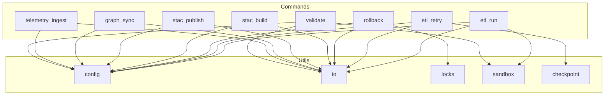

<div align="center">

# 🧩 **Kansas Frontier Matrix — Operations CLI Command Modules**  
`src/pipelines/operations/cli/commands/README.md`

**Purpose:**  
Document the command modules powering the Operations CLI, including ETL execution, retry-safe recovery, trustworthy rollback, STAC creation and publishing, graph synchronization, telemetry ingestion, and validation workflows — all managed under MCP-DL v6.3 and Diamond⁹ Ω / Crown∞Ω certification.

[]()
[]()
[]()
[]()

</div>

---

## 📘 Overview
This directory holds the **command-level modules** for the KFM Operations CLI. Each Python module corresponds to a top-level `kfm` subcommand and adheres to:

- Deterministic execution  
- Idempotent behavior  
- Checkpoint and rollback safety  
- FAIR+CARE metadata ethics  
- MCP-DL documentation-first design  

These commands remain thin orchestration layers that delegate I/O and state management to `utils/` modules.

---

## 📁 Directory Layout

```
src/pipelines/operations/cli/commands/
│
├── etl_run.py              # Execute ETL pipelines (single or all)
├── etl_retry.py            # Checkpoint-based resume engine
├── rollback.py             # Trustworthy rollback + snapshot orchestration
├── stac_build.py           # Build STAC Items and Collections
├── stac_publish.py         # Publish STAC Catalogs
├── graph_sync.py           # Apply Neo4j schema + index updates
├── telemetry_ingest.py     # Ingest and validate Focus Mode telemetry
└── validate.py             # Validation suite for all operations
```

---

## 🧱 Architecture Diagram



---

## 🔧 Command Module Descriptions

### 🗂️ `etl_run.py`
Executes full or source-specific ETL pipelines with dry-run and CI-safe flags.

### 🔁 `etl_retry.py`
Resumes failed ETL pipelines with checkpoint validation and lock protection.

### 🧵 `rollback.py`
Implements snapshot creation, verification, and system rollback aligned with the v10.3 Trustworthy Rollback Playbook.

### 🗺️ `stac_build.py`
Builds STAC 1.0.0-compliant Items and Collections with checksum + provenance metadata.

### 🌐 `stac_publish.py`
Publishes STAC catalogs to local or remote endpoints with pre-publish validation.

### 🧬 `graph_sync.py`
Applies Neo4j constraints, indexes, and triggers optional full graph rebuild.

### 📡 `telemetry_ingest.py`
Processes Focus Mode v2 telemetry with CARE filters and telemetry schema validation.

### 🧪 `validate.py`
Runs ETL, STAC, graph, and provenance validation chains for CI and governance.

---

## 🧾 Governance & Compliance
This directory is governed by:

- ROOT-GOVERNANCE.md  
- FAIR+CARE Council  
- MCP-DL v6.3  
- CI workflows (`docs-lint.yml`, `graph-integrity.yml`, `rollback-tests.yml`, `faircare-validate.yml`, `stac-validate.yml`)  

All changes require updating version metadata, passing CI, and documenting in the Version History.

---

## 📚 Version History

| Version | Date | Notes |
|--------|--------|--------|
| v10.3.0 | 2025-11-14 | File rebuilt with full Markdown Output Protocol compliance |
| v10.2.0 | — | Added telemetry + rollback command modules |
| v10.1.0 | — | Initial command suite established |

---
