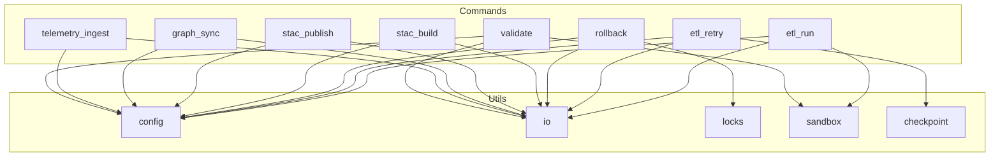

<div align="center">

# 🧩 **Kansas Frontier Matrix — Operations CLI Utilities**  
`src/pipelines/operations/cli/utils/README.md`

**Purpose:**  
Document the utility modules that provide configuration loading, I/O primitives, sandboxing, locking, and checkpointing infrastructure required for safe, MCP-DL compliant command execution across the Operations CLI.

[]()
[]()
[]()
[]()

</div>

---

## 📘 Overview
The **Operations CLI Utility Layer** provides the foundational building blocks powering all command modules under:

```
src/pipelines/operations/cli/commands/
```

These utilities abstract away:

- Configuration parsing  
- Safe filesystem operations  
- Locking and concurrency control  
- Sandbox execution modes (CI-safe)  
- Checkpoint persistence for retry-safe ETL  
- Governance-grade logging and provenance hooks  

Every command in the KFM CLI depends on these utilities for deterministic, auditable, and reversible execution.

---

## 📁 Directory Layout

```
src/pipelines/operations/cli/utils/
│
├── config.py          # Centralized CLI configuration loader and schema checks
├── io.py              # Safe file I/O wrapper (atomic writes, checksums)
├── locks.py           # Concurrency lock manager for all operations
├── sandbox.py         # Sandbox execution mode for CI/dry-run isolation
└── checkpoint.py      # Checkpoint store for retry-safe ETL operations
```

---

## 🧱 Architecture Diagram



---

## 🔧 Utility Module Descriptions

### ⚙️ `config.py` — Configuration & Schema Loader
**Responsibilities:**
- Load CLI configuration from environment and `.kfm` files  
- Validate structure via JSON schema  
- Normalize paths, environment flags, and runtime context  
- Expose immutable config objects to all commands  

**Key guarantees:**
- Deterministic config resolution  
- MCP-DL reproducibility compliance  
- No side effects beyond config loading  

---

### 📁 `io.py` — Safe I/O Wrapper
**Responsibilities:**
- Atomic write operations  
- SHA256 checksum generation  
- Controlled read/write sandboxing  
- Error-resistant temp-file handling  

**Key guarantees:**
- Every write is reversible  
- No corruption under parallel workloads  
- Required for provenance tracking  

---

### 🔒 `locks.py` — Concurrency Lock Manager
**Responsibilities:**
- Process-safe lock files for all operations  
- Deadlock detection  
- Automatic lock cleanup on crash recovery  

**Key guarantees:**
- Prevents concurrent destructive operations  
- Required by rollback, retry, and STAC publishing  

---

### 🧪 `sandbox.py` — Sandbox Execution (CI Mode)
**Responsibilities:**
- Handle `--ci` and `--dry-run` flags  
- Block mutations to filesystem in CI  
- Emit synthetic outputs for simulation  

**Key guarantees:**
- CI workflows remain pure and side-effect free  
- Simulation outputs are telemetry-logged  

---

### 📌 `checkpoint.py` — Checkpoint Persistence Engine
**Responsibilities:**
- Store ETL pipeline checkpoint states  
- Resume or invalidate checkpoints safely  
- Track job lineage, timestamps, and failure metadata  

**Key guarantees:**
- Critical for retry-safe ETL via `etl_retry.py`  
- Integrated with governance telemetry  

---

## 🧾 Governance & Compliance
All utility modules must conform to:

- **ROOT-GOVERNANCE.md**  
- **FAIR+CARE ethical standards**  
- **MCP-DL v6.3** documentation-first rules  
- **CI validation gates** (docs-lint, provenance, rollout tests)

Changes require updating `version`, `last_updated`, tests, and metadata.

---

## 📚 Version History

| Version | Date | Notes |
|--------|--------|--------|
| v10.3.0 | 2025-11-14 | Initial creation of utils README under full Markdown Output Protocol |
| v10.2.0 | — | Introduced checkpoint + sandbox utilities |
| v10.1.0 | — | Initial utility layer established |

---

