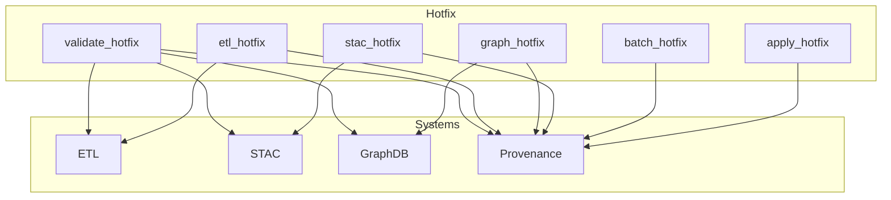

<div align="center">

# 🛠️ **Kansas Frontier Matrix — Hotfix Operations Module**  
`src/pipelines/operations/hotfix/README.md`

**Purpose:**  
Define the rapid-response Hotfix Operations subsystem for KFM pipelines, enabling emergency corrections, rapid ETL patching, metadata fixes, STAC integrity repairs, and graph-safe micro-adjustments under strict governance, reproducibility, and rollback guarantees.

[]()
[]()
[]()
[]()

</div>

---

## 📘 Overview

The **Hotfix Operations Module** provides controlled “surgical intervention” capabilities for the Kansas Frontier Matrix pipeline ecosystem.  
Hotfixes are used when:

- A dataset needs immediate correction  
- An ETL step must be patched without full rebuild  
- A STAC Item or Collection requires metadata correction  
- A graph node or edge is malformed and must be fixed quickly  
- A governance violation must be addressed immediately  
- A rollback would be excessive or slow  

Hotfix operations **must always**:

- Be fully logged  
- Generate governance telemetry  
- Validate schema + provenance after execution  
- Be reversible  
- Not bypass FAIR+CARE rules  
- Pass MCP reproducibility requirements  

This module enables **safe rapid action** without destabilizing the pipeline or knowledge graph.

---

## 📁 Directory Layout

```
src/pipelines/operations/hotfix/
│
├── apply_hotfix.py         # Execute a single hotfix
├── batch_hotfix.py         # Apply multiple atomic hotfixes with rollback-on-failure
├── stac_hotfix.py          # Repair STAC Items/Collections (metadata, assets, links)
├── graph_hotfix.py         # Correct graph nodes/edges under schema constraints
├── etl_hotfix.py           # Emergency ETL micro-patches without full rebuild
└── validate_hotfix.py      # Validate hotfix results, provenance, reversibility
```

---

## 🧱 Architecture Diagram



---

## 🔧 Module Descriptions

### 🛠️ `apply_hotfix.py`
Executes a **single scoped hotfix**.  
Examples of valid hotfixes:

- Replace a malformed STAC property  
- Fix a broken URL  
- Amend a GeoJSON feature’s metadata  
- Correct a graph node label  

Supports:

- Dry-run  
- Logging  
- Reversible transactions  

---

### 📦 `batch_hotfix.py`
Applies **multiple atomic hotfixes** with:

- Automatic rollback-on-failure  
- Lock protection  
- Full governance telemetry  

Use cases:

- Bulk STAC corrections  
- ETL metadata realignment  
- Multi-node graph fixes  

---

### 🗺️ `stac_hotfix.py`
For **STAC repairs**, including:

- Spatial extent corrections  
- Asset path fixes  
- Checksum mismatches  
- Collection-level metadata alignment  

Validates against:

- STAC 1.0.0  
- KFM metadata profile  

---

### 🧬 `graph_hotfix.py`
Safely modifies the **Knowledge Graph**:

- Fix broken edges  
- Patch node properties  
- Repair schema drift  
- Reconcile duplicate nodes  

Enforces Neo4j constraints and provenance capture.

---

### 🧪 `etl_hotfix.py`
Applies emergency fixes to ETL output:

- Patch intermediate datasets  
- Repair partially processed files  
- Correct minor schema violations without full pipeline execution  

Always produces a hotfix manifest.

---

### 📋 `validate_hotfix.py`
Validates:

- Provenance integrity  
- STAC + schema alignment  
- Graph constraints  
- Dataset checksum correctness  
- Reverse-application capability (roll-forward/roll-back)  

---

## 🧾 Governance & Compliance

All hotfixes must adhere to:

- **FAIR+CARE rules**  
- **MCP-DL v6.3 reproducibility**  
- **Trustworthy Rollback Playbook**  
- **STAC/DCAT schema validation**  
- **ROOT-GOVERNANCE.md requirements**  

Every hotfix must generate:

- A telemetry record  
- A manifest update  
- A reversible action trace  

Hotfixes **cannot** be used to bypass policy, ethics, provenance, or schema standards.

---

## 📚 Version History

| Version | Date | Notes |
|--------|--------|--------|
| v10.3.0 | 2025-11-14 | Initial creation of Hotfix Operations README using Markdown Output Protocol |
| v10.2.0 | — | Introduced core hotfix operations framework |
| v10.1.0 | — | Early internal hotfix tooling prototyped |

---

