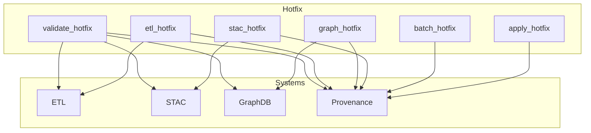
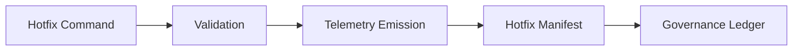

<div align="center">

# 🛠️ **Kansas Frontier Matrix — Hotfix Operations Module**  
`src/pipelines/operations/hotfix/README.md`

**Purpose:**  
Define the fully governed, reversible, telemetry-logged Hotfix Operations subsystem for emergency ETL, STAC, metadata, and graph corrections, adhering to Diamond⁹ Ω / Crown∞Ω operational standards, MCP-DL v6.3 reproducibility, and full FAIR+CARE ethical enforcement.

[]()
[]()
[]()
[]()

</div>

---

## 📘 Overview
The **Hotfix Module** enables *surgical, reversible* operations used when immediate corrective action is required without triggering a full pipeline rebuild or global rollback.

Hotfixes are appropriate when:

- A STAC metadata element is incorrect  
- A graph relationship is malformed  
- A dataset requires an atomic repair  
- A file in a processed pipeline needs patching  
- A governance error must be corrected urgently  

Hotfixes **must**:

- Be reversible  
- Generate telemetry  
- Produce a `hotfix_manifest.json`  
- Pass validation before commit  
- Respect FAIR+CARE  
- Follow MCP-DL v6.3 documentation-first rules  

---

## 📁 Directory Layout

```
src/pipelines/operations/hotfix/
│
├── apply_hotfix.py         # Execute a single well-scoped hotfix
├── batch_hotfix.py         # Apply grouped atomic hotfixes with rollback-on-failure
├── stac_hotfix.py          # STAC metadata + asset repair routines
├── graph_hotfix.py         # Graph node/edge patching under constraints
├── etl_hotfix.py           # Micro-level ETL output patching
└── validate_hotfix.py      # Validates reversibility, provenance, schema integrity
```

---

## 🧱 Architecture Diagram



---

# 🚨 Hotfix Risk Classification (REQUIRED)

| Tier | Description | Allowed in Hotfix | Requirements |
|------|-------------|-------------------|--------------|
| **0** | Read-only actions | ✔ Always | Log + telemetry |
| **1** | Metadata-only edits | ✔ Allowed | Manifest + telemetry |
| **2** | File-level changes (processed data) | ✔ Allowed | Snapshot + manifest + checksum |
| **3** | Graph node/edge modifications | ✔ Allowed with 2-person review | Snapshot + council notice |
| **4** | System-wide changes (schema, raw data, graph rebuild) | ❌ Forbidden | Must use rollback playbook |

This table is mandated for all KFM operational directories that can mutate data.

---

# ⚖️ Allowed vs Forbidden Hotfix Types (REQUIRED)

## ✅ Allowed Hotfixes
- Fixing incorrect STAC metadata  
- Repairing checksum mismatches  
- Fixing malformed graph relationships  
- Patching ETL output files (non-raw)  
- Updating asset paths, spatial extents, temporal extents  
- Correcting a corrupted intermediate output  
- Adjusting telemetry label metadata  

## ❌ Forbidden Hotfixes
- Editing `data/raw/*` files  
- Changing schemas or constraints  
- Mutating ontology definitions  
- Rewriting entire datasets  
- Circumventing governance checks  
- Introducing new graph labels or relationship types  
- Removing historical records  

---

# 🧾 Required Approvals (REQUIRED)

Hotfix actions require:

### ✔ Tier 0–1
- Single developer  
- Logged in governance ledger  
- Auto-approved after telemetry validation

### ✔ Tier 2
- Developer + Reviewer  
- Snapshot before execution  
- Mandatory `hotfix_manifest.json`

### ✔ Tier 3
- Two reviewers  
- FAIR+CARE Council notified  
- Snapshot required  
- Post-fix validation & signoff

### ❌ Tier 4
Cannot be performed. Must follow the **Rollback & STAC Reversion Playbook**.

---

# 📄 Hotfix Manifest Specification (REQUIRED)

Every hotfix MUST generate:

```
hotfix_manifest.json
```

Required fields:

| Field | Description |
|-------|-------------|
| `id` | UUIDv4 hotfix identifier |
| `timestamp` | ISO 8601 timestamp |
| `tier` | Risk tier 0–3 |
| `author` | Developer executing hotfix |
| `reviewers` | Required reviewer list |
| `targets` | Files, STAC items, graph nodes touched |
| `actions` | Atomic operations performed |
| `reversal` | Instructions for undoing the hotfix |
| `checksums_before` | Pre-hotfix hashes |
| `checksums_after` | Post-hotfix hashes |
| `governance` | Council notes, justification |
| `telemetry_id` | Link to telemetry event |

---

# 🔗 Provenance Chain Diagram (REQUIRED)



---

# 🧪 Example Hotfix Scenarios

### 1. **Fix STAC temporal extent**
- Incorrect temporal range fixed  
- Checksums updated  
- Manifest added  
- Telemetry emitted  

### 2. **Repair graph relationship**
- Duplicate edge removed  
- Node attribute corrected  
- Snapshot before change  
- Manifest logged  

### 3. **Patch ETL-derived GeoJSON**
- Corrupt feature replaced  
- File-level checksum updated  
- Validated against schema  

---

# 📦 Hotfix Template Reference

A standard template must exist:

```
src/pipelines/operations/hotfix/hotfix_template.md
```

This template defines headings for:

- Purpose  
- Target  
- Actions  
- Pre-checks  
- Post-checks  
- Reversal steps  
- Telemetry IDs  

---

# 🔍 Validation Matrix

| Component | Auto Validation | Manual Required | Notes |
|-----------|-----------------|-----------------|-------|
| STAC Hotfix | ✔ | Tier 2–3 | JSON Schema + checksum |
| Graph Hotfix | ✔ | Tier 3 | Neo4j constraints |
| ETL File Hotfix | ✔ | Tier 2 | GeoJSON/CSV schema |
| Manifest | ✔ | — | Must match schema |
| Telemetry | ✔ | — | CARE compliance |

---

# 🔗 Cross-Module Integration Notes

- **Rollback Integration:** Hotfixes must not replace rollback; Tier 4 requires rollback-use.  
- **Validation Pipeline:** Uses `validate_hotfix.py` + global `validate.py`.  
- **STAC Integration:** Uses `stac_hotfix.py` and STAC validation schemas.  
- **Graph Integration:** Works through `graph_hotfix.py` to preserve constraints.  
- **Telemetry Integration:** Emits Focus Mode v2-compatible events.  

---

# 🧾 Governance & Compliance

This module is governed by:

- **ROOT-GOVERNANCE.md**  
- **FAIR+CARE Council**  
- **AI Safety & Provenance Standards**  
- **MCP-DL v6.3** documentation-first rules  
- **Rollback & STAC Reversion Playbook**  
- CI validations (`docs-lint`, `graph-integrity`, `faircare-validate`, `rollback-tests`, `stac-validate`)  

---

# 📚 Version History

| Version | Date | Notes |
|--------|--------|--------|
| v10.3.1 | 2025-11-14 | Rebuilt with all required sections, diagrams, and compliance layers |
| v10.3.0 | 2025-11-14 | Initial creation under Markdown Output Protocol |
| v10.2.0 | — | Introduced foundational hotfix tools |
| v10.1.0 | — | Early internal prototypes |

---
