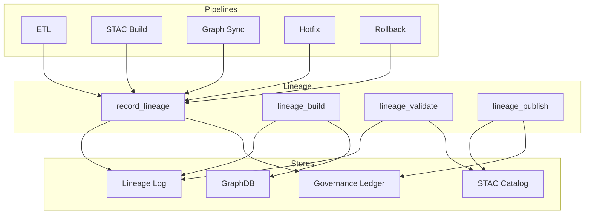
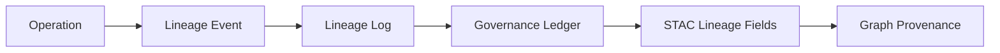

<div align="center">

# 🧬 **Kansas Frontier Matrix — Data Lineage Operations Module**  
`src/pipelines/operations/lineage/README.md`

**Purpose:**  
Define, track, validate, and publish end-to-end data lineage for ETL pipelines, STAC assets, graph nodes, hotfix operations, and rollback events—ensuring complete provenance, reproducibility, and FAIR+CARE alignment across KFM v10.3.

[]()
[]()
[]()
[]()

</div>

---

## 📘 Overview

The **Lineage Operations Module** provides traceability for every data transformation within the Kansas Frontier Matrix.  
Lineage is mandatory for:

- ETL steps (raw → processed)  
- STAC Item and Collection generation  
- GraphDB node and edge creation  
- Hotfix operations (Tier 0–3)  
- Rollback + snapshot creation  
- Telemetry and Focus Mode outputs  
- Dataset provenance (source → artifact → publication)  

All lineage events are recorded in:

- `lineage_log.jsonl` (append-only)  
- The governance ledger  
- STAC `lineage` fields  
- Neo4j `PROVENANCE` relationships  

Lineage enables:

- Full reproducibility  
- Forensic debugging  
- FAIR+CARE ethical auditability  
- Validation of derivative datasets  
- Compliance with MCP-DL v6.3 scientific-method rigor  

---

## 📁 Directory Layout

```
src/pipelines/operations/lineage/
│
├── record_lineage.py      # Create lineage events from any pipeline action
├── lineage_build.py       # Build lineage chains and dependency graphs
├── lineage_validate.py    # Validate completeness, integrity, and schema
├── lineage_publish.py     # Export lineage as STAC + governance artifacts
└── lineage_utils.py       # Helpers for hashing, signatures, IDs, timestamps
```

---

## 🧱 Lineage Architecture Diagram



---

## 🧬 Lineage Event Model

Each lineage entry is a structured record emitted during a meaningful operation.

### Required fields:

| Field | Description |
|-------|-------------|
| `id` | UUIDv4 lineage event ID |
| `timestamp` | ISO 8601 UTC |
| `actor` | CLI user, automation agent, or service |
| `operation` | Operation name (etl_run, stac_build, graph_sync, hotfix, etc.) |
| `inputs` | Upstream files, nodes, assets |
| `outputs` | Newly created artifacts |
| `checksum_before` | Hashes of all inputs |
| `checksum_after` | Hashes of all outputs |
| `provenance_links` | Source-to-derivative chain |
| `governance` | Notes, approvals, CARE flags |
| `reversal` | Reversible action description |
| `tier` | Risk tier (0–3) |

All lineage events must be:

- Immutable  
- Append-only  
- Hash-verified  
- Ledger-registered  

---

## 🔗 Lineage Event Chain Diagram



---

## 🔒 Required Approvals

Lineage operations themselves do not require approval, but lineage must reflect approval requirements of the triggering operation:

- ETL / STAC / Graph Sync → Auto-approved  
- Hotfix Tier 2 → Developer + Reviewer  
- Hotfix Tier 3 → Two reviewers + council notification  
- Rollback → Same approval pathway defined in rollback playbook  

**Lineage must always record the approvals.**

---

## 🧾 Lineage Manifest Requirements

Lineage manifests are produced by `lineage_publish.py` in:

```
data/lineage/manifests/
```

Required manifest fields:

- Lineage chain ID  
- List of all lineage events in chain  
- Checksums (pre/post)  
- Timestamp range (start → end)  
- Validity status  
- CAR/FAIR flags  
- Reproducibility proof (hash chain)  

---

## 🧪 Validation

`lineage_validate.py` ensures:

- No missing upstream events  
- All ETL outputs have documented origins  
- All STAC items contain lineage references  
- All graph nodes/edges have provenance links  
- All hotfix operations have manifests  
- Hash chain integrity is intact  
- No broken links to raw sources  

Validation runs automatically in:

- `graph-integrity.yml`  
- `stac-validate.yml`  
- `faircare-validate.yml`  
- `lineage-integrity.yml`  

---

## 🌐 Publishing

`lineage_publish.py` exports lineage to:

- STAC Items (`properties.lineage`)  
- STAC Collections (`summaries.lineage`)  
- Governance ledger  
- Neo4j provenance relationships  
- Optional external DCAT feed  

Publishing enforces:

- CARE labels  
- SPDX license alignment  
- Timestamp normalization  
- Reproducibility guarantees  

---

## 🛡️ Governance & Compliance

This module is governed by:

- **ROOT-GOVERNANCE.md**  
- **Diamond⁹ Ω / Crown∞Ω Operational Standards**  
- **FAIR+CARE ethical requirements**  
- **MCP-DL v6.3 scientific methodology**  
- **STAC/DCAT lineage metadata rules**  
- CI workflows enforcing lineage integrity  

Every transformation in KFM must be traceable through this module.

---

## 📚 Version History

| Version | Date | Notes |
|--------|--------|--------|
| v10.3.1 | 2025-11-14 | Fully rebuilt README with required lineage rules and diagrams |
| v10.3.0 | 2025-11-14 | Initial creation under the Markdown Output Protocol |
| v10.2.0 | — | Introduced lineage logging utilities |
| v10.1.0 | — | Began lineage tracking prototypes |

---

