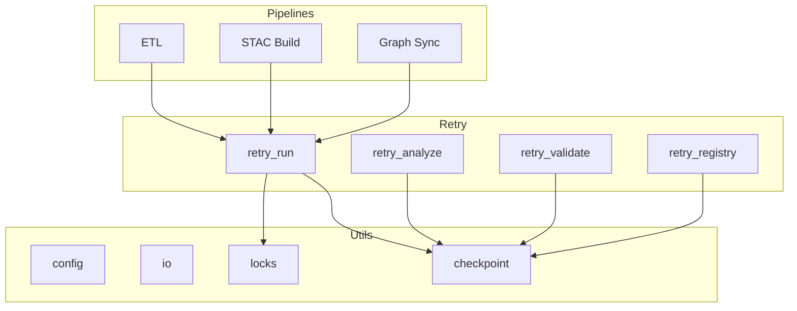
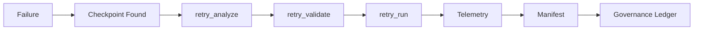

<div align="center">

# 🔁 **Kansas Frontier Matrix — Retry & Recovery Operations Module**  
`src/pipelines/operations/retries/README.md`

**Purpose:**  
Define the deterministic, checkpoint-based retry system for KFM v10.3 pipelines, enabling safe re-execution of partially completed ETL tasks, STAC builds, graph sync operations, and file-level derivations without corrupting datasets or violating governance rules.

[]()
[]()
[]()
[]()

</div>

---

## 📘 Overview

The **Retry & Recovery Operations Module** provides the official mechanism for **resuming failed or interrupted pipelines** using **MCP-compliant checkpoints**, **sandboxed replays**, and **atomic state validation**.

Used when:

- A pipeline run fails mid-step  
- A resource outage interrupts long-running ETL  
- A STAC build partially completes  
- Graph sync halts on constraint error  
- CI interruption requires deterministic replay  

Retry operations **must**:

- Be reproducible  
- Start from last known clean checkpoint  
- Validate all upstream and downstream states  
- Emit telemetry + lineage event  
- Never re-execute completed non-idempotent operations  
- Never advance state if corruption is detected  

This module interacts closely with:

- `etl_retry.py` (CLI)  
- `checkpoint.py` (utils)  
- Lineage subsystem  
- Governance ledger  
- Rollback subsystem  

---

## 📁 Directory Layout

```
src/pipelines/operations/retries/
│
├── retry_run.py            # Primary retry execution engine
├── retry_analyze.py        # Analyze partial state and suggest recovery paths
├── retry_validate.py       # Validate checkpoint integrity and upstream chain
├── retry_registry.py       # Registry of checkpoints and recovery metadata
└── retry_utils.py          # Hashing, locking, transaction guards
```

---

## 🧱 Retry Architecture Diagram



---

# 🧬 Retry Event Specification (REQUIRED)

Each retry attempt produces a structured lineage + telemetry record:

| Field | Description |
|-------|-------------|
| `retry_id` | UUID for the retry operation |
| `checkpoint_id` | Associated checkpoint being resumed |
| `timestamp_start` | ISO 8601 |
| `timestamp_end` | ISO 8601 |
| `actor` | Developer or automated runner |
| `reason` | Why retry was triggered |
| `resume_point` | Name of MCP checkpoint |
| `actions` | Steps taken during recovery |
| `lineage_links` | Upstream → downstream relationship |
| `validation` | Pass/fail status of checkpoint validation |
| `governance` | FAIR+CARE flags, notes |
| `telemetry_id` | Focus Mode telemetry record |

Events must be **append-only**, cryptographically hashed, and ledger-registered.

---

# 🔒 Checkpoint Rules (REQUIRED)

A checkpoint is **the only allowed resume target**.

Checkpoint requirements:

- Created **after every critical step**  
- Contains:
  - hashes of all inputs + outputs  
  - timestamps  
  - graph node counts  
  - STAC item counts  
  - failure propagation map  
- Immutable and versioned  
- Stored under:  
  ```
  data/checkpoints/
  ```

Invalid checkpoints (hash mismatch, missing file, mismatch to lineage) **must not** be resumed.

---

# ⚠️ Allowed vs Forbidden Retry Actions (REQUIRED)

## ✅ Allowed
- Restart ETL step from last clean checkpoint  
- Rebuild STAC Items created **after** the checkpoint  
- Re-run graph sync **only for effected nodes**  
- Re-validate ETL → STAC chain  
- Perform sandbox replays in CI  

## ❌ Forbidden
- Restart pipeline from arbitrary step  
- Re-execute non-idempotent operations (e.g., node creation)  
- Attempt resume if **any** hash mismatch exists  
- Override checkpoint metadata  
- Resume past a hotfix or rollback boundary  

Retries **must not** bypass governance.

---

# 🧾 Required Approvals

Retry operations require escalating review based on risk:

### Tier 0 (pure retry, no mutations)
- Auto-approved  
- Telemetry logged  

### Tier 1 (retry with STAC or graph rebuild)
- Developer + reviewer  
- Must verify checkpoint validity  

### Tier 2 (retry after hotfix boundary)
- Two reviewers  
- Governance Council notified  

### Forbidden
- Any retry past a rollback boundary  
- Requires **rollback**, not retry  

---

# 🧷 Retry Manifest Specification

Every retry run must produce:

```
retry_manifest.json
```

Required fields:

- `retry_id`  
- `checkpoint_id`  
- `tier`  
- Input/output hashes  
- Resume step  
- Steps executed  
- Telemetry ID  
- Reversibility instructions  
- Governance annotations  

The manifest is stored in:

```
data/retries/manifests/
```

---

# 🔗 Retry Lifecycle Diagram (REQUIRED)



---

# 🧪 Validation

`retry_validate.py` enforces:

- Checkpoint hash integrity  
- No broken upstream lineage  
- No hotfix or rollback conflicts  
- No STAC or graph drift  
- No timestamp gaps  
- Deterministic reproducibility  

Runs in CI:

- `retry-integrity.yml`  
- `pipeline-consistency.yml`  
- `graph-integrity.yml`  
- `stac-validate.yml`  

---

# 🌐 Integration With Other Subsystems

- **Hotfix Module:** retry must respect hotfix boundaries  
- **Rollback Module:** retry is forbidden past rollback edge  
- **Lineage Module:** every retry emits lineage  
- **CLI:** implemented by `etl_retry.py` with unified error model  
- **Telemetry:** retry events feed Focus Mode v2 semantic monitoring  

---

# 🛡️ Governance & Compliance

All retry operations must comply with:

- FAIR+CARE rules  
- MCP-DL v6.3 scientific reproducibility  
- Diamond⁹ Ω / Crown∞Ω operational certification  
- Trustworthy Ops Playbook  
- CI validation workflows  

Retries must never compromise lineage, provenance, ethics, or data stability.

---

# 📚 Version History

| Version | Date | Notes |
|--------|--------|--------|
| v10.3.1 | 2025-11-14 | Added full retry classification, lifecycle diagrams, manifests, governance rules |
| v10.3.0 | 2025-11-14 | Initial creation of Retry Operations module |
| v10.2.0 | — | Introduced checkpointing utilities |
| v10.1.0 | — | First retry logic conceptual prototypes |

---

