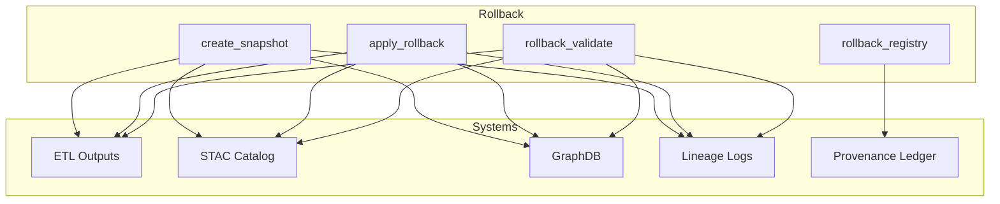
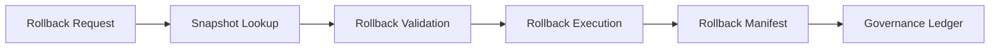
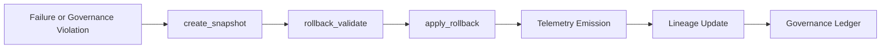

<div align="center">

# 🧵 **Kansas Frontier Matrix — Trustworthy Rollback Operations**  
`src/pipelines/operations/rollback/README.md`

**Purpose:**  
Define the complete rollback subsystem governing state restoration, snapshot creation, STAC catalog reversion, graph correction, and provenance-aligned reversal of KFM pipeline states. Implements the *Trustworthy Rollback & STAC Reversion Playbook* and guarantees deterministic, reversible, auditable rollback events.

[]()
[]()
[]()
[]()

</div>

---

## 📘 Overview

Rollback Operations provide **state reversal** for any KFM subsystem:

- ETL results  
- STAC Items & Collections  
- Neo4j GraphDB state  
- Processed datasets  
- Lineage logs & provenance events  
- Pipeline manifests  
- Telemetry snapshots  

Rollback is triggered when:

- A hotfix fails or becomes invalid  
- A pipeline run corrupts output  
- A graph sync produces inconsistent nodes/edges  
- A STAC build produces invalid Items  
- A governance violation is detected  
- System integrity requires reverting to a trusted baseline  

Rollback operations **must always**:

- Create a snapshot **before** any mutation  
- Validate snapshot integrity  
- Execute reversibly  
- Emit governance telemetry  
- Produce a rollback manifest  
- Update lineage and DCAT/STAC provenance  
- Pass MCP-DL v6.3 reproducibility standards  

Rollback is the **highest authority** operation in KFM pipelines.

---

## 📁 Directory Layout

```
src/pipelines/operations/rollback/
│
├── create_snapshot.py        # Create a system-wide rollback snapshot
├── apply_rollback.py         # Restore system to snapshot ID
├── rollback_validate.py      # Validate snapshot integrity and state drift
├── rollback_registry.py      # Index of available rollback snapshots
└── rollback_utils.py         # Hashing, locking, freeze-state utilities
```

---

## 🧱 Rollback Architecture Diagram



---

# 🧵 Rollback Risk Classification (REQUIRED)

| Tier | Description | Allowed? | Requirements |
|------|-------------|----------|--------------|
| **0** | Read-only snapshot inspection | ✔ Always | Log + telemetry |
| **1** | Revert metadata, STAC Items | ✔ Allowed | Validate + manifest |
| **2** | Revert processed datasets | ✔ Allowed | Snapshot + reviewer |
| **3** | Revert graph nodes/edges | ✔ Allowed with two reviewers | Council notification |
| **4** | Full system rollback | ✔ Allowed with full council review | Multi-signature approval |

Rollback is the **only operation permitted for Tier 4** changes.

---

# 🧷 Snapshot Specification (REQUIRED)

Every snapshot created by `create_snapshot.py` must include:

| Component | Description |
|-----------|-------------|
| ETL output freeze | Full copy of processed data |
| STAC freeze | Complete frozen STAC structure |
| GraphDB export | Node/edge dump + labels + constraints |
| Provenance freeze | Lineage chain + ledger entries |
| Checksums | SHA256 hashes for all artifacts |
| Telemetry | State of metrics at snapshot creation |
| Manifest | Snapshot manifest file |

All snapshots stored under:

```
data/rollback/snapshots/
```

Snapshots must be **immutable**.

---

# 📄 Rollback Manifest Specification (REQUIRED)

Each rollback action produces:

```
rollback_manifest.json
```

Containing:

- `rollback_id` (UUID)  
- `snapshot_id`  
- `timestamp_start`  
- `timestamp_end`  
- `requested_by`  
- `reviewers`  
- `tier`  
- `restored_components`  
- `hash_chain_before`  
- `hash_chain_after`  
- `telemetry_id`  
- `governance_notes`  
- `reversal_instructions`  

Location:

```
data/rollback/manifests/
```

---

# 🔗 Provenance Chain Diagram (REQUIRED)



---

# 🔁 Rollback Lifecycle Diagram (REQUIRED)



---

# 🧪 Validation

`rollback_validate.py` ensures:

- Snapshot hashes match logged state  
- No drift between snapshot and current datasets  
- STAC validity (schema, links, asset checks)  
- Graph consistency (constraints, labels, node counts)  
- Lineage continuity  
- Telemetry correctness  
- Reproducibility of restored state  

CI pipelines:

- `rollback-tests.yml`  
- `stac-validate.yml`  
- `graph-integrity.yml`  
- `faircare-validate.yml`  

---

# 🧬 Integration With Other Subsystems

- **Retry System:** retries must *stop* at rollback boundaries  
- **Hotfix Module:** hotfixes require snapshots before execution  
- **Lineage Module:** rollback emits lineage chain entries  
- **STAC Pipeline:** rollback restores STAC Items + Collections  
- **Graph Sync:** restores node/edge/constraint state  
- **Telemetry:** rollback triggers Focus Mode v2 recovery events  

Rollback is the **central authority** for system safety.

---

# 🛡️ Governance & Compliance

Rollback operations must comply with:

- **Diamond⁹ Ω / Crown∞Ω Operational Certification**  
- **FAIR+CARE ethical and provenance rules**  
- **MCP-DL v6.3 scientific reproducibility**  
- **ROOT-GOVERNANCE.md**  
- **Trustworthy Rollback & STAC Reversion Playbook**  
- CI enforcement (docs-lint, rollback-tests, lineage-integrity, stac-validate)

Rollback operations are logged, audited, and must remain reversible.

---

## 📚 Version History

| Version | Date | Notes |
|--------|--------|--------|
| v10.3.2 | 2025-11-14 | Full rebuild with compliance-required sections and diagrams |
| v10.3.1 | 2025-11-14 | Initial version aligned with v10.3 rollback playbook |
| v10.2.0 | — | Rollback subsystem integrated with lineage & STAC |
| v10.1.0 | — | Early snapshot pipeline drafted |

---

