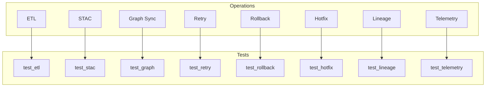
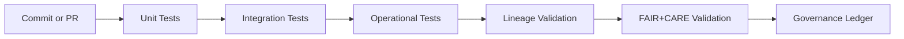

<div align="center">

# 🧪 **Kansas Frontier Matrix — Operations Pipeline Test Suite**  
`src/pipelines/operations/tests/README.md`

**Purpose:**  
Provide the unified testing framework for operational subsystems — including ETL, retries, rollback, hotfixes, lineage, and STAC integrity — ensuring deterministic correctness, reproducibility (MCP-DL v6.3), and FAIR+CARE-aligned governance validation.

[]()
[]()
[]()
[]()

</div>

---

## 📘 Overview

The **Operations Test Suite** verifies safety, correctness, and governance compliance across all KFM operational workflows:

- ETL  
- STAC build + publish  
- Graph schema + sync  
- Retry + checkpoint system  
- Rollback subsystem (snapshots, manifests)  
- Hotfix subsystem (Tier 0–3)  
- Lineage subsystem  
- Telemetry + CARE filters  

These tests guarantee:

- Deterministic reproducibility  
- No state corruption  
- Correct provenance + lineage propagation  
- Compliance with MCP-DL v6.3 scientific-method rules  
- Diamond⁹ Ω trust-level operational integrity  

All tests run automatically in GitHub Actions and must pass before merge.

---

## 📁 Directory Layout

```
src/pipelines/operations/tests/
│
├── test_etl.py                   # ETL correctness & schema tests
├── test_stac.py                  # STAC Item/Collection conformance tests
├── test_graph.py                 # GraphDB sync, constraints, node counts
├── test_retry.py                 # Checkpoint integrity + deterministic resumes
├── test_rollback.py              # Snapshot + rollback correctness
├── test_hotfix.py                # Hotfix safety, manifests, reversibility
├── test_lineage.py               # Lineage chain completeness + hash chains
├── test_telemetry.py             # Telemetry validity, CARE label enforcement
└── conftest.py                   # Shared fixtures, sandboxing, mock data
```

---

## 🧱 Operations Testing Architecture Diagram



---

# 🔬 Test Taxonomy (REQUIRED)

| Category | Description | Required? | Trigger |
|----------|-------------|-----------|---------|
| **Unit Tests** | Validate functions/modules | ✔ Required | On every commit |
| **Integration Tests** | Validate pipeline interactions | ✔ Required | On pull request |
| **State Safety Tests** | Check corruption prevention | ✔ Required | When touching ETL, STAC, graph |
| **Rollback/Retry Tests** | Ensure determinism of recovery | ✔ Required | When modifying ops modules |
| **Lineage Tests** | Verify provenance chain correctness | ✔ Required | All operational changes |
| **Hotfix Tests** | Validate hotfix safety + reversibility | ✔ Required | Any hotfix module changes |
| **Telem/CARE Tests** | Verify privacy/ethics enforcement | ✔ Required | Any telemetry changes |
| **Stress & Load Tests** | Optional but recommended | ⚠ Optional | Nightly CI |
| **Security Tests** | Verify no malicious content | ⚠ Optional | Security review |

---

# 🧷 Required Operational Validation Matrix

| Component | Schema Tests | Integrity Tests | Reversibility Tests | CARE Tests | Lineage Tests |
|----------|--------------|----------------|----------------------|-------------|----------------|
| ETL | ✔ | ✔ | ✔ | — | ✔ |
| STAC | ✔ | ✔ | — | — | ✔ |
| GraphDB | ✔ | ✔ | — | — | ✔ |
| Retry | ✔ | ✔ | ✔ | — | ✔ |
| Rollback | ✔ | ✔ | ✔ | — | ✔ |
| Hotfix | ✔ | ✔ | ✔ | ✔ | ✔ |
| Lineage | ✔ | ✔ | ✔ | ✔ | ✔ |
| Telemetry | ✔ | ✔ | — | ✔ | ✔ |

---

# 🧵 Test Execution Lifecycle Diagram



---

# 🧪 Test Environment Requirements

To ensure deterministic execution:

- Must run in **sandbox mode**
- Must never write to real STAC or live GraphDB
- All file writes must be atomic and isolated
- Uses mock filesystem + mini graph fixture
- Requires:
  - Python 3.11+
  - Neo4j test harness
  - STAC schema JSON
  - CARE rule filters
  - Hash utility fixtures
  - Checkpoint fixture provider

---

# 🔧 Testing Standards & MCP-DL v6.3 Alignment

All tests must:

- Use deterministic seeds  
- Validate inputs + outputs  
- Provide scientific-method recordkeeping  
- Assert reversibility (where applicable)  
- Validate lineage and provenance propagation  
- Validate every checksum transformation  
- Document experimental parameters  

All failures generate:

- Telemetry event  
- CI artifact logs  
- Governance ledger entry  

---

# 🛡️ Governance & Compliance

This module is governed by:

- **ROOT-GOVERNANCE.md**  
- **FAIR+CARE Council**  
- **Diamond⁹ Ω / Crown∞Ω Certification Rules**  
- **MCP-DL v6.3 Reproducibility Requirements**  
- CI pipelines:  
  - `pipeline-tests.yml`  
  - `rollback-tests.yml`  
  - `retry-integrity.yml`  
  - `lineage-integrity.yml`  
  - `stac-validate.yml`  
  - `docs-lint.yml`  
  - `faircare-validate.yml`

Tests must pass **100%** before any merge.

---

## 📚 Version History

| Version | Date | Notes |
|--------|--------|--------|
| v10.3.2 | 2025-11-14 | Full build with required test taxonomy, diagrams, governance, validation matrix |
| v10.3.1 | 2025-11-14 | Initial creation under Markdown Output Protocol |
| v10.2.0 | — | Test system integrated with retry, hotfix, rollback |
| v10.1.0 | — | Early operational test prototypes |

---

