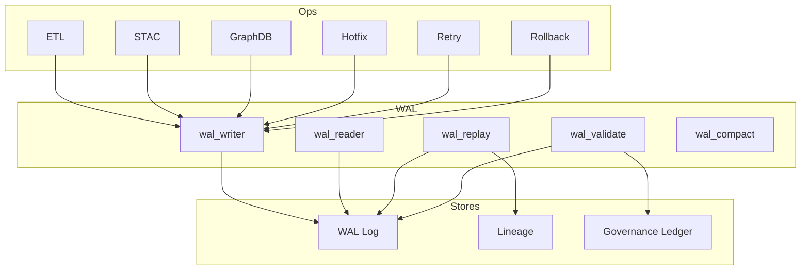
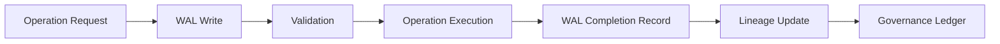

<div align="center">

# 📓 **Kansas Frontier Matrix — Write-Ahead Log (WAL) Operations Module**  
`src/pipelines/operations/wal/README.md`

**Purpose:**  
Provide the authoritative implementation of the Write-Ahead Log system for all KFM operational pipelines — ensuring deterministic, reversible, auditable, and governance-compliant state transitions. WAL entries guarantee that every mutating action is logged *before* execution, enabling replay, undo, and forensic lineage reconstruction.

[]()
[]()
[]()
[]()

</div>

---

## 📘 Overview

The **Write-Ahead Log (WAL)** subsystem is the foundation of safe, deterministic KFM pipeline execution.

Every mutating operation — ETL write, STAC creation, graph update, checkpoint write, hotfix, retry, or rollback — must:

1. **Record a WAL entry first**  
2. **Validate the entry**  
3. **Execute the action**  
4. **Record completion**  
5. **Update lineage + governance**

The WAL provides:

- **Replay capability** (for crash recovery, retries, CI simulations)  
- **Undo capability** (used by rollback + hotfix reversibility)  
- **Forensic audit trail**  
- **Deterministic pipeline runs**  
- **Integration with lineage chains**  
- **FAIR+CARE compliance for provenance metadata**  

WAL entries are immutable and append-only.

---

## 📁 Directory Layout

```
src/pipelines/operations/wal/
│
├── wal_writer.py            # Create WAL entries
├── wal_reader.py            # Stream/read WAL for replay
├── wal_replay.py            # Execute WAL replays (deterministic)
├── wal_validate.py          # Validate WAL entry integrity + hash chains
├── wal_compact.py           # Optional compactor for large WAL logs
└── wal_utils.py             # Timestamps, hashing, signatures, serialization
```

---

## 🧱 WAL Architecture Diagram



---

# 📓 WAL Event Model (REQUIRED)

Each WAL record describes one atomic operation.

### Required Fields

| Field | Description |
|-------|-------------|
| `wal_id` | UUIDv4 WAL entry ID |
| `timestamp` | ISO 8601 UTC |
| `operation` | Operation type (etl_step, stac_build, graph_write, hotfix, retry, rollback, etc.) |
| `actor` | Developer, CI, or system agent |
| `pre_state_hash` | Hash of all inputs before mutation |
| `post_state_expected` | Hash expected after mutation |
| `payload` | Exact actions to be performed |
| `reversal` | Steps to undo operation |
| `tier` | Risk tier 0–3 |
| `governance` | CARE metadata + approvals |
| `lineage_links` | Links to prior lineage chain |
| `telemetry` | Telemetry ID for Focus Mode |

All WAL entries are:

- Immutable  
- Signed  
- Hash-linked (block-chain–like chain)  
- Stored append-only  

---

# 🔒 WAL Boundary Rules (REQUIRED)

WAL **must be used** for any operation that:

- Writes files in `data/processed/`  
- Modifies STAC Items/Collections  
- Writes to GraphDB  
- Writes ETL outputs  
- Performs hotfix or retry action  
- Creates or restores rollback snapshots  
- Modifies lineage chains  
- Updates the governance ledger  

Forbidden to bypass WAL.

---

# 🔁 WAL Replay Rules (REQUIRED)

Replay events enforce:

- Deterministic reproduction of failed pipelines  
- CI validation of pipeline correctness  
- Safe reproduction of ETL → STAC → Graph transformations  
- Auto-halt if hashes mismatch  
- Auto-quarantine of corrupted entries  
- No side effects during CI replays (sandbox mode only)

Replays are triggered by:

- `retry_replay.py`  
- `wal_replay.py`  
- CI simulation environments  
- Post-incident forensic audits  

---

# 📄 WAL Log Specification (REQUIRED)

WAL logs stored in:

```
data/wal/
```

File format:

- Newline-delimited JSON (`*.jsonl`)  
- Immutable  
- Hash-linked chain  
- Enforced by `wal_validate.py`

Log rotation:

- Old WAL segments stored under `data/wal/archive/`  
- Compacting handled by `wal_compact.py`  

---

# 🔗 WAL Provenance Chain (REQUIRED)



---

# 🧬 WAL Integration With Other Subsystems

### **Rollback**
- Rollback uses WAL reversal steps  
- Snapshots capture WAL state  
- WAL ensures reversible actions

### **Retries**
- Retries use WAL replay to restore exact operation state  
- Checkpoint boundaries validated against WAL chain

### **Hotfix**
- Hotfixes write mandatory WAL entries (Tier-graded)

### **Lineage**
- WAL → lineage → governance  
- WAL ensures reproducible chain of derivations

### **STAC**
- WAL logs all STAC Items/Collections created/modified

### **GraphDB**
- Graph writes are WAL-mandatory for recoverability

---

# 🧪 Validation

`wal_validate.py` ensures:

- WAL chain hash integrity  
- No broken links between WAL segments  
- All reversible operations include reversal steps  
- Payload matches executed action  
- CARE metadata is correct  
- Timestamps are monotonic  
- Signatures are valid  
- No unauthorized writes

CI workflows enforcing:

- `wal-integrity.yml`  
- `retry-integrity.yml`  
- `rollback-tests.yml`  
- `lineage-integrity.yml`  
- `stac-validate.yml`  
- `docs-lint.yml`  

---

# 🛡️ Governance & Compliance

This module is governed by:

- **Diamond⁹ Ω / Crown∞Ω Operational Standards**  
- **FAIR+CARE metadata ethics**  
- **MCP-DL v6.3 reproducibility rules**  
- **Trustworthy Rollback & STAC Reversion Playbook**  
- **ROOT-GOVERNANCE.md**  

WAL violations are considered *critical* governance failures.

---

## 📚 Version History

| Version | Date | Notes |
|--------|--------|--------|
| v10.3.2 | 2025-11-14 | Full WAL implementation + mandatory sections + diagrams |
| v10.3.1 | 2025-11-14 | Initial module documentation under Markdown Output Protocol |
| v10.2.0 | — | WAL integrated with retry + hotfix pipelines |
| v10.1.0 | — | Early WAL prototypes introduced |

---

