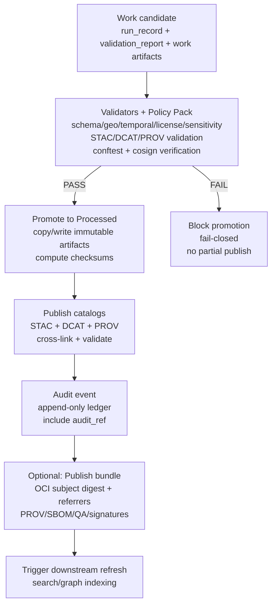

# Promotion Pipeline (`src/pipelines/promotion/`)


> [!IMPORTANT]
> **Promotion is KFM’s publishing gate. It is fail-closed.**
>
> If any required artifact, validation, policy decision, or catalog output is missing/invalid, **promotion MUST stop** and MUST NOT partially publish.

> [!WARNING]
> **Sensitive datasets require extra governance.**
>
> If a dataset is flagged sensitive (e.g., private individuals, culturally restricted knowledge, sensitive site locations), promotion MUST enforce the configured *restriction/redaction route* and MAY require human approval before any public publication.

---

## Purpose
The **Promotion Pipeline** is the canonical “publish” step that moves a dataset version from **Work → Processed/Public** while producing the *evidence artifacts* required for downstream systems:

- **Immutable, checksummed processed artifacts** (the files that runtime can serve)
- **Catalogs**: **STAC** (spatial assets), **DCAT** (dataset metadata), **PROV** (lineage/provenance)
- **Audit ledger event** (for governance + Focus Mode “audit_ref” traceability)
- **Optional content-addressed bundle publication** (e.g., OCI registry artifact + referrers for PROV/SBOM/QA/signatures)

Promotion exists to guarantee KFM’s core promise:
> **Nothing becomes “publicly usable” unless it is versioned, validated, attributable, and provable.**

---

## Scope
This README documents:
- **What promotion means in KFM**
- **The Promotion Contract** (required inputs/outputs)
- **Validation gates** and failure modes
- **Interfaces/ports** promotion should use (trust membrane compliance)
- **CI/CD expectations** (merge-blocking gates, acceptance harness)
- **Operational guidance** (idempotency, rollback/supersession, observability)

Out of scope:
- Implementation details of upstream ETL (ingest/normalize pipelines)
- Downstream API/UI behavior (except where promotion artifacts are prerequisites)

---

## Audience
- Pipeline engineers & maintainers (implementing/operating promotion)
- Governance reviewers (verifying required gates exist)
- Data contributors (understanding what is required for publishing)
- Security/DevOps (attestation + provenance verification responsibilities)

---

## Non-negotiables (KFM invariants)
These are **MUST NOT REGRESS** constraints:

1. **Fail-closed by default**  
   Promotion denies by default unless all required gates pass.

2. **Trust membrane compliance**  
   - Promotion code must interact with storage/catalog/graph via **interfaces/ports** (no direct “reach around” to infra from higher layers).
   - No client/UI bypasses the governed API boundary (promotion artifacts feed the API; the UI never reads raw stores directly).

3. **Catalog-first evidence**  
   Promotion MUST emit and validate:
   - **STAC** where spatial assets exist
   - **DCAT** for dataset metadata distribution
   - **PROV** linking raw → derived outputs

4. **Checksum discipline**  
   - Promotion MUST compute and store checksums for published artifacts.
   - Downstream serving SHOULD verify checksums before serving critical artifacts.

5. **Governance fields required**  
   License, attribution, and sensitivity classification must exist and validate.

6. **Auditability**  
   Promotion MUST write an audit event containing at minimum: dataset_id, version/run id(s), actor, decision summary, and references to evidence artifacts.

---

## Repository context
Promotion lives in the `src/pipelines/` subsystem.

### Related repo paths (expected)
| Area | Path | What lives here |
|---|---|---|
| Data domains | `data/<domain>/{raw,work,processed}/` | Raw sources, intermediate work outputs, and final processed artifacts |
| Catalogs (STAC/DCAT/PROV) | `data/stac/`, `data/catalog/dcat/`, `data/prov/` | Published catalogs and provenance bundles |
| Schemas | `schemas/` | JSON Schemas for STAC/DCAT/PROV + KFM receipts/manifests |
| Pipelines | `src/pipelines/` | ETL + validation + promotion code |
| Graph build | `src/graph/` | Lineage graph build/sync |
| API boundary | `src/server/` | Governed API services (no direct DB access by frontend) |
| UI | `web/` | React/Map UI |

---

## What “promotion” means in KFM
Promotion is the boundary where KFM transitions from:
- **Work**: intermediate/experimental outputs (not yet “serving-grade”), to
- **Processed/Public**: immutable, validated outputs that runtime systems can serve.

Promotion is responsible for:
1. **Selecting the candidate** dataset version/run (from `data/<domain>/work/…`)
2. **Validating** the candidate against:
   - schema checks
   - geospatial/temporal validity checks
   - governance requirements (license, sensitivity)
   - policy pack decisions (OPA/Rego/conftest)
   - catalog existence/validity (STAC/DCAT/PROV)
3. **Publishing processed artifacts** with **checksums**
4. **Publishing catalogs** and ensuring they cross-link correctly
5. **Emitting an audit event** (append-only semantics)
6. **Triggering downstream refresh** (graph/search indices) after successful promotion

---

## Data zones
| Zone | Location | Mutability | Who can read it | Typical contents |
|---|---|---:|---|---|
| Raw | `data/<domain>/raw/` | Read-only once landed | Internal + governed services | Original source files + raw manifests |
| Work | `data/<domain>/work/` | Mutable during processing | Internal + CI + maintainers | Intermediate outputs + validation reports |
| Processed | `data/<domain>/processed/` | **Immutable** | Runtime systems | Serving-grade artifacts + checksums |

---

## Promotion Contract
Promotion operates on a *single, explicit* dataset candidate described by a **Run Record / Manifest**.

### Required inputs (minimum)
| Artifact | Required | Purpose | Typical location |
|---|:---:|---|---|
| `run_record.json` (or `run_manifest.json`) | ✅ | Declares inputs, outputs, code identity, and references to validations/provenance | `data/<domain>/work/<dataset_id>/run_record.json` |
| `validation_report.json` | ✅ | Machine-readable proof of gate results | `data/<domain>/work/<dataset_id>/validation_report.json` |
| Work artifacts | ✅ | Candidate outputs to be promoted | `data/<domain>/work/<dataset_id>/...` |
| License & attribution fields | ✅ | Legal + ethical requirements | in manifest/catalogs |
| Sensitivity classification | ✅ | Governance routing | in manifest/catalogs |
| STAC/DCAT/PROV bundles | ✅ | Publication metadata + lineage | `data/stac/`, `data/catalog/dcat/`, `data/prov/` (or staged in work then published) |

### Required outputs (minimum)
| Output | Required | Notes |
|---|:---:|---|
| Processed artifacts | ✅ | Written to `data/<domain>/processed/<dataset_id>/<version_id>/...` (versioned, immutable) |
| `checksums.txt` (or JSON digest map) | ✅ | Checksums for each processed artifact |
| Published STAC | ✅ (if spatial) | Collection + items, cross-linked to DCAT + PROV |
| Published DCAT | ✅ | Dataset entry + distributions referencing processed artifacts |
| Published PROV | ✅ | Lineage chain linking raw → processed (+ activity + agent) |
| Audit ledger event | ✅ | Append-only event with decision summary + artifact refs |
| Optional registry bundle | ⬜ | OCI artifact + referrers (PROV/SBOM/QA/signatures) |

---

## Deterministic identity: `spec_hash` and version IDs
Promotion should produce stable identities to enable reproducibility and caching.

### Recommended strategy
- **spec_hash**: `sha256(JCS(spec))` where `spec` is a schema-defined JSON object and JCS is RFC 8785 canonicalization.
- Include:
  - `spec_schema_id`
  - `spec_recipe_version`
- Derive a **dataset_version_id** from stable inputs such as:
  - `spec_hash`
  - output digests
  - (optionally) code identity (git SHA / image digest)

> [!NOTE]
> The exact version-id strategy must be consistent across pipelines and should be defined once in `schemas/` + a shared utility.

---

## Promotion flow


---

## Validation gates (CI-enforced)
Promotion MUST enforce (at minimum):

### Core promotion gate checklist
- [ ] **License present** (machine-readable)  
- [ ] **Sensitivity classification present** (and routes applied)  
- [ ] **Schema checks pass** (dataset class schema + required fields)  
- [ ] **Geospatial checks pass** (if applicable; CRS/bbox geometry sanity)  
- [ ] **Temporal checks pass** (if applicable; intervals, ordering)  
- [ ] **Checksums computed** for all processed artifacts  
- [ ] **STAC/DCAT/PROV exist** and validate (including cross-links)  
- [ ] **Audit event recorded** (append-only semantics)  
- [ ] **Human approval** if sensitive (where policy requires)

### Policy-as-code gate
- [ ] **OPA/Rego policy pack** returns `allow=true` for `promotion` action  
- [ ] **Materiality rules** (if used) do not block promotion and are recorded in the receipt  
- [ ] “Kill switch” / emergency deny flag is **not** active

### Supply-chain gate (if using attestations)
- [ ] Required signatures exist (e.g., cosign signature + Rekor inclusion where policy requires)
- [ ] Required attestations exist (SBOM, provenance, QA) and verify against subject digest

> [!TIP]
> Treat “validators + policy pack + attestation verification” as a reusable **acceptance harness** that can run locally and in CI.

---

## Interfaces (ports) promotion should use
To preserve clean architecture and the trust membrane, the promotion pipeline should call **interfaces** (implemented by infrastructure adapters), not infra directly.

| Port / Interface | Responsibilities |
|---|---|
| `WorkStore` | Read candidate artifacts + validation files |
| `ProcessedStore` | Write promoted artifacts + checksums (immutable paths) |
| `CatalogWriter` | Write/validate STAC/DCAT/PROV |
| `PolicyEngine` | Evaluate OPA/Rego decisions (deny-by-default) |
| `AuditLedger` | Append audit events + return `audit_ref` |
| `RegistryClient` (optional) | Publish OCI artifacts + attach referrers |
| `IndexerClient` | Trigger graph/search refresh after successful promotion |

---

## Artifacts: example run record (illustrative)
```json
{
  "run_id": "run_2026-02-14T12:34:56Z",
  "dataset_id": "example_dataset",
  "inputs": [{"uri":"data/example/raw/source.csv","sha256":"..."}],
  "code": {"git_sha":"...", "image":"kfm/pipeline@sha256:..."},
  "outputs": [{"uri":"data/example/work/out.parquet","sha256":"..."}],
  "validation_report": "data/example/work/example_dataset/validation_report.json",
  "prov_ref": "data/prov/example_dataset/run_2026-02-14T12:34:56Z.json",
  "spec_schema_id": "kfm.schema.run_record.v1",
  "spec_recipe_version": "1.0.0",
  "spec_hash": "sha256:..."
}
```

---

## CI/CD integration model
Promotion should be triggered only when:
- a candidate is produced (run record + validation report exist), AND
- acceptance harness passes, AND
- policy pack allows, AND
- (if required) human approval is recorded.

Recommended CI behavior:
- **Merge-blocking** checks (fail-closed):
  - `validate-receipts`
  - `validate-catalogs`
  - `policy-conftest`
  - `attestations-verify` (optional but recommended)
- On pass: execute promotion job (writes processed artifacts + catalogs + audit event)
- On fail: block promotion and block merge (if promotion is part of merge requirements)

---

## Audit ledger and evidence UX prerequisites
Promotion must ensure downstream systems can trace and present evidence:
- The audit event must include references to:
  - run_id / dataset_id / version_id
  - STAC/DCAT/PROV refs
  - any policy decisions (and versions)
- Catalog references should be resolvable via the API layer (e.g., `prov://`, `stac://`, `dcat://` patterns).

> [!IMPORTANT]
> The audit ledger MUST be append-only. Any correction should be a *new event* (revision/supersession), not mutation.

---

## Idempotency, rollback, and supersession
### Idempotency
Promotion SHOULD be safe to re-run:
- If the target processed version already exists and digests match → no-op success.
- If it exists and digests differ → fail (do not overwrite).

### Rollback / correction
KFM should prefer **supersession** over destructive rollback:
- Mark a bad version as revoked/superseded in catalogs
- Publish a corrected version with a new version_id
- Keep provenance chain intact (`prov:wasRevisionOf` pattern is recommended where applicable)

---

## Observability
Promotion should emit structured logs/metrics at minimum:
- `promotion_started` / `promotion_succeeded` / `promotion_failed`
- dataset_id, run_id, version_id, actor
- policy decision summary (allow/deny + rule ids)
- catalog validation results
- duration per step

---

## Troubleshooting
### “Promotion blocked: missing run_record or validation_report”
- Ensure upstream pipeline emitted both artifacts
- Verify paths match expected data-domain conventions
- Confirm validation report is “complete” (not partial)

### “Catalog invalid: STAC/DCAT/PROV validation failed”
- Validate against repo schemas under `schemas/`
- Check cross-links:
  - STAC `via` links to DCAT dataset
  - DCAT distributions reference processed artifact URIs/digests
  - PROV references match artifact paths and digests

### “Policy denied promotion”
- Inspect conftest/OPA output for deny rule id
- Confirm license/sensitivity fields are present and valid
- Confirm kill-switch is not active

### “Digest/signature verification failed”
- Ensure subject digest matches the published bundle
- Re-generate SBOM/provenance and re-attest
- Verify keyless signing expectations (Rekor inclusion where required)

---

## Definition of Done (for changes to promotion)
A PR that changes promotion behavior is “done” only when:

- [ ] Unit tests cover new decision logic
- [ ] Contract tests validate run_record/manifest schema expectations
- [ ] Acceptance harness passes locally and in CI
- [ ] Documentation updated (this README + relevant `schemas/` docs)
- [ ] Governance review performed if policy/gates changed
- [ ] No weakening of fail-closed behavior (deny-by-default preserved)

---

## Glossary
- **Promotion**: The governed publish step from Work → Processed/Public.
- **Run record / run manifest**: Typed receipt describing inputs/outputs/code/provenance.
- **STAC/DCAT/PROV**: Required catalogs for spatial assets (STAC), dataset metadata (DCAT), and lineage (PROV).
- **Audit ledger**: Append-only event log referencing promotions and evidence refs.
- **spec_hash**: Canonical hash of a schema-defined spec for reproducibility.
- **Fail-closed**: Default deny; promotion happens only when all checks pass.

---

## References (repo-local)
- `docs/MASTER_GUIDE_v13.md` (canonical pipeline + structure)
- `docs/architecture/` (blueprints/ADRs)
- `docs/governance/REVIEW_GATES.md` (governance triggers)
- `schemas/` (catalog + receipt schemas)

