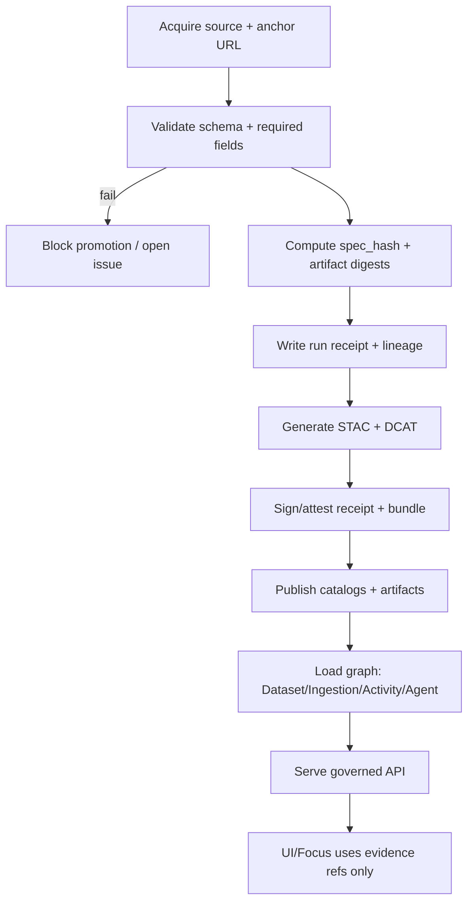

# 🧾 KFM Pipeline Registry


**Path:** `src/pipelines/registry/`

This folder is the **source of truth for what can run** in KFM’s ETL/ingestion system (pipelines/connectors + watchers), and for the **governance metadata required to publish** anything beyond Raw/Work into Processed.

> [!IMPORTANT]
> **Registry changes are governed changes.** They define what data enters KFM and under what policy & evidence conditions it can be promoted. Treat edits here like production code + policy changes.

---

## Table of contents

- [Purpose](#purpose)
- [Non-negotiables](#non-negotiables)
- [What belongs here](#what-belongs-here)
- [Recommended layout](#recommended-layout)
- [Lifecycle](#lifecycle)
- [Registry object types](#registry-object-types)
- [Pipeline entries](#pipeline-entries)
- [Watcher entries](#watcher-entries)
- [Receipts, run records, and required artifacts](#receipts-run-records-and-required-artifacts)
- [Promotion gates](#promotion-gates)
- [Validation and test expectations](#validation-and-test-expectations)
- [Security and secrets](#security-and-secrets)
- [Change control and versioning](#change-control-and-versioning)
- [Definition of Done](#definition-of-done)
- [FAQ](#faq)

---

## Purpose

KFM uses a **plugin-based** ingestion/ETL approach: contributors can “drop in” a new pipeline, register it, and the orchestrator discovers & runs it without editing a central engine. The registry is what makes that discovery possible.

At a high level:

- A **pipeline/connector** describes how a dataset is discovered/acquired/normalized/validated/published.
- A **watcher** describes how upstream change detection should occur and how it triggers PR → CI → promotion workflows.
- Registry entries are **metadata contracts**: they connect code to data zones, catalogs, provenance, and policy.

---

## Non-negotiables

These are system invariants that registry entries must support:

1. **Trust membrane:** downstream consumers (UI, Focus Mode, external clients) never access databases directly; all access is via the governed API + policy boundary.
2. **Fail-closed policy:** anything that fails policy/evidence checks must be blocked (promotion, publication, or serving).
3. **Promotion gates:** Raw → Work → Processed; promotion requires checksums + catalogs (DCAT/STAC/PROV).
4. **Evidence-first narratives:** Focus Mode must cite or abstain; every answer produces an audit reference.

> [!WARNING]
> If a dataset cannot produce its **catalogs + provenance chain**, it is not eligible for promotion. Registry entries must be written so that “missing evidence” is a normal, handled failure mode.

---

## What belongs here

✅ **Yes**
- Pipeline / connector registry entries (what to run and why)
- Watcher registry entries (what to monitor upstream and how)
- Promotion / policy references used by CI (promotion contract, provenance guard, etc.)
- Examples/templates for contributors
- Registry governance notes (required fields, validation expectations)

❌ **No**
- ETL code itself → belongs in `src/pipelines/`
- Graph build code → belongs in `src/graph/`
- API code and contracts → belongs in `src/server/`
- UI code → belongs in `web/`
- Raw/Work/Processed data artifacts → belong in `data/`

---

## Recommended layout

> [!NOTE]
> If your repo already has a different structure, align this README to match reality. The goal is **one canonical home** for registry artifacts.

```text
src/
  pipelines/
    registry/
      README.md

      pipelines/                 # one file per pipeline/connector entry
        <pipeline_id>.yaml

      watchers/                  # one file per watcher entry
        <watcher_id>.yaml

      policies/                  # optional: policy bundles referenced by entries
        promotion_contract/      # e.g., required checks, failure modes
        provenance_guard/
        materiality_rules/

      _examples/
        pipeline.example.yaml
        watcher.example.yaml
```

---

## Lifecycle

This is the intended “fail-closed” lifecycle: citations/provenance are produced **before** data is exposed.



---

## Registry object types

| Kind | Purpose | Typical file | Enforced by |
|---|---|---|---|
| `Pipeline` | Defines a connector/pipeline (discover→acquire→transform→validate→publish) | `pipelines/<pipeline_id>.yaml` | CI + orchestrator |
| `Watcher` | Monitors upstream change; triggers PR/CI/promotion workflows | `watchers/<watcher_id>.yaml` | CI + watcher service |
| `PolicyBundle` | Promotion contract, provenance guard, materiality rules | `policies/**` | CI (OPA/conftest), server policy |

---

## Pipeline entries

### Conceptual contract

A pipeline/connector should implement the connector-driven contract:

```text
discover -> acquire -> transform -> validate -> publish
```

A pipeline entry exists to:
- identify the dataset(s) it governs,
- specify cadence and trigger mechanisms,
- declare validation/policy gates,
- declare the catalogs and provenance artifacts it must emit,
- declare operational expectations (idempotency/backfills).

### Minimum required fields

Your pipeline entry MUST cover these categories (even if some are “not applicable”):

| Category | Why it exists |
|---|---|
| Identity | stable IDs for joins, audit, citations |
| Ownership | who reviews and who is accountable |
| Source | accessURL/endpoint + authentication strategy |
| Cadence | schedule/backfill strategy |
| Zones | raw/work/processed outputs and promotion intent |
| Catalog obligations | DCAT always; STAC/PROV as applicable |
| Validation gates | schema, geometry, time sanity, license/policy |
| Determinism | checksums + spec_hash + content-addressing |
| Evidence linkage | run record + provenance reference |
| Policy labels | public vs restricted vs sensitive-location etc. |

### Suggested pipeline entry template

```yaml
apiVersion: kfm.registry/v1
kind: Pipeline
metadata:
  pipeline_id: example_pipeline
  title: Example Pipeline
  owners:
    - name: Data Steward Team
      contact: steward@example.org
  tags: [domain:hazards, provider:example]
spec:
  dataset:
    dataset_id: example_dataset
    license: CC-BY-4.0
    sensitivity_level: public   # or restricted / culturally_sensitive / pii_risk / sensitive-location
    attribution: "Example Publisher"
  source:
    type: http
    accessURL: "https://example.org/source"
    incremental_cursor: "modified_date"   # or snapshot+diff
    auth:
      mode: none               # or api_key / oauth / signed_url
      secret_ref: null         # secrets never committed; reference vault/secret store
  connector:
    runtime: python
    entrypoint: "src.pipelines.example:ExampleConnector"  # module:class/function
  schedule:
    cadence: daily            # real-time | daily | weekly | annual | static
    cron: "0 3 * * *"
    timezone: "UTC"
  orchestration:
    idempotent: true
    supports_backfill: true
    backfill_notes: "Document historic ranges + expected runtime"
  outputs:
    zones:
      raw_prefix: "data/<domain>/raw/example_dataset/"
      work_prefix: "data/<domain>/work/example_dataset/"
      processed_prefix: "data/<domain>/processed/example_dataset/"
    artifacts:
      - uri: "data/<domain>/processed/example_dataset/example.parquet"
        media_type: "application/vnd.apache.parquet"
    catalogs:
      dcat_dataset: "data/catalog/dcat/example_dataset.jsonld"
      stac_collection: "data/stac/collections/example_dataset/collection.json"
      prov_bundle: "data/prov/example_dataset/run_<run_id>.json"
  validation:
    minimum_gates:
      - row_schema_validation
      - geometry_validity_bounds
      - temporal_consistency
      - license_attribution_present
      - provenance_checksums_complete
    policy:
      label: public
      redaction_ruleset_ref: "policies/redaction/public_default.rego"
  promotion:
    intent: processed
    gate_contract_ref: "policies/promotion_contract/v1.rego"
```

> [!TIP]
> Prefer one file per pipeline to avoid merge conflicts and to keep reviews focused.

---

## Watcher entries

Watchers detect material upstream changes and drive the “watcher → PR → CI → registry/attestations” pattern.

### Minimum required fields

Watcher schema requirements include:

- `watcher_id`
- `endpoint`
- `poll`
- `policy`
- `outputs`
- `spec_hash`
- `signature_ref`

### Suggested watcher entry template

```yaml
apiVersion: kfm.registry/v1
kind: Watcher
metadata:
  watcher_id: example_watcher
  title: Example Upstream Watcher
  owners:
    - name: Data Steward Team
      contact: steward@example.org
spec:
  endpoint: "https://example.org/source"
  poll:
    cadence: hourly
    strategy: etag_last_modified   # or checksum_probe / sitemap / api_cursor
  policy:
    materiality_rules_ref: "policies/materiality_rules/v1.rego"
  outputs:
    creates_pr: true
    pr_includes:
      - run_receipt
      - stac
      - dcat
      - prov
  spec_hash:
    algorithm: sha256
    canonicalization: rfc8785_jcs
    value: "sha256:<computed>"
  signature_ref:
    type: cosign
    ref: "oci://registry.example/kfm/watchers/example_watcher@sha256:<digest>"
```

---

## Receipts, run records, and required artifacts

### What every run must emit

At minimum, each run must emit a run record + validation report, and promotion is blocked unless both exist and are complete.

**Run record (illustrative):**

```json
{
  "run_id": "run_...",
  "dataset_id": "example_dataset",
  "inputs": [{"uri":"data/raw/example.csv","sha256":"..."}],
  "code": {"git_sha":"...","image":"kfm/pipeline:..."},
  "outputs": [{"uri":"data/processed/example.parquet","sha256":"..."}],
  "validation_report": "data/work/example/validation_report.json",
  "prov_ref": "data/prov/example/run_....json"
}
```

### Recommended richer receipt

For deterministic ingestion + provenance hub patterns, a richer `run_receipt` is recommended (fields include `fetched_at`, caching headers, `spec_hash`, `artifact_digest`, and gate results).

```json
{
  "example": "kfm.run_receipt.v1",
  "fetched_at": "2026-02-13T00:00:00Z",
  "accessURL": "https://example.org/source",
  "etag": "W/\"abc123\"",
  "last_modified": "Wed, 12 Feb 2026 00:00:00 GMT",
  "spec_hash": "sha256:<spec>",
  "artifact_digest": "sha256:<artifact>",
  "tool_versions": {"pipeline": "1.0.0"},
  "policy_gate": {
    "status": "pass",
    "checks": ["license_present", "stac_present"]
  }
}
```

### Canonical artifact homes

KFM’s directory conventions matter because the API, graph build, and UI assume stable canonical locations.

```text
data/
  <domain>/
    raw/          # read-only source snapshots or slices
    work/         # intermediate artifacts + validation reports
    processed/    # published outputs (never manually edited)
  stac/
    collections/
    items/
  catalog/
    dcat/
  prov/
  graph/
    csv/
    cypher/
schemas/
src/
  pipelines/
  graph/
  server/
web/
tools/
tests/
```

> [!IMPORTANT]
> Processed outputs must **never** be manually edited. Fix the pipeline (or raw source snapshot) and re-run.

---

## Promotion gates

Promotion gates prevent “data without evidence” from reaching Processed/public.

### Required checklist

To promote to processed/public:

1. license present  
2. sensitivity classification present  
3. schema and geospatial checks pass  
4. checksums computed  
5. STAC/DCAT/PROV artifacts exist and validate  
6. audit event recorded  
7. human approval if sensitive  

> [!WARNING]
> Registry entries must declare promotion intent and policy labels so CI can enforce gates.

---

## Validation and test expectations

### Ingestion workflow

Every pipeline should structure work as:

- Discover: resolve endpoints, parameters, auth needs; cache capability metadata.
- Acquire: fetch incremental slices when possible; otherwise snapshot and diff.
- Normalize: canonical encodings (UTF-8), geometry (WGS84), time (ISO 8601).
- Validate: schema checks, geometry validity, timestamp sanity, license/policy checks.
- Enrich: derive join keys (GeoIDs), normalization, cautious entity resolution candidates.
- Publish: promote to Processed, update catalogs, trigger index refresh (search/graph).

### Minimum validation gates

At minimum:

- Row-level schema validation (required fields present; coercion rules documented)
- Geometry validity + bounds checks
- Temporal consistency checks
- License + attribution captured (DCAT) and restrictions encoded in policy
- Provenance completeness: every promoted artifact has a PROV chain + deterministic checksum

### CI-ready test plan

- Unit: schema mapping and type coercion; geometry validity helpers; incremental window logic
- Integration: run connector against fixed small slice; assert stable checksums + counts
- Contract: verify API response includes provenance bundle and respects policy redaction
- Regression: profiling metrics (null rates, min/max, distinct keys) stable or versioned with explanation

---

## Security and secrets

- **Secrets are never committed.** Use a secret store/vault reference from registry entries.
- Prefer deterministic fetching patterns (ETag/Last-Modified) and record them in receipts.
- Use signatures/attestations for promoted bundles and registry artifacts where required by policy.

> [!NOTE]
> If you introduce a new auth method or secret requirement, update policy + threat model docs as part of the same PR.

---

## Change control and versioning

- Treat the registry as a governed contract.
- Prefer additive changes; deprecate before removal.
- Breaking changes (IDs, schema, promotion requirements) require a governance review and migration notes.

---

## Definition of Done

Use this checklist when adding or changing a pipeline entry:

- [ ] Connector implemented and registered in registry
- [ ] Raw acquisition produces deterministic manifest + checksums
- [ ] Normalization emits canonical schema and/or STAC assets
- [ ] Validation gates implemented and enforced in CI
- [ ] Policy labels defined; restricted fields/locations redacted per rules
- [ ] Catalogs emitted (DCAT always; STAC/PROV as applicable) and link-check clean
- [ ] Run record + validation report emitted; receipts include spec_hash + artifact digests
- [ ] API contract tests pass for at least one representative query
- [ ] Backfill strategy documented (historical ranges + expected runtime)
- [ ] No manual edits required for processed outputs

---

## FAQ

### Why is this folder separate from `src/pipelines/`?
Because `src/pipelines/` is where code lives, while `src/pipelines/registry/` is where the governed “what can run + what can be promoted” contracts live.

### Can I merge a pipeline without STAC/DCAT/PROV?
Not if the pipeline intends to publish to Processed/public. The system is designed to fail closed on missing evidence.

### What if upstream data is flaky?
You still emit receipts and provenance for what you fetched. If validation fails, promotion is blocked and an issue is raised. Failures are first-class events.

### How do we keep IDs stable?
Dataset IDs are stable; version IDs are content-addressed (hash of raw manifest + metadata). Never overwrite prior versions.

