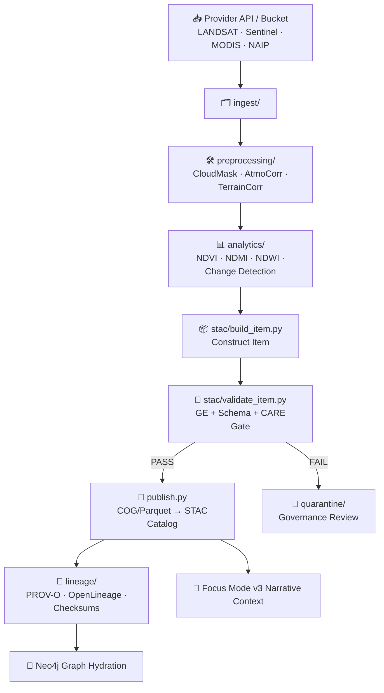

<div align="center">

# 🛰️ **KFM v11 — Remote Sensing Pipelines**  
`src/pipelines/remote-sensing/README.md`

### **Multispectral · SAR · Thermal · Elevation · Hazard · Ecological Indicators**  
### **STAC/DCAT · FAIR+CARE · Sovereignty · Lineage · GDAL 3.12+ · COG/Parquet**

Remote-sensing pipelines transform **raw satellite & aerial imagery** into  
**FAIR+CARE-certified, provenance-tracked, catalog-ready geospatial datasets**  
that power KFM’s map layers, hazard models, ecological analyses, hydrological reasoning,  
and Focus Mode v3 narratives.

</div>

---

## 📘 1. Purpose

This module defines KFM v11’s **end-to-end remote sensing architecture**:

- Sensor ingestion (LANDSAT · Sentinel-1/2 · NAIP · MODIS · VIIRS)  
- Preprocessing (cloud mask · atmo correction · SAR terrain correction)  
- Raster harmonization (projection · alignment · normalization)  
- Derivative analyses (NDVI · NDMI · NDWI · burn scars · floods · drought)  
- STAC/DCAT publication  
- PROV-O + OpenLineage lineage  
- Sovereignty-aware raster masking  
- OTel v11 telemetry & energy/carbon reporting  
- Auto-integration into Focus Mode v3 & Story Node v3  

These pipelines comply with **MCP-DL v6.3**, **KFM-PDC v11**,  
and the **Heritage & Sovereignty Protection Standards**.

---

## 🗂️ 2. Directory Layout (v11)

```text
src/pipelines/remote-sensing/
│
├── README.md
│
├── ingest/                         # Provider-specific ingestion
│   ├── landsat_ingest.py
│   ├── sentinel2_ingest.py
│   ├── sentinel1_ingest.py
│   ├── naip_ingest.py
│   └── modis_ingest.py
│
├── preprocessing/                  # Sensor correction modules
│   ├── cloud_mask.py
│   ├── atmospheric_correction.py
│   ├── sar_terrain_correction.py
│   ├── reprojection.py
│   └── harmonization.py
│
├── analytics/                      # Derivative products
│   ├── ndvi.py
│   ├── ndmi.py
│   ├── ndwi.py
│   ├── burn_scar.py
│   ├── flood_extent.py
│   └── change_detection.py
│
├── stac/                           # STAC/DCAT publication logic
│   ├── build_item.py
│   ├── build_collection.py
│   ├── validate_item.py
│   └── publish.py
│
├── lineage/                        # Lineage + checksums
│   ├── lineage_builder.py
│   ├── checksum_tools.py
│   └── provenance.jsonld
│
└── utils/
    ├── read_write.py
    ├── geospatial.py
    ├── masking.py
    └── timestamps.py
```

---

## 🧩 3. v11 Remote Sensing DAG Architecture



---

## 🌐 4. Supported Sensor Families (v11)

### 🛰️ Optical Multispectral  
LANDSAT C2 L2 · Sentinel-2 MSI · NAIP

Includes:
- Cloud/shadow masks (FMask / S2Cloudless)  
- Atmospheric correction (LaSRC / Sen2Cor equivalent settings)  
- GSD harmonization (10m → 30m normalization)  

### 📡 SAR (Sentinel-1 GRD)
- Terrain correction  
- Gamma-nought calibration  
- Speckle filtering  
- Coherence-based products (optional)  

### 🔥 Thermal / Environmental  
MODIS · VIIRS  
- LST  
- Drought indicators  
- Environmental anomaly layers  

---

## ⚙️ 5. Preprocessing Standards (v11)

All pipelines must:

- Reproject to **EPSG:4326**  
- Write COGs with:
  - `compress=DEFLATE`, `predictor=yes`, `tiled=true`
  - pyramids/overviews required  
- Use GeoParquet with:
  - WGS84 geometry  
  - dictionary encoding  
  - statistics enabled  

Mandatory masks:
- `CLOUD_MASK`  
- `SHADOW_MASK`  
- `QA_BAND`  

No invalid pixels may pass validation.

---

## 🧠 6. Analysis Modules

### Vegetation Indices  
- `ndvi.py`  
- `ndmi.py`  
- `ndwi.py`  
Sensor-specific coefficients required.

### Change Detection  
- burn scar mapping  
- flood extent delta imagery  
- NDVI temporal deltas  
- agriculture transition  

### SAR Flood Extraction  
- terrain-corrected backscatter  
- thresholding + hysteresis  
- optional coherence filters  

---

## 📦 7. STAC Publication (v11)

STAC Items must include:

- EO, SAR, RASTER, PROJ extensions  
- `proj:shape`, `proj:transform`  
- `raster:bands` with band metadata  
- `kfm:*` lineage/contract metadata  
- CARE + sovereignty metadata  

Validation through:

- JSON Schema  
- Great Expectations (GE) Checkpoints  
- CARE governance validator  
- STAC/DCAT crosswalk auditor  

---

## 🧬 8. Lineage & Checksums (v11)

All processing must emit:

- sha256 checksums  
- PROV-O lineage graph  
- OpenLineage events (`start`, `complete`, `fail`)  
- Upstream STAC item references  
- Versioned `kfm:ingest_hash` and `kfm:process_hash`  

Stored under:

```
lineage/provenance.jsonld
```

---

## ⚖️ 9. FAIR+CARE & Sovereignty Rules

### Required protections:
- H3-based masking for sovereign/heritage zones  
- No raw coordinates for sensitive features  
- CARE review on publication  
- Accurate CARE classification  
- Sovereignty escalation on conflict  

These pipelines must never **fail open**.

---

## 📡 10. Telemetry (OTel v11)

Metrics required:

- `kfm.rs_latency_ms`  
- `kfm.rs_pixels_processed`  
- `kfm.rs_energy_wh`  
- `kfm.rs_carbon_gco2e`  
- `kfm.rs_validation_failures`  
- `kfm.rs_care_flags`  

Telemetry bundles stored under:

```
releases/<version>/remote-sensing-telemetry.json
```

---

## 🧪 11. Local Development

```bash
python ingest/sentinel2_ingest.py --aoi data/kansas.geojson
python preprocessing/cloud_mask.py
python analytics/ndvi.py
python stac/build_item.py
python stac/publish.py
```

---

## 🕰️ 12. Version History

| Version | Date | Summary |
|--------:|------|---------|
| v11.0.0 | 2025-11-24 | Full KFM-MDP v11 rebuild; STAC/DCAT alignment; CARE/Sovereignty integration; telemetry v11; lineage & reliability enhancements. |
| v10.3.1 | 2025-11-14 | Initial remote-sensing architecture. |

---

<div align="center">

© 2025 Kansas Frontier Matrix  
**Remote Sensing × FAIR+CARE × Sovereignty × Lineage × Scientific Rigor**  
Diamond⁹ Ω / Crown∞Ω Ultimate Certified

</div>