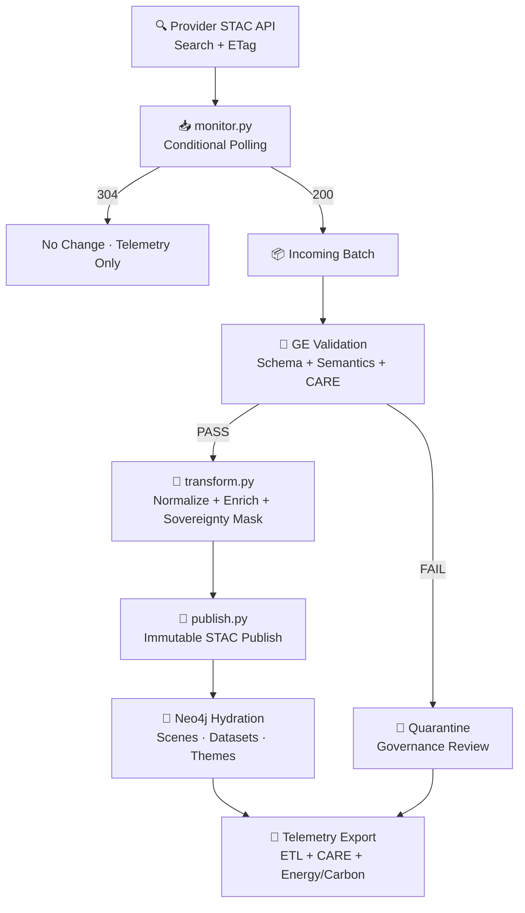

<div align="center">

# 🛰️ **KFM v11 — STAC Pipelines Overview**  
`src/pipelines/stac/README.md`

### **Continuous Ingestion · Schema Validation · FAIR+CARE · Sovereignty · Immutable Publishing · Telemetry · Lineage**

KFM v11 STAC Pipelines convert **external and internal spatiotemporal datasets**  
into **fully-governed, STAC/DCAT-compliant, sovereignty-safe, lineage-tracked** Items & Collections  
that power the Kansas Frontier Matrix mapping, analytics, and narrative engines.

</div>

---

## 📘 1. Purpose

This module defines the **full architecture** for:

- STAC ingestion (polling + deltas + ETags)  
- GE validation gates (schema + semantics + governance)  
- CARE + sovereignty enforcement  
- Normalization & metadata augmentation  
- Publication to the KFM STAC Catalog  
- Neo4j graph hydration  
- Telemetry + sustainability reporting  
- Lineage & checksum recording (sha256)  

All pipelines are aligned with:

- **MCP-DL v6.3**  
- **KFM-MDP v11**  
- **KFM-PDC v11 (Data Contracts)**  
- **STAC 1.0.0 + Extensions**  
- **FAIR+CARE governance**  
- **CIDOC-CRM · PROV-O · GeoSPARQL**  

---

## 🗂️ 2. Directory Layout (v11)

```text
src/pipelines/stac/
│
├── README.md
│
├── monitor-validate-publish/              
│   ├── README.md
│   ├── monitor.py                         # ETag polling
│   ├── transform.py                       # Normalize + enhance + mask
│   ├── publish.py                         # Immutable publishing
│   ├── expectations/                      # GE expectations + checkpoints
│   ├── data/                              # incoming → quarantine → published
│   └── .github/workflows/README.md        # CI rules for validation gating
│
└── utils/
    ├── stac_helpers.py
    ├── asset_tools.py
    └── metadata_tools.py
```

---

## 🧩 3. High-Level STAC Pipeline Flow (v11)



---

## ⚙️ 4. Responsibilities of STAC Pipelines (v11)

### **1. monitor.py**
- ETag-based conditional polling  
- Rate-limited batch ingestion  
- Governance-aware AOI filtering  
- Telemetry for:
  - latency  
  - HTTP status distribution  
  - carbon/energy cost  

### **2. GE Validation Layer**
Validates:

- Schema compliance  
- Spatial/temporal correctness  
- Asset href integrity  
- Projection metadata  
- Bounding box vs AOI  
- CARE & sovereignty rules  
- Required KFM fields (`kfm:*`)  

### **3. transform.py**
Adds:

- `kfm:checksum`  
- `kfm:ingest_version`  
- `kfm:care_label`  
- `kfm:sovereignty_notes`  
- `kfm:provenance` skeleton  
- Data Contract v11 bindings  
- Masking of sensitive geometries  
- Role normalization  

### **4. publish.py**
- Writes immutable STAC Collections & Items  
- Ensures semantic versioning  
- Generates thumbnails (optional)  
- Emits OpenLineage `publish` events  
- Triggers Neo4j hydration  

### **5. Governance & Quarantine**
- CARE violation → quarantine  
- Sovereignty zone conflicts → review  
- Invalid metadata → blocked  
- Governance ledger entry created  

---

## 📦 5. Storage Model (v11)

```text
data/stac/incoming/<ts>/items.jsonl
data/stac/quarantine/<ts>/
data/stac/published/collections/<collection>.json
data/stac/published/items/<collection>/<item>.json
data/geometry/kansas_aoi.geojson
data/telemetry/stac_<ts>.jsonl
```

Published STAC data is **immutable**.

---

## 🧠 6. FAIR+CARE & Sovereignty Enforcement

STAC pipelines must:

- Mask coordinates for sensitive datasets  
- Include CARE labels for all items  
- Enforce tribal data governance rules  
- Stop publication on sovereignty conflict  
- Annotate items with:
  - `kfm:sovereignty_notes`  
  - `kfm:care_label`  
  - `kfm:ethical_risk`  

Quarantined items require council review.

---

## 📡 7. Telemetry & Reliability Integration

Metrics emitted (OTel v11):

- `kfm.stac_latency_ms`  
- `kfm.stac_items_processed`  
- `kfm.stac_validation_failures`  
- `kfm.stac_care_flags`  
- `kfm.stac_energy_wh`  
- `kfm.stac_carbon_gco2e`  
- ETag hit/miss counts  

Telemetry aggregated at:

```
releases/<version>/stac-telemetry.json
```

---

## 📜 8. Local Development

```bash
python monitor-validate-publish/monitor.py
great_expectations checkpoint run stac_item_suite
python monitor-validate-publish/publish.py
```

---

## 🕰️ 9. Version History

| Version | Date | Summary |
|--------:|------|---------|
| v11.0.0 | 2025-11-24 | Full KFM-MDP v11 upgrade: FAIR+CARE, sovereignty, reliability, lineage, telemetry v11. |
| v10.3.1 | 2025-11-14 | Initial overview of STAC ingestion & validation pipelines. |

---

<div align="center">

© 2025 Kansas Frontier Matrix  
**STAC Pipelines · Provenance · Sovereignty · FAIR+CARE · Reliability**  
Diamond⁹ Ω / Crown∞Ω  

</div>