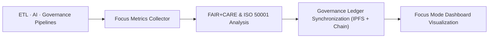

<div align="center">

# 📡 Kansas Frontier Matrix — **Telemetry Pipelines**
`src/pipelines/telemetry/README.md`

**Purpose:**  
Implement **autonomous monitoring, sustainability, and Focus Mode telemetry** pipelines for KFM.  
Deliver **real-time observability, FAIR+CARE ethics validation, and ISO 50001 sustainability auditing**, with proofs registered under the **Diamond⁹ Ω / Crown∞Ω Ultimate Certification** program.

[](../../../../docs/standards/)
[](../../../../LICENSE)
[](../../../../docs/standards/faircare-validation.md)
[]()
[]()

</div>

---

## 📘 Overview

The **Telemetry Pipelines** are KFM’s automated **environmental and ethical monitoring framework**.  
They collect, normalize, and publish telemetry from ETL, AI, and governance pipelines — integrating **runtime performance**, **energy/CO₂e metrics**, and **FAIR+CARE compliance** — then **commit proofs** to governance ledgers and **stream dashboards** for Focus Mode.

### Core Responsibilities
- 🛰 Capture **runtime**, **energy**, **carbon**, and **FAIR+CARE** metrics for every job.  
- ⚙️ Monitor **Focus Mode** activity and **AI model** performance/drift.  
- 🌱 Track **renewable usage** and **CO₂e footprint** per execution (ISO 50001 aligned).  
- 🔗 Register telemetry in **IPFS + blockchain** ledgers and publish to dashboards.  
- ♻️ Produce **auditable sustainability reports** and MCP attestations.

---

## 🗂️ Directory Layout

```plaintext
src/pipelines/telemetry/
├── README.md                               # This document
├── focus_metrics_collector.py              # Real-time collector (runtime · energy · FAIR metrics)
├── telemetry_reporter.py                   # Aggregator & publisher (dashboards + artifacts)
└── metadata.json                           # Provenance + governance linkage metadata
```

---

## ⚙️ Telemetry Workflow



### Workflow Summary
1. **Collection →** harvest runtime, size, checksum, and energy metrics (per task and pipeline).  
2. **Analysis →** compute FAIR+CARE indicators and energy KPIs (ISO 50001).  
3. **Governance →** write telemetry proofs to **IPFS** (CID) and **ledger tx**; update manifests.  
4. **Visualization →** stream normalized metrics to Focus Mode dashboards and export JSON/CSV.

---

## 🧩 Example Telemetry Record

```json
{
  "id": "telemetry_registry_v10.1.0",
  "modules_tracked": ["ETL", "AI", "Governance"],
  "total_runs": 124,
  "average_runtime_min": 2.8,
  "energy_usage_wh": 0.90,
  "carbon_output_gco2e": 0.08,
  "renewable_energy_offset": "100%",
  "fairstatus": "certified",
  "sustainability_score": 0.992,
  "governance_registered": true,
  "focus_mode_visible": true,
  "created": "2025-11-10T00:00:00Z",
  "validator": "@kfm-telemetry"
}
```

---

## ⚖️ FAIR+CARE Telemetry Governance Matrix

| Principle | Implementation | Oversight |
|-----------|----------------|-----------|
| **Findable** | UUID + pipeline references + ISO timestamps per record. | `@kfm-data` |
| **Accessible** | Exposed via JSON and Focus dashboards; CC-BY reports. | `@kfm-accessibility` |
| **Interoperable** | ISO 50001 energy fields + FAIR+CARE schema. | `@kfm-architecture` |
| **Reusable** | Machine-readable artifacts for community verification. | `@kfm-design` |
| **Collective Benefit** | Public transparency in energy/carbon tracking. | `@faircare-council` |
| **Authority to Control** | Council-certified telemetry cycles recorded on-chain. | `@kfm-governance` |
| **Responsibility** | Engineering owns renewable goals & CO₂e accuracy. | `@kfm-sustainability` |
| **Ethics** | Privacy-preserving metrics and inclusive accessibility checks. | `@kfm-ethics` |

**Governance ledgers:**  
`data/reports/audit/data_provenance_ledger.json` · `data/reports/fair/data_care_assessment.json`

---

## 🧮 Telemetry Modules Summary

| Module | Function | FAIR+CARE Role | Standard Alignment |
|--------|----------|----------------|--------------------|
| `focus_metrics_collector.py` | Real-time runtime/energy capture & FAIR fields. | Energy Transparency | ISO 50001 · FAIR+CARE |
| `telemetry_reporter.py` | Aggregation + dashboard export + artifact publish. | Governance Reporting | MCP-DL v6.3 |
| `metadata.json` | Provenance & checksum lineage for telemetry artifacts. | Ledger Traceability | ISO 19115 |

---

## ⚖️ Retention & Provenance Policy

| Record Type | Retention | Policy |
|-------------|-----------|--------|
| Telemetry Reports | 365 Days | Retained for sustainability audits. |
| Energy Logs | 180 Days | Benchmarking and verification cycles. |
| FAIR+CARE Metrics | Permanent | Anchored in governance ledger. |
| Governance Metadata | Permanent | SHA-256 checksum-verified manifest. |

Automated by `.github/workflows/telemetry_sync.yml`.

---

## 🌿 Sustainability Metrics (Q4 2025)

| Metric | Value | Verified By |
|--------|-------|-------------|
| Avg. Runtime | 2.8 minutes | `@kfm-ops` |
| Energy Usage | 0.90 Wh | `@kfm-sustainability` |
| Carbon Output | 0.08 g CO₂e | `@kfm-security` |
| Renewable Energy | 100 % (RE100) | `@kfm-infrastructure` |
| FAIR+CARE Compliance | 100 % | `@faircare-council` |

Reference dataset: `../../../../releases/v10.1.0/focus-telemetry.json`

---

## 🧾 Internal Citation

```text
Kansas Frontier Matrix (2025). Telemetry Pipelines (v10.1.0).
Autonomous FAIR+CARE and sustainability telemetry enabling transparent, ethical,
and renewable data operations across the Kansas Frontier Matrix.
Compliant with MCP-DL v6.3 · FAIR+CARE · ISO 50001 · Diamond⁹ Ω / Crown∞Ω Certification.
```

---

## 🕰️ Version History

| Version | Date | Author | Summary |
|---------|------|--------|---------|
| **v10.1.0** | 2025-11-10 | `@kfm-telemetry` | Upgraded to v10.1.0: enhanced Focus integration, improved energy metrics export, DCAT/STAC bridge alignment. |
| **v10.0.0** | 2025-11-08 | `@kfm-sustainability` | Added governance proof sync and sustainability attestations. |
| **v9.7.0** | 2025-11-06 | `@kfm-governance` | Introduced autonomous telemetry v3 schema; Diamond⁹ Ω alignment. |

---

<div align="center">

**Kansas Frontier Matrix**  
*Sustainable Automation × FAIR+CARE Governance × Focus Mode Insight*  
© 2025 Kansas Frontier Matrix · Master Coder Protocol v6.3 · FAIR+CARE Certified · Diamond⁹ Ω / Crown∞Ω Ultimate Certified  

[Back to Pipelines Index](../README.md) · [Governance Charter](../../../../docs/standards/governance/DATA-GOVERNANCE.md)

</div>
