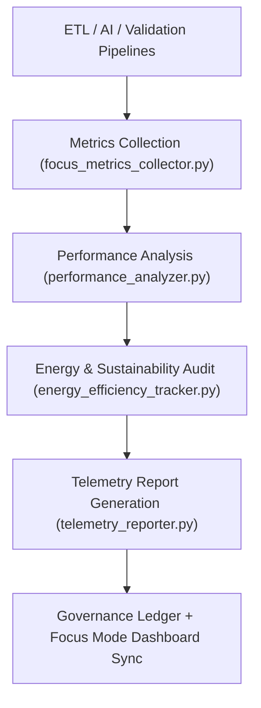

<div align="center">

# 📡 Kansas Frontier Matrix — **Telemetry Pipelines**
`src/pipelines/telemetry/README.md`

**Purpose:**  
FAIR+CARE-certified **telemetry automation system** for monitoring data workflows, sustainability metrics, and performance governance across the Kansas Frontier Matrix (KFM).  
These pipelines deliver continuous observability, energy reporting, and ethics tracking under MCP-DL v6.3 standards.

[](../../../../docs/standards/faircare-validation.md)
[](../../../../LICENSE)
[](../../../../docs/architecture/repo-focus.md)

</div>

---

## 📚 Overview

The `src/pipelines/telemetry/` directory manages **real-time system telemetry and performance analytics** for all FAIR+CARE-governed operations within KFM.  
It integrates energy tracking, governance metrics, and Focus Mode insights to ensure transparent reporting and sustainability compliance.

### Core Responsibilities
- Collect system performance and energy consumption telemetry.  
- Monitor FAIR+CARE ethics, accessibility, and transparency metrics.  
- Link telemetry results to provenance and governance ledgers.  
- Feed metrics into Focus Mode dashboards for real-time reporting.  

---

## 🗂️ Directory Layout

```plaintext
src/pipelines/telemetry/
├── README.md                              # This file — documentation for telemetry pipelines
│
├── focus_metrics_collector.py             # Collects ETL, AI, and validation performance metrics
├── telemetry_reporter.py                  # Formats and exports telemetry for Focus Mode dashboards
├── performance_analyzer.py                # Analyzes throughput, latency, and sustainability KPIs
├── energy_efficiency_tracker.py           # Tracks carbon usage and renewable offset efficiency
└── metadata.json                          # Provenance, checksum, and FAIR+CARE linkage metadata
```

---

## ⚙️ Telemetry Workflow



### Workflow Description
1. **Metrics Collection:** Aggregates operational and governance performance telemetry from all active pipelines.  
2. **Performance Analysis:** Evaluates runtime efficiency and throughput under FAIR+CARE ethics monitoring.  
3. **Sustainability Tracking:** Measures carbon output, renewable energy usage, and efficiency trends.  
4. **Governance Sync:** Registers telemetry metrics to blockchain-based ledgers.  
5. **Focus Mode Integration:** Displays validated metrics in real-time Focus Mode dashboards.  

---

## 🧩 Example Telemetry Metadata Record

```json
{
  "id": "src_telemetry_pipeline_v9.5.0_2025Q4",
  "modules_executed": [
    "focus_metrics_collector.py",
    "performance_analyzer.py",
    "telemetry_reporter.py"
  ],
  "etl_latency_sec": 39.5,
  "ai_inference_time_ms": 208,
  "energy_usage_wh": 24.2,
  "carbon_offset_gco2e": 17.8,
  "checksum_verified": true,
  "fairstatus": "certified",
  "governance_registered": true,
  "telemetry_ref": "releases/v9.5.0/focus-telemetry.json",
  "governance_ref": "reports/audit/ai_src_telemetry_ledger.json",
  "created": "2025-11-02T23:59:00Z",
  "validator": "@kfm-telemetry"
}
```

---

## 🧠 FAIR+CARE Governance Matrix

| Principle | Implementation |
|------------|----------------|
| **Findable** | Metrics indexed by dataset, system, and governance ID. |
| **Accessible** | Telemetry outputs stored in open, machine-readable formats. |
| **Interoperable** | Metrics schema aligns with FAIR+CARE, ISO 50001, and DCAT 3.0 standards. |
| **Reusable** | Datasets contain provenance and checksum metadata for reproducibility. |
| **Collective Benefit** | Promotes sustainability and ethical awareness in automation systems. |
| **Authority to Control** | FAIR+CARE Council certifies telemetry and energy efficiency reports. |
| **Responsibility** | Validators ensure transparency in performance and ethics data. |
| **Ethics** | Monitors sustainability, inclusivity, and resource fairness across systems. |

All audit logs recorded in:  
`reports/audit/ai_src_telemetry_ledger.json` • `reports/fair/src_telemetry_summary.json`

---

## ⚙️ Telemetry Pipelines Summary

| Pipeline | Function | FAIR+CARE Purpose |
|-----------|-----------|------------------|
| `focus_metrics_collector.py` | Collects system-wide performance metrics. | FAIR+CARE transparency and monitoring. |
| `performance_analyzer.py` | Evaluates runtime and throughput efficiency. | Ethics-driven optimization reporting. |
| `telemetry_reporter.py` | Exports FAIR+CARE-certified telemetry to Focus Mode dashboards. | Open governance communication. |
| `energy_efficiency_tracker.py` | Tracks carbon output and renewable energy ratios. | FAIR+CARE sustainability compliance. |

Automated by `telemetry_pipelines_sync.yml`.

---

## ⚖️ Sustainability Metrics Record

```json
{
  "telemetry_cycle": "Q4 2025",
  "etl_latency_sec": 39.5,
  "ai_inference_time_ms": 208,
  "power_consumed_wh": 24.2,
  "renewable_ratio_percent": 100,
  "carbon_emitted_gco2e": 17.8,
  "offset_status": "complete",
  "verified_by": "@kfm-governance",
  "timestamp": "2025-11-02T23:59:00Z"
}
```

---

## 🧾 Retention Policy

| File Type | Retention Duration | Policy |
|------------|--------------------|--------|
| Telemetry Logs | 90 days | Rotated after Focus Mode export. |
| Energy Audits | 365 days | Archived for sustainability audits. |
| FAIR+CARE Certifications | Permanent | Stored under governance ledger for accountability. |
| Metadata | Permanent | Preserved for lineage and ethics traceability. |

Cleanup automated by `telemetry_pipelines_cleanup.yml`.

---

## 🧾 Internal Use Citation

```text
Kansas Frontier Matrix (2025). Telemetry Pipelines (v9.5.0).
FAIR+CARE-certified automation framework for system telemetry, sustainability metrics, and performance monitoring.
Ensures transparency, reproducibility, and ethical compliance under MCP-DL v6.3 and ISO 50001.
```

---

## 🧾 Version Notes

| Version | Date | Notes |
|----------|------|--------|
| v9.5.0 | 2025-11-02 | Integrated carbon tracking and renewable energy metrics for FAIR+CARE compliance. |
| v9.3.2 | 2025-10-28 | Enhanced Focus Mode telemetry synchronization with governance dashboard. |
| v9.3.0 | 2025-10-26 | Established telemetry pipelines for FAIR+CARE and sustainability monitoring. |

---

<div align="center">

**Kansas Frontier Matrix** · *Telemetry × Sustainability × FAIR+CARE Ethics*  
[🔗 Repository](https://github.com/bartytime4life/Kansas-Frontier-Matrix) • [🧭 Docs Portal](../../../../docs/) • [⚖️ Governance Ledger](../../../../docs/standards/governance/)

</div>
