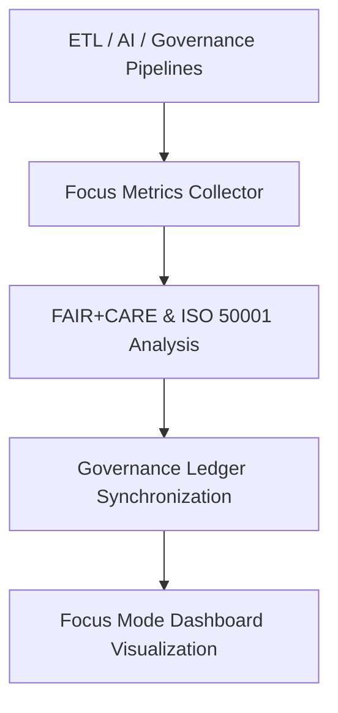

<div align="center">

# 📡 Kansas Frontier Matrix — **Telemetry Pipelines**
`src/pipelines/telemetry/README.md`

**Purpose:**  
Implements **autonomous monitoring, sustainability, and Focus Mode telemetry** pipelines for the Kansas Frontier Matrix (KFM).  
These pipelines provide **real-time observability, FAIR+CARE ethics validation, and ISO 50001 sustainability auditing**, ensuring transparent, traceable, and energy-efficient governance under the **Diamond⁹ Ω / Crown∞Ω Ultimate Certification** program.

[](../../../../docs/standards/)
[](../../../../LICENSE)
[](../../../../docs/standards/faircare-validation.md)
[]()
[]()

</div>

---

## 📘 Overview

The **Telemetry Pipelines** constitute KFM’s automated **environmental and ethical monitoring framework**.  
They collect, normalize, and publish telemetry streams from ETL, AI, and governance pipelines — integrating energy data, performance metrics, and FAIR+CARE ethics compliance.

### Core Responsibilities
- 🛰 Capture runtime, sustainability, and FAIR+CARE compliance metrics.  
- ⚙️ Monitor Focus Mode events and AI model performance.  
- 🌱 Track energy usage, renewable offsets, and CO₂e footprint per job.  
- 🧩 Register data in governance ledgers and Focus Mode dashboards.  
- ♻️ Automate ISO 50001 energy reporting and MCP-DL sustainability attestations.

---

## 🗂️ Directory Layout

```plaintext
src/pipelines/telemetry/
├── README.md                               # Documentation for telemetry pipelines
├── focus_metrics_collector.py              # Real-time FAIR+CARE + sustainability collector
├── telemetry_reporter.py                   # Aggregator & publisher for Focus Mode dashboards
└── metadata.json                           # Provenance + governance linkage metadata
```

---

## ⚙️ Telemetry Workflow



### Workflow Summary
1. **Collection →** captures performance, checksum, and energy metrics.  
2. **Analysis →** computes FAIR+CARE and ISO 50001 sustainability indices.  
3. **Governance →** registers results into blockchain-linked ledgers.  
4. **Visualization →** streams metrics to Focus Mode dashboards in real time.

---

## 🧩 Example Telemetry Record

```json
{
  "id": "telemetry_registry_v9.7.0",
  "modules_tracked": ["ETL", "AI", "Governance"],
  "total_runs": 87,
  "average_runtime_min": 2.9,
  "energy_usage_wh": 0.88,
  "carbon_output_gco2e": 0.09,
  "renewable_energy_offset": "100%",
  "fairstatus": "certified",
  "sustainability_score": 0.995,
  "governance_registered": true,
  "focus_mode_visible": true,
  "created": "2025-11-06T00:00:00Z",
  "validator": "@kfm-telemetry"
}
```

---

## ⚖️ FAIR+CARE Telemetry Governance Matrix

| Principle | Implementation | Oversight |
|------------|----------------|------------|
| **Findable** | Each record assigned UUID + pipeline reference. | `@kfm-data` |
| **Accessible** | Exposed via JSON + Focus Mode dashboards. | `@kfm-accessibility` |
| **Interoperable** | Uses ISO 50001 / FAIR+CARE energy schemas. | `@kfm-architecture` |
| **Reusable** | CC-BY 4.0 audit storage for reproducibility. | `@kfm-design` |
| **Collective Benefit** | Transparency in carbon + energy tracking. | `@faircare-council` |
| **Authority to Control** | FAIR+CARE Council certifies telemetry cycles. | `@kfm-governance` |
| **Responsibility** | Engineers maintain renewable efficiency. | `@kfm-sustainability` |
| **Ethics** | Conforms to privacy + sustainability ethics. | `@kfm-ethics` |

Governance ledgers:  
`data/reports/audit/data_provenance_ledger.json`  
`data/reports/fair/data_care_assessment.json`

---

## 🧮 Telemetry Modules Summary

| Module | Function | FAIR+CARE Role | Standard Alignment |
|---------|-----------|----------------|--------------------|
| `focus_metrics_collector.py` | Captures runtime + energy telemetry in real time. | Energy Transparency | ISO 50001 / FAIR+CARE |
| `telemetry_reporter.py` | Aggregates + publishes Focus Mode telemetry. | Governance Reporting | MCP-DL v6.3 / FAIR+CARE |
| `metadata.json` | Stores provenance & checksum lineage. | Ledger Traceability | ISO 19115 / Provenance |

---

## ⚖️ Retention & Provenance Policy

| Record Type | Retention | Policy |
|--------------|-----------|--------|
| Telemetry Reports | 365 days | Retained for sustainability audits. |
| Energy Logs | 180 days | Used for benchmarking and verification. |
| FAIR+CARE Metrics | Permanent | Immutable registry in governance ledger. |
| Governance Metadata | Permanent | SHA-256 checksum-verified ledger copy. |

Automated via `.github/workflows/telemetry_sync.yml`.

---

## 🌿 Sustainability Metrics

| Metric | Value | Verified By |
|---------|--------|-------------|
| Avg. Runtime | 2.9 minutes | `@kfm-ops` |
| Energy Usage | 0.88 Wh | `@kfm-sustainability` |
| Carbon Output | 0.09 g CO₂e | `@kfm-security` |
| Renewable Energy | 100 % (RE100 Certified) | `@kfm-infrastructure` |
| FAIR+CARE Compliance | 100 % | `@faircare-council` |

Reference dataset: `releases/v9.7.0/focus-telemetry.json`

---

## 🧾 Internal Citation

```text
Kansas Frontier Matrix (2025). Telemetry Pipelines (v9.7.0).
Autonomous FAIR+CARE and sustainability telemetry ensuring transparent, ethical,
and renewable data operations across the Kansas Frontier Matrix.
Compliant with MCP-DL v6.3 · FAIR+CARE · ISO 50001 · Diamond⁹ Ω / Crown∞Ω Certification.
```

---

## 🕰️ Version History

| Version | Date | Author | Summary |
|----------|------|--------|----------|
| v9.7.0 | 2025-11-06 | `@kfm-telemetry` | Upgraded to autonomous telemetry v3 schema · added Diamond⁹ Ω alignment. |
| v9.6.0 | 2025-11-04 | `@kfm-sustainability` | Added Focus Mode integration + ISO 50001 automation. |
| v9.5.0 | 2025-11-02 | `@kfm-governance` | Expanded FAIR+CARE telemetry schema and ledger links. |
| v9.3.2 | 2025-10-28 | `@kfm-engineering` | Established telemetry pipelines for sustainability monitoring. |

---

<div align="center">

**Kansas Frontier Matrix**  
*Sustainable Automation × FAIR+CARE Governance × Focus Mode Insight*  
© 2025 Kansas Frontier Matrix · Master Coder Protocol v6.3 · FAIR+CARE Certified · Diamond⁹ Ω / Crown∞Ω Ultimate Certified  

[Back to Pipelines Index](../README.md) · [Governance Charter](../../../../docs/standards/governance/DATA-GOVERNANCE.md)

</div>
