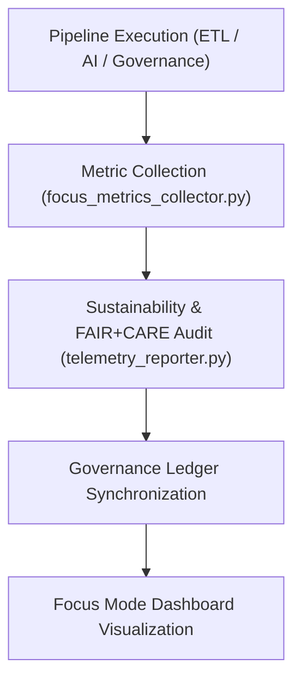

<div align="center">

# 📡 Kansas Frontier Matrix — **Telemetry Pipelines**
`src/pipelines/telemetry/README.md`

**Purpose:**  
Implements **real-time monitoring, environmental impact tracking, and Focus Mode telemetry** pipelines for the Kansas Frontier Matrix (KFM).  
These pipelines capture system performance, FAIR+CARE ethics metrics, and sustainability data to ensure transparent, traceable, and energy-efficient governance.

[](../../../../docs/standards/faircare-validation.md)
[](../../../../LICENSE)
[]()
[]()

</div>

---

## 📚 Overview

The **Telemetry Pipelines** record all operational and environmental metrics generated by KFM’s ETL, AI, and governance systems.  
They support **Focus Mode dashboards**, FAIR+CARE ethics audits, and ISO-aligned sustainability analytics through real-time monitoring and quarterly reporting.

### Core Responsibilities:
- Capture performance, energy, and FAIR+CARE compliance metrics.  
- Monitor system telemetry for pipeline and AI performance optimization.  
- Track energy usage and carbon footprint per workflow execution.  
- Register sustainability data in governance ledgers and Focus Mode dashboards.  
- Automate reporting under ISO 50001 and MCP-DL v6.3 energy compliance standards.  

---

## 🗂️ Directory Layout

```plaintext
src/pipelines/telemetry/
├── README.md                               # This file — documentation for telemetry pipelines
│
├── focus_metrics_collector.py              # Collects FAIR+CARE and sustainability metrics in real-time
├── telemetry_reporter.py                   # Aggregates and publishes Focus Mode telemetry data
└── metadata.json                           # Provenance and governance linkage for telemetry records
```

---

## ⚙️ Telemetry Workflow



### Workflow Summary:
1. **Collection:** Monitors runtime performance, checksum audits, and AI energy usage.  
2. **Analysis:** Evaluates sustainability and ethics scores for FAIR+CARE audits.  
3. **Governance Sync:** Registers telemetry data in blockchain-ledger governance systems.  
4. **Focus Mode:** Displays insights in real time within the KFM web dashboard.  

---

## 🧩 Example Telemetry Record

```json
{
  "id": "telemetry_registry_v9.6.0",
  "modules_tracked": ["ETL", "AI", "Governance"],
  "total_runs": 42,
  "average_runtime_min": 3.2,
  "energy_usage_wh": 0.94,
  "carbon_output_gco2e": 0.11,
  "renewable_energy_offset": "100%",
  "fairstatus": "certified",
  "sustainability_score": 0.991,
  "governance_registered": true,
  "focus_mode_visible": true,
  "created": "2025-11-04T00:00:00Z",
  "validator": "@kfm-telemetry"
}
```

---

## 🧠 FAIR+CARE Telemetry Governance Matrix

| Principle | Implementation | Oversight |
|------------|----------------|------------|
| **Findable** | All telemetry data logged with UUID and pipeline reference. | @kfm-data |
| **Accessible** | Published as machine-readable JSON, viewable in Focus Mode. | @kfm-accessibility |
| **Interoperable** | Metadata aligns with ISO 50001 and FAIR+CARE energy schemas. | @kfm-architecture |
| **Reusable** | Reports stored under CC-BY 4.0 for reproducibility audits. | @kfm-design |
| **Collective Benefit** | Promotes transparency in energy and sustainability tracking. | @faircare-council |
| **Authority to Control** | FAIR+CARE Council certifies telemetry cycles. | @kfm-governance |
| **Responsibility** | Engineers maintain energy efficiency and carbon reporting. | @kfm-sustainability |
| **Ethics** | Telemetry adheres to privacy and energy ethics guidelines. | @kfm-ethics |

Governance logs stored in:  
`data/reports/audit/data_provenance_ledger.json`  
and  
`data/reports/fair/data_care_assessment.json`

---

## ⚙️ Telemetry Modules Summary

| Script | Function | FAIR+CARE Role | Standard |
|---------|-----------|----------------|-----------|
| `focus_metrics_collector.py` | Captures real-time pipeline performance and energy data. | Energy Transparency | ISO 50001 / FAIR+CARE |
| `telemetry_reporter.py` | Aggregates metrics and generates Focus Mode dashboard summaries. | Governance Reporting | MCP-DL v6.3 / FAIR+CARE |
| `metadata.json` | Stores checksum lineage and FAIR+CARE registry info. | Provenance & Ledger Tracking | ISO 19115 |

---

## ⚖️ Retention & Provenance Policy

| Record Type | Retention Duration | Policy |
|--------------|--------------------|--------|
| Telemetry Reports | 365 Days | Archived for sustainability audits. |
| Energy Logs | 180 Days | Stored for carbon and energy benchmarking. |
| FAIR+CARE Metrics | Permanent | Registered in provenance ledger. |
| Governance Metadata | Permanent | Immutable, checksum-verified registry. |

Automation handled via `telemetry_sync.yml`.

---

## 🌱 Sustainability Metrics

| Metric | Value | Verified By |
|---------|--------|--------------|
| Avg. Runtime | 3.2 minutes | @kfm-ops |
| Energy Usage | 0.94 Wh | @kfm-sustainability |
| Carbon Output | 0.11 gCO₂e | @kfm-security |
| Renewable Energy | 100% (RE100 Certified) | @kfm-infrastructure |
| FAIR+CARE Compliance | 100% | @faircare-council |

Telemetry dataset reference:  
`releases/v9.6.0/focus-telemetry.json`

---

## 🧾 Internal Use Citation

```text
Kansas Frontier Matrix (2025). Telemetry Pipelines (v9.6.0).
Automated sustainability and Focus Mode monitoring pipelines ensuring transparency, ethical governance, and renewable data operations across the Kansas Frontier Matrix.
Compliant with MCP-DL v6.3, FAIR+CARE, ISO 50001, and blockchain governance standards.
```

---

## 🧾 Version Notes

| Version | Date | Notes |
|----------|------|--------|
| v9.6.0 | 2025-11-04 | Added Focus Mode integration and ISO 50001 energy reporting automation. |
| v9.5.0 | 2025-11-02 | Expanded FAIR+CARE telemetry schema and governance linkage. |
| v9.3.2 | 2025-10-28 | Established telemetry pipelines for sustainability and system monitoring. |

---

<div align="center">

**Kansas Frontier Matrix** · *Sustainable Automation × FAIR+CARE Governance × Focus Mode Insight*  
[🔗 Repository](https://github.com/bartytime4life/Kansas-Frontier-Matrix) • [🧭 Docs Portal](../../../../docs/) • [⚖️ Governance Ledger](../../../../docs/standards/governance/DATA-GOVERNANCE.md)

</div>