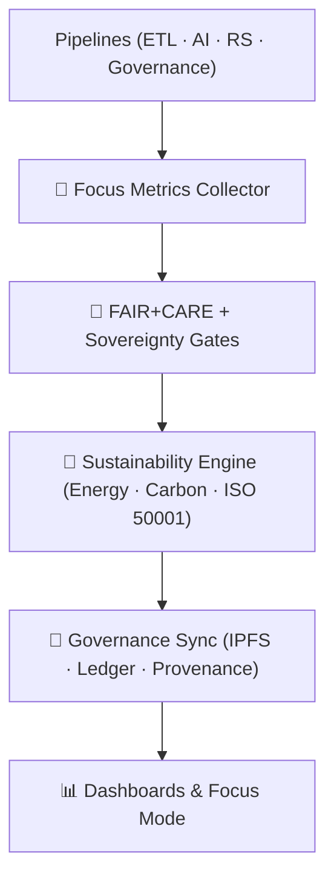

<div align="center">

# 📡 **Kansas Frontier Matrix — Telemetry Pipelines (v11 LTS)**  
`src/pipelines/telemetry/README.md`

### **Monitoring · Sustainability · FAIR+CARE · Focus Mode Intelligence · Governance Telemetry**

Telemetry Pipelines form the **observability, sustainability, and governance backbone** of KFM.  
They measure, record, validate, and publish metrics across **ETL**, **AI**, **governance**, **graph**,  
**Focus Mode**, and **remote-sensing** pipelines — with complete lineage, sovereignty gates,  
and ISO-aligned sustainability reporting.

</div>

---

## 📘 1. Purpose

Telemetry Pipelines:

- Capture **runtime**, **latency**, **I/O**, **performance**, **energy (Wh)**, **carbon (gCO₂e)**  
- Monitor **AI explainability**, **bias**, **drift**, and **Focus Mode activity**
- Enforce **FAIR+CARE** & sovereignty gates on telemetry visibility
- Produce renewable-energy and CO₂e proofs (ISO 50001 aligned)
- Generate governance-auditable artifacts for:
  - FAIR+CARE Council  
  - Sustainability Board  
  - Release governance  
  - System SLO reviews  
- Power Focus Mode with real-time performance & ethics metadata

Telemetry is the **safety net** guaranteeing transparency and ethical operation across KFM v11.

---

## 🗂️ 2. Directory Layout (v11)

```text
src/pipelines/telemetry/
│
├── README.md                      # This file — Telemetry Pipelines overview
│
├── focus_metrics_collector.py     # Real-time collector (runtime · energy · FAIR+CARE)
├── telemetry_reporter.py          # Aggregator → dashboards · artifacts · governance bundles
└── metadata.json                  # Provenance + CARE + sovereignty + hash lineage
```

---

## 🧬 3. Telemetry Architecture (v11)



Telemetry passes through:

1. **Collection Layer** — unified metric capture  
2. **Governance Layer** — FAIR+CARE + sovereignty enforcement  
3. **Sustainability Layer** — ISO 50001 energy/carbon computation  
4. **Lineage Layer** — PROV-O + checksum bundle  
5. **Publication Layer** — dashboards, JSONL exporters, Focus Mode metadata  

---

## ⚙️ 4. Metrics Categories (v11)

### **System Metrics**
- runtime_ms  
- latency_ms (p50/p95/p99)  
- IO_read/write_bytes  
- memory_peak_mb  

### **AI Metrics**
- explainability_score  
- bias_flag  
- drift_score  
- model_energy_wh  
- model_carbon_gco2e  

### **FAIR+CARE Metrics**
- care_label  
- sovereignty_zone_hit  
- governance_block_count  
- accessible_metadata_score  

### **Sustainability Metrics**
- energy_wh  
- carbon_gco2e  
- renewable_pct  
- efficiency_factor  

### **Reliability Metrics**
- retry_count  
- wal_events  
- lineage_events  
- error_budget_burn  
- validation_failures  

---

## 🧠 5. FAIR+CARE Governance Enforcement

Telemetry visibility **must respect** governance rules:

- Sensitive provenance, coordinates, or narratives → masked or summarized  
- CARE flags:
  - `public`  
  - `restricted`  
  - `sovereign`  
- Sovereignty features:
  - H3-generalization  
  - Redaction of sensitive AI outputs  
- All governance decisions attached via:
  - `kfm:sovereignty_notes`
  - `kfm:care_label`
  - `kfm:ethical_review`

---

## 🌍 6. Sustainability Engine (ISO 50001 Alignment)

Energy & carbon telemetry follows:

- **OpenTelemetry Energy DSL**
- **gCO₂e = Wh × carbon_intensity_factor**  
- Renewable attribution uses RE100 methodology  
- All sustainability reports stored under:

```
data/reports/sustainability/<timestamp>.json
```

Outputs feed:

- Sustainability dashboards  
- Governance Council review  
- Public impact reports  

---

## 📡 7. Telemetry Reporter (v11)

`telemetry_reporter.py` generates:

- JSONL telemetry bundles  
- STAC/DCAT telemetry artifacts  
- Governance ledger entries  
- Focus Mode signal overlays (ethics + sustainability + SLO)  

Supports publication to:

- Web dashboards  
- Focus Mode v3  
- Neo4j lineage graph  
- Release manifests  

---

## 🧪 8. Example Telemetry Record (v11)

```json
{
  "telemetry_id": "telemetry_2025_11_24_v11",
  "pipeline": "etl_hydrology",
  "runtime_ms": 15342,
  "latency_ms": { "p50": 128, "p95": 224, "p99": 301 },
  "energy_wh": 1.12,
  "carbon_gco2e": 0.09,
  "retry_count": 0,
  "faircare": { "care_label": "public", "sovereignty_zones": [] },
  "lineage_events": 12,
  "governance_synced": true,
  "focus_mode_visible": true,
  "timestamp": "2025-11-24T13:59:00Z"
}
```

---

## 📦 9. Retention & Provenance Policy

| Artifact | Retention | Policy |
|---------|-----------|--------|
| Telemetry Bundles | 365 days | Sustainability review cycles |
| FAIR+CARE Metrics | Permanent | Governance ledger |
| Energy Logs | 180 days | ISO 50001 verification |
| Dashboard Exports | 90 days | Rolling windows |
| Provenance Manifests | Permanent | SHA-256 chain immutability |

Governed via:

```
.github/workflows/telemetry_sync.yml
```

---

## 🕰️ 10. Version History

| Version | Date | Summary |
|--------:|------|---------|
| v11.0.0 | 2025-11-24 | Full KFM-MDP v11 rewrite with sovereignty, FAIR+CARE, sustainability, lineage, and telemetry v11 alignment. |
| v10.1.0 | 2025-11-10 | Previous telemetry pipeline setup. |

---

<div align="center">

© 2025 Kansas Frontier Matrix  
**Telemetry × Sustainability × Governance × FAIR+CARE × Focus Mode**  
Diamond⁹ Ω / Crown∞Ω — MCP-DL v6.3  
“Transparency is the true north of autonomous systems.”  

</div>