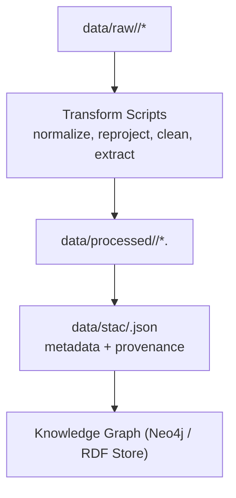

<div align="center">

# 🔄 Kansas Frontier Matrix — Data Transformation Pipelines  
`src/pipelines/transform/README.md`

**Standardization · Geospatial Processing · Temporal Normalization**

[](../../../.github/workflows/site.yml)
[](../../../.github/workflows/stac-validate.yml)
[](../../../.github/workflows/codeql.yml)
[](../../../.github/workflows/trivy.yml)
[](../../../docs/)
[](../../../LICENSE)

</div>

---

```yaml
---
title: "Kansas Frontier Matrix — Data Transformation Pipelines"
version: "v1.7.0"
last_updated: "2025-10-17"
owners: ["@kfm-data", "@kfm-architecture"]
tags: ["etl","transform","geospatial","temporal","normalization","ontology","stac","mcp","ci","semver"]
status: "Stable"
license: "MIT"
semver_policy: "MAJOR.MINOR.PATCH"
semantic_alignment:
  - STAC 1.0
  - GeoJSON
  - ISO 8601
  - OWL-Time
  - CIDOC CRM
  - DCAT 2.0
  - PeriodO
ci_required_checks:
  - pre-commit
  - unit-tests
  - stac-validate
  - codeql
  - trivy
  - docs-validate
---
```

---

## 🎯 Purpose

The **`src/pipelines/transform/`** module handles **data standardization, normalization, and semantic conversion** across the **Kansas Frontier Matrix (KFM)** architecture.  

It converts validated assets from `fetch/` into **interoperable, open formats** — **GeoJSON**, **COG GeoTIFF**, **CSV**, and **Parquet** — ensuring each dataset is **semantically enriched**, **temporally aligned**, and **ready for ingestion** into the **Knowledge Graph** and **STAC catalog**.  

Every script and process adheres to the **Master Coder Protocol (MCP)** and the **MCP-DL v6.2** documentation style, ensuring transparent, reproducible, and audit-ready data pipelines.

---

## 🏗️ Pipeline Role in the System


<!-- END OF MERMAID -->

The **transform stage** ensures spatial, temporal, and ontological coherence across all datasets:  

- **Spatial normalization:** CRS unification and geometry cleaning.  
- **Temporal normalization:** conversion to ISO 8601 and OWL-Time intervals.  
- **Semantic linking:** preparation of entities for CIDOC CRM and DCAT alignment.  

---

## 📂 Directory Layout

```
src/pipelines/transform/
├── __init__.py
├── geocode_utils.py         # GNIS/Nominatim geocoding + place disambiguation
├── raster_to_cog.py         # Convert rasters to Cloud-Optimized GeoTIFFs
├── vector_to_geojson.py     # Convert shapefiles/geodatabases to GeoJSON
├── csv_cleaner.py           # Clean tabular and time-series data
├── text_cleaner.py          # Preprocess OCR-extracted text (noise, encoding)
├── date_normalizer.py       # Normalize time references to ISO 8601 / OWL-Time
├── schema_validator.py      # Validate processed outputs via JSON Schemas
└── README.md                # (this file)
```

Each script performs **one reproducible transformation**, with logged provenance and checksums for auditability.

---

## ⚙️ Standard Workflow

1. **Reproject Spatial Data**  
   - Normalize CRS to **EPSG:4326 (WGS84)** for web/GIS compatibility.  
   - Tools: `gdalwarp`, `rasterio.warp`, `ogr2ogr`.

2. **Convert Raster Formats**  
   - Produce **COG (Cloud-Optimized GeoTIFF)** for fast tiled streaming:  
     ```bash
     rio cogeo create input.tif output_cog.tif --overview-level=5 --web-optimized
     ```

3. **Convert Vector Formats**  
   - Convert `.shp` or `.gdb` to GeoJSON, fixing geometry errors:  
     ```bash
     ogr2ogr -f GeoJSON -t_srs EPSG:4326 output.json input.shp
     ```

4. **Clean Tabular Data**  
   - Standardize fields, drop nulls, normalize timestamps:  
     ```python
     df['date'] = pd.to_datetime(df['date'], errors='coerce')
     df.to_csv('cleaned.csv', index=False)
     ```

5. **Geocode & Spatial Join**  
   - Resolve locations with GNIS / Nominatim.  
   - Join to counties, hydrology layers, or historical boundaries.

6. **Temporal Normalization**  
   - Convert fuzzy time (e.g., “Spring 1857”) → `1857-03-01/1857-06-01`.  
   - Align with **OWL-Time** and **PeriodO** for semantic consistency.

7. **Ontology & Schema Alignment**  
   - Tag entities using CIDOC CRM and DCAT:  
     - `crm:E53_Place`, `crm:E5_Event`, `crm:E52_Time-Span`  
   - Validate all outputs via `schema_validator.py` to ensure STAC/JSON Schema compliance.

---

## 🧮 Example Usage

```bash
# Convert shapefiles to GeoJSON
python src/pipelines/transform/vector_to_geojson.py --input data/raw/usgs --output data/processed/vectors

# Create Cloud-Optimized GeoTIFFs
python src/pipelines/transform/raster_to_cog.py --input data/raw/dem --output data/processed/rasters

# Geocode historical settlements
python src/pipelines/transform/geocode_utils.py --file data/raw/settlements.csv --out data/processed/geocoded.csv

# Execute full transformation workflow
make transform
```

---

## 🧱 Template for New Transform Scripts

```python
#!/usr/bin/env python3
"""
@MCP-LOG Kansas Frontier Matrix — Transformation Script Template
Purpose: Clean and standardize a dataset for STAC + Graph ingestion.
"""
import pandas as pd, os, json
from datetime import datetime

def transform(input_path: str, output_path: str):
    df = pd.read_csv(input_path)
    df.columns = [c.strip().lower() for c in df.columns]
    df['date'] = pd.to_datetime(df['date'], errors='coerce')
    os.makedirs(os.path.dirname(output_path), exist_ok=True)
    df.to_csv(output_path, index=False)
    meta = {
        "id": os.path.basename(output_path),
        "processed": datetime.now().isoformat(),
        "source": input_path,
        "license": "Open Data / Public Domain"
    }
    json.dump(meta, open(output_path + ".meta.json", "w"), indent=2)
    print(f"✅ Transformed {input_path} → {output_path}")

if __name__ == "__main__":
    transform("data/raw/example.csv", "data/processed/example_clean.csv")
```

---

## 🧾 Standards & Conventions

| Category | Standard | Description |
| :-- | :-- | :-- |
| Spatial CRS | **EPSG:4326** | Geographic WGS84 projection |
| Raster | **COG GeoTIFF** | Cloud-optimized raster tiles |
| Vector | **GeoJSON** | Open geospatial data format |
| Temporal | **ISO 8601 / OWL-Time** | Intervals & time spans |
| Ontology | **CIDOC CRM / DCAT / PeriodO** | Semantic linkage and heritage integration |
| Metadata | **STAC 1.0** | Spatiotemporal asset catalog compliance |
| Validation | **JSON Schema** | Structural and semantic validation |

---

## 🧰 Logging & Provenance

Logs are stored in `logs/pipelines/transform.log`:

```
[2025-10-17 09:41:10] vector_to_geojson | trails_1870.shp → trails_1870.geojson | OK
[2025-10-17 09:46:52] raster_to_cog | ks_dem_1m.tif → ks_dem_1m_cog.tif | SHA256=afe2b...
[2025-10-17 09:51:08] geocode_utils | 127 resolved via GNIS | 3 unresolved
```

Each log records:
- Script name  
- Input/output paths  
- Result status  
- SHA256 checksum  

Each output also writes `.meta.json` sidecars to preserve provenance for STAC + Knowledge Graph ingestion.

---

## 🔗 Integration with Other Pipelines

| Stage | Description |
| :-- | :-- |
| **Upstream** | `fetch/` — acquires raw inputs and manifests (NOAA, USGS, KGS, etc.) |
| **Downstream** | `enrich/` — AI/NLP enrichment, entity linking · `load/` — graph + STAC insertion |
| **Automation** | Triggered via `make transform` or CI/CD (`.github/workflows/etl.yml`) |

---

## 🧾 Version History

| Version | Date | Type | Changes |
| :-- | :-- | :-- | :-- |
| v1.7.0 | 2025-10-17 | Added | Versioning, QA/CI alignment, Provenance enhancements |
| v1.6.0 | 2025-10-17 | Improved | Ontology integration, OWL-Time normalization |
| v1.5.0 | 2025-10-17 | Added | Full YAML metadata, badges, validation consistency |

---

## 📚 References

- [📄 File & Data Architecture](../../../docs/architecture.md)
- [🧠 AI System Developer Documentation](../../../docs/ai-system.md)
- [🧮 Scientific Modeling & Simulation Guide](../../../docs/standards/README.md)
- [🪶 Integrating Historical, Cartographic, and Geological Research (MCP Reference)](../../../docs/integration/README.md)
- [📘 Documentation Standards (MCP-DL v6.2)](../../../docs/standards/markdown_guide.md)

---

<div align="center">

**Kansas Frontier Matrix © 2025**  
*Open Science · Open Data · Reproducible History*

</div>
```