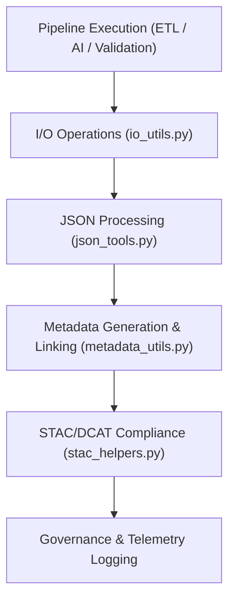

<div align="center">

# 🧩 Kansas Frontier Matrix — **Pipeline Utilities**
`src/pipelines/utils/README.md`

**Purpose:**  
Core FAIR+CARE-certified utility library for ETL, AI, governance, and validation pipelines within the Kansas Frontier Matrix (KFM).  
These shared modules provide standardized input/output handling, JSON tooling, STAC metadata management, and provenance synchronization across all workflows.

[](../../../../docs/standards/faircare-validation.md)
[](../../../../LICENSE)
[](../../../../docs/architecture/repo-focus.md)

</div>

---

## 📚 Overview

The `src/pipelines/utils/` directory contains **shared helper modules** used across all ETL, AI, validation, governance, and telemetry pipelines.  
By centralizing critical utility functions, the framework ensures consistent governance logging, FAIR+CARE-compliant metadata handling, and reproducible data processing.

### Core Responsibilities
- Manage consistent file I/O operations and error handling.  
- Facilitate JSON schema parsing, serialization, and validation.  
- Support STAC/DCAT metadata generation and provenance linking.  
- Simplify checksum verification, manifest updates, and logging integration.  

---

## 🗂️ Directory Layout

```plaintext
src/pipelines/utils/
├── README.md                              # This file — documentation for pipeline utilities
│
├── io_utils.py                            # Handles secure file read/write, encoding, and error management
├── json_tools.py                          # Provides JSON schema utilities and validation functions
├── stac_helpers.py                        # Manages STAC metadata creation, validation, and crosswalks
├── metadata_utils.py                      # Generates, updates, and synchronizes provenance metadata
└── metadata.json                          # Governance and provenance linkage metadata
```

---

## ⚙️ Utility Integration Workflow



### Workflow Description
1. **File I/O:** Secure reading/writing with checksum integrity and encoding management.  
2. **JSON Handling:** Schema validation, transformation, and audit-ready export.  
3. **Metadata Operations:** FAIR+CARE provenance linking and contract synchronization.  
4. **STAC/DCAT Integration:** Automated crosswalk generation for geospatial metadata.  
5. **Governance Logging:** Records actions and telemetry events for transparency.  

---

## 🧩 Example Utility Metadata Record

```json
{
  "id": "src_utils_registry_v9.5.0_2025Q4",
  "modules_executed": [
    "io_utils.py",
    "json_tools.py",
    "metadata_utils.py"
  ],
  "checksum_verified": true,
  "stac_compliant": true,
  "fairstatus": "certified",
  "governance_registered": true,
  "telemetry_ref": "releases/v9.5.0/focus-telemetry.json",
  "governance_ref": "reports/audit/ai_src_utils_ledger.json",
  "created": "2025-11-02T23:59:00Z",
  "validator": "@kfm-utils"
}
```

---

## 🧠 FAIR+CARE Governance Matrix

| Principle | Implementation |
|------------|----------------|
| **Findable** | Utilities indexed and versioned with lineage and governance metadata. |
| **Accessible** | Open-source functions maintained under MIT license and FAIR+CARE registry. |
| **Interoperable** | Compatible with FAIR+CARE, ISO 19115, DCAT 3.0, and STAC 1.0 schemas. |
| **Reusable** | Modular helper functions reusable across all domain pipelines. |
| **Collective Benefit** | Promotes standardization and reproducibility across the KFM ecosystem. |
| **Authority to Control** | FAIR+CARE Council certifies core utility updates. |
| **Responsibility** | Developers maintain ethical and reproducible code design. |
| **Ethics** | All automation adheres to open governance and transparency standards. |

Audit logs recorded in:  
`reports/audit/ai_src_utils_ledger.json` • `reports/fair/src_utils_summary.json`

---

## ⚙️ Utility Module Summary

| Module | Purpose | FAIR+CARE Function |
|---------|----------|--------------------|
| `io_utils.py` | Handles read/write operations with checksum and encoding safety. | Ensures integrity and reproducibility. |
| `json_tools.py` | Validates and processes JSON schema documents. | FAIR+CARE metadata compliance. |
| `stac_helpers.py` | Builds and validates STAC/DCAT metadata crosswalks. | FAIR+CARE interoperability assurance. |
| `metadata_utils.py` | Manages provenance metadata and governance updates. | Ethics-linked data traceability. |

Automated via `utils_pipelines_sync.yml`.

---

## ⚖️ Provenance Example

```json
{
  "checksum": "sha256:a9f98c43d1873c11e8764d2b8f91a56aee9ab4c7...",
  "stac_reference": "stac_collections/environmental_data_v9.5.0.json",
  "provenance_record": "data/reports/audit/data_provenance_ledger.json#record_2841",
  "validator": "@kfm-utils",
  "timestamp": "2025-11-02T23:59:00Z"
}
```

---

## 🧾 Retention Policy

| Asset Type | Retention Duration | Policy |
|-------------|--------------------|--------|
| Utility Scripts | Permanent | Version-controlled under FAIR+CARE lineage registry. |
| Validation Reports | 365 days | Retained for audit and compliance review. |
| Provenance Metadata | Permanent | Stored under governance ledger for traceability. |
| FAIR+CARE Certifications | Permanent | Archived for reproducibility verification. |

Cleanup automated by `utils_pipelines_cleanup.yml`.

---

## 🧾 Internal Use Citation

```text
Kansas Frontier Matrix (2025). Pipeline Utilities (v9.5.0).
FAIR+CARE-certified shared library for file I/O, JSON schema validation, metadata governance, and STAC interoperability.
Ensures transparency, reproducibility, and open standards under MCP-DL v6.3 compliance.
```

---

## 🧾 Version Notes

| Version | Date | Notes |
|----------|------|--------|
| v9.5.0 | 2025-11-02 | Added ISO 19115 + STAC 1.0 metadata crosswalk support. |
| v9.3.2 | 2025-10-28 | Enhanced checksum management and metadata synchronization. |
| v9.3.0 | 2025-10-26 | Established shared utility layer for all KFM pipelines. |

---

<div align="center">

**Kansas Frontier Matrix** · *Utility Functions × FAIR+CARE Ethics × Provenance Reliability*  
[🔗 Repository](https://github.com/bartytime4life/Kansas-Frontier-Matrix) • [🧭 Docs Portal](../../../../docs/) • [⚖️ Governance Ledger](../../../../docs/standards/governance/)

</div>

