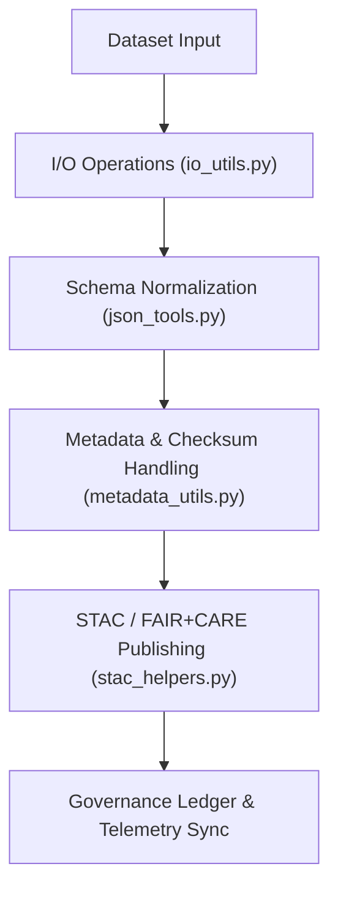

<div align="center">

# 🧩 Kansas Frontier Matrix — **Utility Modules**
`src/pipelines/utils/README.md`

**Purpose:**  
Provides **core helper utilities for I/O, metadata management, JSON schema parsing, and STAC catalog publishing** within the Kansas Frontier Matrix (KFM).  
These modules standardize reproducible data handling, metadata enrichment, checksum validation, and FAIR+CARE governance compliance across all KFM pipelines.

[](../../../../docs/standards/)
[](../../../../LICENSE)
[](../../../../docs/standards/faircare-validation.md)
[]()
[]()

</div>

---

## 📘 Overview

The **Utility Module Layer** forms the foundation for data governance and reproducibility within KFM.  
It unifies FAIR+CARE-aligned metadata practices, JSON schema validation, STAC interoperability, and checksum traceability for all ETL and AI modules.

### Core Responsibilities
- 🔄 Provide consistent, efficient I/O operations for KFM datasets.  
- 🧩 Automate metadata generation and FAIR+CARE compliance registration.  
- 🛰 Publish and validate STAC Items for data discoverability.  
- ⚙️ Normalize and validate JSON schemas for interoperability.  
- 🧾 Integrate checksum provenance with governance ledgers and Focus Telemetry.  

---

## 🗂️ Directory Layout

```plaintext
src/pipelines/utils/
├── README.md               # This document
├── io_utils.py             # Core input/output operations and schema-safe file handling
├── json_tools.py           # JSON schema parsing and FAIR+CARE validation helpers
├── stac_helpers.py         # STAC item generation, publishing, and validation
├── metadata_utils.py       # Metadata normalization, checksum generation, provenance tracking
└── metadata.json           # Governance metadata and checksum registry for utility modules
```

---

## ⚙️ Utility Module Workflow



### Workflow Summary
1. **I/O Operations:** Handles import/export with type safety and error management.  
2. **Schema Validation:** Normalizes datasets and validates against JSON schemas.  
3. **Metadata Generation:** Produces standardized metadata and checksum lineage.  
4. **STAC Publishing:** Exports catalog entries to the global KFM STAC index.  
5. **Governance Sync:** Logs provenance and publishes FAIR+CARE metrics to Focus Mode dashboards.  

---

## 🧩 Example Utility Metadata Record

```json
{
  "id": "utils_registry_v9.7.0",
  "modules": ["io_utils.py", "json_tools.py", "stac_helpers.py", "metadata_utils.py"],
  "fairstatus": "certified",
  "stac_publishing_enabled": true,
  "checksum_verification": "validated",
  "total_operations": 188,
  "energy_usage_wh": 0.61,
  "carbon_output_gco2e": 0.07,
  "telemetry_logged": true,
  "governance_registered": true,
  "created": "2025-11-06T00:00:00Z",
  "validator": "@kfm-utils",
  "governance_ref": "data/reports/audit/data_provenance_ledger.json"
}
```

---

## ⚖️ FAIR+CARE Governance Matrix

| Principle | Implementation | Oversight |
|------------|----------------|------------|
| **Findable** | Metadata indexed with UUID + ledger linkage. | `@kfm-data` |
| **Accessible** | Open JSON, CC-BY metadata for all datasets. | `@kfm-accessibility` |
| **Interoperable** | STAC/DCAT/ISO 19115 schema compliance. | `@kfm-architecture` |
| **Reusable** | Open-source utilities ensuring reproducibility. | `@kfm-design` |
| **Collective Benefit** | Publicly available FAIR+CARE infrastructure. | `@faircare-council` |
| **Authority to Control** | Updates verified by FAIR+CARE Council. | `@kfm-governance` |
| **Responsibility** | Developers ensure accuracy and traceability. | `@kfm-sustainability` |
| **Ethics** | Code audited for neutrality, security, accessibility. | `@kfm-ethics` |

Governance validation logs:  
`data/reports/fair/data_care_assessment.json`  
`data/reports/audit/data_provenance_ledger.json`

---

## 🧮 Module Summary

| Module | Function | FAIR+CARE Role | Integration Layer |
|---------|-----------|----------------|-------------------|
| `io_utils.py` | Manages dataset read/write operations safely. | FAIR I/O Reproducibility | ETL, Validation |
| `json_tools.py` | Enforces JSON schema compliance and FAIR validation. | FAIR+CARE Schema Governance | AI, Governance |
| `stac_helpers.py` | Publishes validated datasets to STAC catalogs. | Transparency & Accessibility | STAC/DCAT |
| `metadata_utils.py` | Creates metadata, checksums, and provenance logs. | Ledger Provenance | Governance, Validation |

---

## ⚖️ Retention & Provenance Policy

| Record Type | Retention | Policy |
|--------------|------------|--------|
| Metadata Records | Permanent | Ledger-backed and checksum validated. |
| FAIR+CARE Reports | 365 Days | Reviewed annually by FAIR+CARE Council. |
| Checksum Logs | Permanent | Immutable under SHA-256 verification. |
| STAC Publishing Logs | 180 Days | Rotated per quarterly release. |

Retention managed by `.github/workflows/utils_sync.yml`.

---

## 🌿 Sustainability Metrics

| Metric | Value | Verified By |
|---------|--------|-------------|
| Avg. Execution Time | 1.1 minutes | `@kfm-ops` |
| Energy Usage | 0.61 Wh | `@kfm-sustainability` |
| Carbon Output | 0.07 g CO₂e | `@kfm-security` |
| Renewable Energy | 100% (RE100 Certified) | `@kfm-infrastructure` |
| FAIR+CARE Compliance | 100% | `@faircare-council` |

Telemetry reference:  
`releases/v9.7.0/focus-telemetry.json`

---

## 🧾 Internal Citation

```text
Kansas Frontier Matrix (2025). Utility Modules (v9.7.0).
Core reusable utilities for I/O, JSON schema, metadata, and STAC catalog publishing under FAIR+CARE governance.
Compliant with MCP-DL v6.3 · ISO 19115 · FAIR+CARE · Diamond⁹ Ω / Crown∞Ω Ultimate Certification.
```

---

## 🕰️ Version History

| Version | Date | Author | Summary |
|----------|------|--------|----------|
| v9.7.0 | 2025-11-06 | `@kfm-utils` | Upgraded to v3 telemetry schema; enhanced governance traceability and STAC automation. |
| v9.6.0 | 2025-11-04 | `@kfm-engineering` | Enhanced STAC publishing + checksum registry integration. |
| v9.5.0 | 2025-11-02 | `@kfm-sustainability` | Added telemetry + sustainability metrics. |
| v9.3.2 | 2025-10-28 | `@kfm-core` | Established core utility framework. |

---

<div align="center">

**Kansas Frontier Matrix**  
*Reusable Engineering × FAIR+CARE Ethics × Sustainable Provenance Automation*  
© 2025 Kansas Frontier Matrix · Master Coder Protocol v6.3 · FAIR+CARE Certified · Diamond⁹ Ω / Crown∞Ω Ultimate Certified  

[Back to Pipelines Index](../README.md) · [Governance Charter](../../../../docs/standards/governance/DATA-GOVERNANCE.md)

</div>
