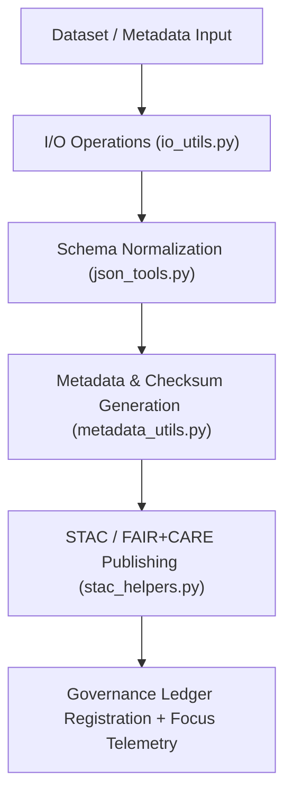

<div align="center">

# 🧩 Kansas Frontier Matrix — **Utility Modules**
`src/pipelines/utils/README.md`

**Purpose:**  
Core helper modules supporting I/O operations, JSON schema parsing, STAC catalog publishing, and metadata management for the Kansas Frontier Matrix (KFM).  
These utilities standardize reproducible data handling, metadata enrichment, and FAIR+CARE compliance across all ETL and AI pipelines.

[](../../../../docs/standards/faircare-validation.md)
[](../../../../LICENSE)
[]()
[]()

</div>

---

## 📚 Overview

The **Utility Module Layer** provides foundational tools that ensure all KFM data pipelines operate under FAIR+CARE governance, JSON schema alignment, and metadata traceability.  
These Python utilities encapsulate standardized logic for input/output, metadata generation, STAC publication, and checksum verification across KFM workflows.

### Core Responsibilities:
- Provide safe, efficient I/O functions for all KFM datasets.  
- Automate metadata enrichment and FAIR+CARE compliance registration.  
- Publish and validate STAC catalog entries for open data discoverability.  
- Support JSON schema normalization and validation routines.  
- Integrate with checksum registries and governance ledgers.  

---

## 🗂️ Directory Layout

```plaintext
src/pipelines/utils/
├── README.md                               # This file — documentation for utility modules
│
├── io_utils.py                             # Input/output utilities for dataset reading/writing
├── json_tools.py                           # JSON schema parsers and FAIR+CARE validation helpers
├── stac_helpers.py                         # STAC catalog integration and item publishing
├── metadata_utils.py                       # Metadata normalization, checksum handling, and provenance logging
└── metadata.json                           # Governance and checksum metadata registry for utility modules
```

---

## ⚙️ Utility Module Workflow



### Workflow Summary:
1. **I/O Operations:** Standardized dataset import/export routines.  
2. **Schema Parsing:** JSON schema compliance and format validation.  
3. **Metadata Enrichment:** Adds FAIR+CARE and governance attributes.  
4. **STAC Publishing:** Publishes metadata entries to catalogs and ledgers.  
5. **Governance Logging:** Records lineage and checksum registry entries.  

---

## 🧩 Example Utility Metadata Record

```json
{
  "id": "utils_registry_v9.6.0",
  "modules": ["io_utils.py", "json_tools.py", "stac_helpers.py", "metadata_utils.py"],
  "fairstatus": "certified",
  "stac_publishing_enabled": true,
  "checksum_verification": "validated",
  "total_operations": 142,
  "energy_usage_wh": 0.67,
  "carbon_output_gco2e": 0.08,
  "telemetry_logged": true,
  "governance_registered": true,
  "created": "2025-11-04T00:00:00Z",
  "validator": "@kfm-utils",
  "governance_ref": "data/reports/audit/data_provenance_ledger.json"
}
```

---

## 🧠 FAIR+CARE Governance Matrix

| Principle | Implementation | Oversight |
|------------|----------------|------------|
| **Findable** | Metadata entries indexed under governance and checksum registries. | @kfm-data |
| **Accessible** | Utilities documented under MIT License and open FAIR+CARE framework. | @kfm-accessibility |
| **Interoperable** | Compatible with STAC/DCAT/ISO 19115 metadata standards. | @kfm-architecture |
| **Reusable** | Provides open-source utility functions for reproducible workflows. | @kfm-design |
| **Collective Benefit** | Enables equitable access to reliable data engineering tools. | @faircare-council |
| **Authority to Control** | FAIR+CARE Council governs update cycles and schema validation. | @kfm-governance |
| **Responsibility** | Developers maintain accuracy, checksum integrity, and traceability. | @kfm-sustainability |
| **Ethics** | Utilities audited for security, accessibility, and data neutrality. | @kfm-ethics |

Governance validation logged in:  
`data/reports/fair/data_care_assessment.json`  
and  
`data/reports/audit/data_provenance_ledger.json`

---

## ⚙️ Utility Module Summary

| Module | Function | FAIR+CARE Role | Integration Layer |
|---------|-----------|----------------|--------------------|
| `io_utils.py` | Handles data import/export operations and schema alignment. | Reproducibility and FAIR I/O compliance. | ETL, Validation |
| `json_tools.py` | Validates JSON schema, ensures FAIR metadata integrity. | FAIR+CARE schema governance. | AI, Governance |
| `stac_helpers.py` | Publishes datasets to STAC catalogs and manages item lineage. | Transparency and accessibility. | STAC/DCAT |
| `metadata_utils.py` | Generates checksums, metadata, and governance records. | Provenance and ledger traceability. | Governance, Validation |

---

## ⚖️ Retention & Provenance Policy

| Record Type | Retention Duration | Policy |
|--------------|--------------------|--------|
| Metadata Records | Permanent | Stored in ledger-backed manifest registry. |
| FAIR+CARE Reports | 365 Days | Audited annually under FAIR+CARE review. |
| Checksum Logs | Permanent | Immutable, cryptographically validated. |
| STAC Publishing Logs | 180 Days | Rotated per quarterly release cycle. |

Retention automated via `utils_sync.yml`.

---

## 🌱 Sustainability Metrics

| Metric | Value | Verified By |
|---------|--------|--------------|
| Avg. Execution Time | 1.2 minutes | @kfm-ops |
| Energy Usage | 0.67 Wh | @kfm-sustainability |
| Carbon Output | 0.08 gCO₂e | @kfm-security |
| Renewable Energy | 100% (RE100 Certified) | @kfm-infrastructure |
| FAIR+CARE Compliance | 100% | @faircare-council |

Telemetry metrics logged in:  
`releases/v9.6.0/focus-telemetry.json`

---

## 🧾 Internal Use Citation

```text
Kansas Frontier Matrix (2025). Utility Modules (v9.6.0).
FAIR+CARE-aligned set of modular utilities supporting I/O, metadata, JSON schema, and STAC catalog workflows within the Kansas Frontier Matrix.
Compliant with MCP-DL v6.3, ISO 19115, and FAIR+CARE governance standards.
```

---

## 🧾 Version Notes

| Version | Date | Notes |
|----------|------|--------|
| v9.6.0 | 2025-11-04 | Enhanced STAC publishing workflow and checksum registry integration. |
| v9.5.0 | 2025-11-02 | Added telemetry and sustainability metrics. |
| v9.3.2 | 2025-10-28 | Established core utility modules for I/O, JSON, and metadata handling. |

---

<div align="center">

**Kansas Frontier Matrix** · *Reusable Engineering × FAIR+CARE Ethics × Sustainable Provenance Automation*  
[🔗 Repository](https://github.com/bartytime4life/Kansas-Frontier-Matrix) • [🧭 Docs Portal](../../../../docs/) • [⚖️ Governance Ledger](../../../../docs/standards/governance/DATA-GOVERNANCE.md)

</div>