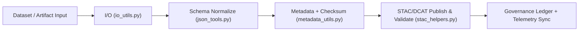

<div align="center">

# 🧩 Kansas Frontier Matrix — **Utility Modules**
`src/pipelines/utils/README.md`

**Purpose:**  
Provide **core helper utilities for I/O, metadata governance, JSON schema validation, and STAC/DCAT publishing** across KFM pipelines.  
Standardizes **reproducible data handling, FAIR+CARE enrichment, checksum lineage, and governance proofs** for all ETL/AI components.

[](../../../../docs/standards/)
[](../../../../LICENSE)
[](../../../../docs/standards/faircare-validation.md)
[]()
[]()

</div>

---

## 📘 Overview

The **Utility Module Layer** is the shared substrate for **data governance and reproducibility** in KFM.  
It unifies **FAIR+CARE metadata**, **JSON schema normalization**, **STAC/DCAT interoperability**, and **checksum traceability** used by ETL, Validation, Governance, and AI pipelines.

### Core Responsibilities
- 🔄 Consistent, resilient **I/O operations** for datasets and artifacts.  
- 🧩 Automated **metadata generation** with FAIR+CARE fields and authority-to-control.  
- 🛰 **STAC/DCAT publishing & validation** for discoverability and interoperability.  
- ⚙️ **JSON Schema / Pydantic** normalization and validation helpers.  
- 🧾 **Checksum lineage & governance** registration (IPFS + blockchain) + telemetry hooks.  

---

## 🗂️ Directory Layout

```plaintext
src/pipelines/utils/
├── README.md               # This document
├── io_utils.py             # Safe I/O + typed read/write helpers
├── json_tools.py           # JSON schema parsing, normalization, validation
├── stac_helpers.py         # STAC/DCAT item/collection generation & validation
├── metadata_utils.py       # FAIR+CARE metadata, checksums, provenance logging
└── metadata.json           # Provenance and checksum registry for utils module
```

---

## ⚙️ Utility Module Workflow



### Workflow Summary
1. **I/O:** Type-safe import/export with atomic writes, retries, and size/hash checks.  
2. **Schema:** Normalize records and validate fields with JSON Schema / Pydantic.  
3. **Metadata:** Generate FAIR+CARE metadata; compute SHA-256; update `metadata.json`.  
4. **STAC/DCAT:** Emit Items/Collections and verify against STAC 1.0 / DCAT 3.0.  
5. **Governance:** Commit provenance (IPFS CID + ledger tx) and export utilities telemetry.  

---

## 🧩 Example Utility Metadata Record

```json
{
  "id": "utils_registry_v10.1.0",
  "modules": ["io_utils.py", "json_tools.py", "stac_helpers.py", "metadata_utils.py"],
  "fairstatus": "certified",
  "stac_publishing_enabled": true,
  "checksum_verification": "validated",
  "total_operations": 236,
  "energy_usage_wh": 0.60,
  "carbon_output_gco2e": 0.07,
  "telemetry_logged": true,
  "governance_registered": true,
  "created": "2025-11-10T00:00:00Z",
  "validator": "@kfm-utils",
  "governance_ref": "data/reports/audit/data_provenance_ledger.json"
}
```

---

## ⚖️ FAIR+CARE Governance Matrix

| Principle | Implementation | Oversight |
|-----------|----------------|-----------|
| **Findable** | UUID-indexed metadata with ledger links and ISO timestamps. | `@kfm-data` |
| **Accessible** | Open JSON + CC-BY metadata; redaction policy enforced. | `@kfm-accessibility` |
| **Interoperable** | STAC 1.0 / DCAT 3.0 / ISO 19115 field mapping. | `@kfm-architecture` |
| **Reusable** | MIT-licensed utilities; deterministic outputs. | `@kfm-design` |
| **Collective Benefit** | Public FAIR+CARE infrastructure for community reuse. | `@faircare-council` |
| **Authority to Control** | A2C fields recorded; council review tracked in ledger. | `@kfm-governance` |
| **Responsibility** | Checksums & provenance are mandatory gates. | `@kfm-sustainability` |
| **Ethics** | Accessibility, inclusivity, and data minimization verified. | `@kfm-ethics` |

Governance validation logs:  
`data/reports/fair/data_care_assessment.json` · `data/reports/audit/data_provenance_ledger.json`

---

## 🧮 Module Summary

| Module | Function | FAIR+CARE Role | Integration Layer |
|--------|----------|----------------|-------------------|
| `io_utils.py` | Typed, atomic I/O for datasets/artifacts. | FAIR I/O Reproducibility | ETL · Validation |
| `json_tools.py` | Schema normalization + validation. | FAIR+CARE Schema Governance | ETL · AI · Governance |
| `stac_helpers.py` | STAC/DCAT publishing + linting. | Transparency & Accessibility | Catalog Layer |
| `metadata_utils.py` | Checksums, provenance, authority-to-control. | Ledger Provenance | Governance · Validation |

---

## ⚖️ Retention & Provenance Policy

| Record Type | Retention | Policy |
|-------------|-----------|--------|
| Metadata Records | Permanent | Checksum + ledger anchored. |
| FAIR+CARE Reports | 365 Days | Annual council review. |
| Checksum Logs | Permanent | Immutable SHA-256 lineage. |
| STAC/DCAT Logs | 180 Days | Rotated per quarterly release. |

Retention managed by `.github/workflows/utils_sync.yml`.

---

## 🌿 Sustainability Metrics (Q4 2025)

| Metric | Value | Verified By |
|--------|-------|-------------|
| Avg. Execution Time | 1.1 min | `@kfm-ops` |
| Energy Usage | 0.60 Wh | `@kfm-sustainability` |
| Carbon Output | 0.07 g CO₂e | `@kfm-security` |
| Renewable Energy | 100% (RE100) | `@kfm-infrastructure` |
| FAIR+CARE Compliance | 100% | `@faircare-council` |

Telemetry reference:  
`../../../../releases/v10.1.0/focus-telemetry.json`

---

## 🧾 Internal Citation

```text
Kansas Frontier Matrix (2025). Utility Modules (v10.1.0).
Reusable utilities for I/O, schema validation, metadata governance, and STAC/DCAT catalog publishing under FAIR+CARE and MCP-DL v6.3.
```

---

## 🕰️ Version History

| Version | Date | Author | Summary |
|---------|------|--------|---------|
| **v10.1.0** | 2025-11-10 | `@kfm-utils` | Upgraded to v10.1.0: improved STAC/DCAT bridge, authority-to-control fields, enhanced telemetry export. |
| **v10.0.0** | 2025-11-08 | `@kfm-engineering` | Added provenance anchoring (IPFS + ledger) and stronger schema guards. |
| **v9.7.0** | 2025-11-06 | `@kfm-core` | Telemetry v3; governance traceability and STAC automation. |

---

<div align="center">

**Kansas Frontier Matrix**  
*Reusable Engineering × FAIR+CARE Ethics × Sustainable Provenance Automation*  
© 2025 Kansas Frontier Matrix · Master Coder Protocol v6.3 · FAIR+CARE Certified · Diamond⁹ Ω / Crown∞Ω Ultimate Certified  

[Back to Pipelines Index](../README.md) · [Governance Charter](../../../../docs/standards/governance/DATA-GOVERNANCE.md)

</div>
