<div align="center">

# 🧩 **KFM v11 — Utility Modules**  
`src/pipelines/utils/README.md`

### **I/O · Metadata · STAC · JSON Schema · FAIR+CARE · Sovereignty · Lineage · Reliability**

The Utility Modules form KFM’s **cross-cutting data governance substrate**, enabling  
deterministic I/O, schema normalization, provenance creation, sovereignty enforcement,  
and STAC/DCAT publishing for ETL, AI, governance, and telemetry pipelines.

</div>

---

## 📘 1. Purpose

The Utility Layer standardizes:

- Typed I/O with atomic writes and hash validation  
- JSON Schema & Pydantic-based record normalization  
- STAC/DCAT metadata generation and validation  
- FAIR+CARE governance enrichment  
- Sovereignty and cultural-data protections  
- Checksum lineage (sha256) and PROV-O provenance scaffolding  
- Telemetry event emission for all utility operations  

Utility Modules are **deterministic**, **governed**, and **pipeline-agnostic**.

---

## 🗂️ 2. Directory Layout (v11)

```text
src/pipelines/utils/
│
├── README.md
│
├── io_utils.py             # Typed I/O · atomic writes · retries · WAL-safe operations
├── json_tools.py           # Schema parsing · validation · normalization
├── stac_helpers.py         # STAC/DCAT item/collection generation & validation
├── metadata_utils.py       # FAIR+CARE metadata · checksums · PROV-O · sovereignty notes
└── metadata.json           # Provenance + checksum registry (auto-updated)
```

---

## 🧬 3. Utility Layer Workflow (v11)

```mermaid
flowchart LR
    A["📥 Input Dataset / Artifact"] --> B["📦 I/O Layer (io_utils.py)"]
    B --> C["🧪 Schema Normalize (json_tools.py)"]
    C --> D["🔐 Metadata + Checksum (metadata_utils.py)"]
    D --> E["🛰 STAC/DCAT Build & Validation (stac_helpers.py)"]
    E --> F["🏛 Governance Ledger + Telemetry Sync"]
```



---

## ⚙️ 4. Module Responsibilities

### **io_utils.py**
- Typed read/write helpers  
- Atomic file writes  
- Automatic retry/on-failure logic  
- Size, hash, and integrity checks  
- Safe temp-file management  
- Integration with WAL and rollback systems  

### **json_tools.py**
- JSON Schema normalization  
- Pydantic models for structural safety  
- Removal of illegal fields  
- Format alignment (datetime, bbox, CRS, enums)  

### **stac_helpers.py**
- Build STAC Items & Collections  
- EO/SAR/Projection extensions  
- STAC/DCAT crosswalk mapping  
- Validation using JSON Schema + GE checkpoints  
- Sovereignty-aware masking of sensitive geometries  

### **metadata_utils.py**
- Compute checksums (sha256)  
- Record provenance chain  
- FAIR+CARE metadata injection  
- Catalog-ready metadata export  
- Authority-to-Control fields  
- Sovereignty classification  

---

## 🛡 5. FAIR+CARE + Sovereignty Enforcement

All Utility Module outputs must include:

- `kfm:care_label`  
- `kfm:sovereignty_notes`  
- `kfm:provenance`  
- `kfm:checksum`  
- Redaction or masking for sensitive spatial/cultural data  

CARE enforcement includes:

- Collective Benefit  
- Authority to Control  
- Responsibility  
- Ethics  

Sovereignty enforcement requires H3-level generalization (R7→R9) for cultural features.

---

## 🧾 6. Example Utility Metadata Record (v11)

```json
{
  "id": "utils_registry_v11.0.0",
  "modules": [
    "io_utils.py",
    "json_tools.py",
    "stac_helpers.py",
    "metadata_utils.py"
  ],
  "fairstatus": "certified",
  "checksum_verification": "validated",
  "operations_logged": 412,
  "energy_usage_wh": 0.51,
  "carbon_output_gco2e": 0.06,
  "telemetry_logged": true,
  "governance_registered": true,
  "created": "2025-11-24T13:32:00Z",
  "validator": "@kfm-utils"
}
```

---

## 📡 7. Telemetry Integration (OTel v11)

Utility telemetry emits:

- `kfm.utils_latency_ms`  
- `kfm.utils_bytes_read`  
- `kfm.utils_bytes_written`  
- `kfm.utils_checksum_failures`  
- `kfm.utils_care_flags`  
- `kfm.utils_energy_wh`  
- `kfm.utils_carbon_gco2e`  

Telemetry bundles stored in:

```
releases/<version>/utils-telemetry.json
```

---

## 📦 8. Retention & Provenance Policy

| Artifact | Retention | Policy |
|---------|-----------|--------|
| metadata.json | Permanent | Immutable checksum lineage |
| FAIR+CARE Logs | 365 Days | Annual governance review |
| STAC/DCAT Logs | 180 Days | Rotated each release |
| I/O Trace Logs | 90 Days | DevOps observability windows |

Automated by `.github/workflows/utils_sync.yml`.

---

## 🧪 9. Local Development

```bash
python io_utils.py --validate data/example.json
python json_tools.py --schema schemas/example.json --input data/example.json
python stac_helpers.py build-item --input raster.tif --output item.json
python metadata_utils.py audit metadata.json
```

---

## 🕰 10. Version History

| Version | Date | Summary |
|--------:|------|---------|
| v11.0.0 | 2025-11-24 | Full KFM-MDP v11 rewrite: FAIR+CARE, sovereignty, STAC/DCAT v11, checksum lineage, telemetry v11, OpenLineage hooks. |
| v10.1.0 | 2025-11-10 | Previous utility layer. |

---

<div align="center">

© 2025 Kansas Frontier Matrix  
**Reusable Engineering × FAIR+CARE × Sovereignty × Provenance × Telemetry**  
Diamond⁹ Ω / Crown∞Ω  

</div>