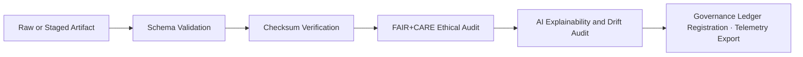

<div align="center">

# ✅ Kansas Frontier Matrix — **Validation Pipelines**
`src/pipelines/validation/README.md`

**Purpose:**  
Operate the **schema, checksum, FAIR+CARE, and AI audit pipelines** that guarantee data quality, ethical compliance, and reproducibility across KFM.  
These pipelines form an **auditable quality-control backbone** so every dataset and model meets FAIR+CARE, ISO, and governance standards **before release**.

[](../../../../docs/standards/)
[](../../../../LICENSE)
[](../../../../docs/standards/faircare-validation.md)
[]()
[]()

</div>

---

## 📘 Overview

The **Validation Pipelines** enforce KFM’s governance and reproducibility standards.  
They verify **schema integrity**, **checksum lineage**, **FAIR+CARE compliance**, and **explainability & bias** for AI outputs, then **register proofs** to the governance ledger and **export telemetry**.

### Core Responsibilities
- ✅ **Schema & metadata validation** (JSON Schema / Pydantic)  
- 🔐 **Checksum lineage** (SHA-256 for all artifacts)  
- 🧩 **FAIR+CARE ethics, accessibility, sustainability** audits  
- 🤖 **AI explainability, bias, and drift** evaluations (SHAP / LIME)  
- 🔗 **Governance proofs** (IPFS + blockchain) and **telemetry export**  

---

## 🗂️ Directory Layout

```plaintext
src/pipelines/validation/
├── README.md                      # This document
├── schema_validation.py            # Data/model schema conformance
├── checksum_audit.py               # SHA-256 generation and verification
├── faircare_audit_runner.py        # FAIR+CARE compliance & ethics checks
├── ai_explainability_validator.py  # Explainability, bias, and drift tests
└── metadata.json                   # Pipeline provenance & registry metadata
```

---

## ⚙️ Validation Workflow



### Workflow Summary
1. **Schema Validation:** Structural and field-level checks (JSON Schema / Pydantic).  
2. **Checksum Audit:** SHA-256 lineage confirmation per artifact.  
3. **FAIR+CARE Audit:** Reviews accessibility, attribution, authority to control, and sustainability notes.  
4. **AI Audit:** Explains predictions (SHAP/LIME), checks bias thresholds, and monitors drift.  
5. **Governance & Telemetry:** Writes proofs to IPFS + blockchain; exports runtime/energy/carbon & FAIR metrics.

---

## 🧩 Example Validation Metadata Record

```json
{
  "id": "validation_registry_v10.1.0",
  "pipelines_executed": [
    "schema_validation.py",
    "checksum_audit.py",
    "faircare_audit_runner.py",
    "ai_explainability_validator.py"
  ],
  "fairstatus": "certified",
  "schema_validated": true,
  "checksum_verified": true,
  "ai_explainability_verified": true,
  "bias_score": 0.010,
  "faircare_score": 0.996,
  "total_records_validated": 297540,
  "governance_registered": true,
  "created": "2025-11-10T00:00:00Z",
  "validator": "@kfm-validation"
}
```

---

## 🧠 FAIR+CARE Governance Matrix

| Principle | Implementation | Oversight |
|-----------|----------------|-----------|
| **Findable** | Validation outputs indexed with unique ledger & checksum IDs. | `@kfm-data` |
| **Accessible** | Reports emitted as JSON/CSV/Markdown for public review. | `@kfm-accessibility` |
| **Interoperable** | Aligns with ISO 19115, STAC 1.0, DCAT 3.0, OWL-Time. | `@kfm-architecture` |
| **Reusable** | MIT-licensed outputs for community verification. | `@kfm-design` |
| **Collective Benefit** | Transparent quality audits build public trust. | `@faircare-council` |
| **Authority to Control** | Council-governed rule updates & exceptions. | `@kfm-governance` |
| **Responsibility** | Engineers maintain schema & ethical validations. | `@kfm-sustainability` |
| **Ethics** | Bias, inclusivity, and accessibility checks per cycle. | `@kfm-ethics` |

Governance records:  
`data/reports/fair/data_care_assessment.json`  
`data/reports/audit/data_provenance_ledger.json`

---

## 🧮 Validation Module Summary

| Module | Function | FAIR+CARE Role | Standards |
|--------|----------|----------------|-----------|
| `schema_validation.py` | Data/model schema integrity | Data Integrity | JSON Schema · ISO 19115 |
| `checksum_audit.py` | SHA-256 lineage verification | Provenance | STAC · DCAT |
| `faircare_audit_runner.py` | FAIR+CARE compliance checks | Ethics Certification | MCP-DL v6.3 |
| `ai_explainability_validator.py` | Explainability & drift audit | Transparency | SHAP · LIME |

---

## ⚖️ Retention & Provenance Policy

| Record Type | Retention | Policy |
|-------------|-----------|--------|
| Validation Reports | 365 Days | Retained for reproducibility and audit. |
| FAIR+CARE Certifications | Permanent | Immutable in blockchain-ledger proofs. |
| Checksum Registries | Permanent | Stored in provenance logs and manifests. |
| AI Audit Logs | 180 Days | Rotated per retraining cycle. |

Retention automated via `.github/workflows/validation_sync.yml`.

---

## 🌿 Sustainability Metrics (Q4 2025)

| Metric | Value | Verified By |
|--------|-------|-------------|
| Avg. Runtime | 2.7 min | `@kfm-ops` |
| Energy Usage | 0.88 Wh | `@kfm-sustainability` |
| Carbon Output | 0.09 g CO₂e | `@kfm-security` |
| Renewable Energy | 100% (RE100) | `@kfm-infrastructure` |
| FAIR+CARE Compliance | 100% | `@faircare-council` |

Telemetry reference:  
`../../../../releases/v10.1.0/focus-telemetry.json`

---

## 🧾 Internal Citation

```text
Kansas Frontier Matrix (2025). Validation Pipelines (v10.1.0).
Automated schema, checksum, FAIR+CARE, and AI explainability validation ensuring transparent,
reproducible, and ethical governance across the Kansas Frontier Matrix.
Compliant with MCP-DL v6.3 · ISO 19115 · Diamond⁹ Ω / Crown∞Ω Ultimate Certification.
```

---

## 🕰️ Version History

| Version | Date | Author | Summary |
|---------|------|--------|---------|
| **v10.1.0** | 2025-11-10 | `@kfm-validation` | Upgraded to v10.1.0: added streaming validations, improved DCAT/STAC checks, enhanced energy metrics export. |
| **v10.0.0** | 2025-11-08 | `@kfm-validation` | Integrated AI explainability gates and governance proof sync. |
| **v9.7.0** | 2025-11-06 | `@kfm-validation` | Telemetry v3 schema; ISO-aligned automation hooks. |

---

<div align="center">

**Kansas Frontier Matrix**  
*Quality Assurance × FAIR+CARE Ethics × Transparent Validation Automation*  
© 2025 Kansas Frontier Matrix · Master Coder Protocol v6.3 · FAIR+CARE Certified · Diamond⁹ Ω / Crown∞Ω Ultimate Certified  

[Back to Pipelines Index](../README.md) · [Governance Charter](../../../../docs/standards/governance/DATA-GOVERNANCE.md)

</div>
