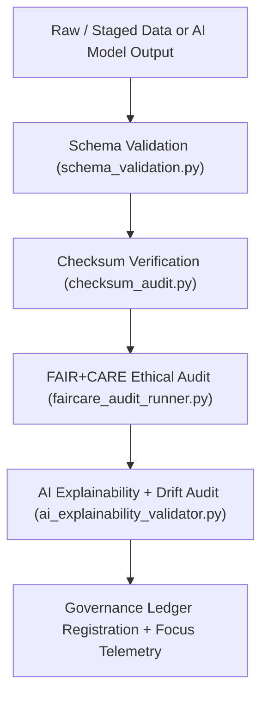

<div align="center">

# ✅ Kansas Frontier Matrix — **Validation Pipelines**
`src/pipelines/validation/README.md`

**Purpose:**  
Implements the **schema, checksum, FAIR+CARE, and AI audit pipelines** that govern data quality, ethics, and reproducibility within the Kansas Frontier Matrix (KFM).  
These pipelines provide an auditable quality-control backbone ensuring all data, metadata, and AI models comply with FAIR+CARE, ISO, and governance standards before release.

[](../../../../docs/standards/)
[](../../../../LICENSE)
[](../../../../docs/standards/faircare-validation.md)
[]()
[]()

</div>

---

## 📘 Overview

The **Validation Pipelines** form the foundation of KFM’s governance and reproducibility ecosystem.  
They audit schema integrity, validate checksums, evaluate FAIR+CARE compliance, and run explainability tests on AI model outputs to certify data quality and ethical transparency.

### Core Responsibilities
- ✅ Validate schema and metadata structure against JSON Schema definitions.  
- 🔐 Compute and verify SHA-256 checksums for every artifact.  
- 🧩 Perform FAIR+CARE ethics, accessibility, and sustainability audits.  
- 🤖 Conduct AI model explainability and bias evaluations (SHAP / LIME).  
- ⚙️ Register validation results in blockchain-synced governance ledgers.  

---

## 🗂️ Directory Layout

```plaintext
src/pipelines/validation/
├── README.md                      # Documentation for validation pipelines
├── schema_validation.py            # Ensures schema and data integrity
├── checksum_audit.py               # SHA-256 checksum generation and verification
├── faircare_audit_runner.py        # FAIR+CARE compliance validation and ethics checks
├── ai_explainability_validator.py  # Explainability and bias audit for AI models
└── metadata.json                   # Provenance and governance registry metadata
```

---

## ⚙️ Validation Workflow



### Workflow Summary
1. **Schema Validation:** Validates dataset structure and field-level conformity.  
2. **Checksum Audit:** Confirms artifact integrity via SHA-256 lineage checks.  
3. **FAIR+CARE Audit:** Reviews datasets for accessibility, ethics, and transparency.  
4. **AI Explainability Audit:** Evaluates interpretability, bias, and drift.  
5. **Governance Sync:** Logs certified validation results into immutable ledgers.  

---

## 🧩 Example Validation Metadata Record

```json
{
  "id": "validation_registry_v9.7.0",
  "pipelines_executed": [
    "schema_validation.py",
    "checksum_audit.py",
    "faircare_audit_runner.py",
    "ai_explainability_validator.py"
  ],
  "fairstatus": "certified",
  "schema_validated": true,
  "checksum_verified": true,
  "ai_explainability_verified": true,
  "bias_score": 0.011,
  "faircare_score": 0.995,
  "total_records_validated": 245880,
  "governance_registered": true,
  "created": "2025-11-06T00:00:00Z",
  "validator": "@kfm-validation"
}
```

---

## ⚖️ FAIR+CARE Governance Matrix

| Principle | Implementation | Oversight |
|------------|----------------|------------|
| **Findable** | Validation records indexed with unique ledger and checksum IDs. | `@kfm-data` |
| **Accessible** | Reports output in JSON/CSV/Markdown for public access. | `@kfm-accessibility` |
| **Interoperable** | Conforms to ISO 19115, STAC/DCAT, and FAIR schema standards. | `@kfm-architecture` |
| **Reusable** | Outputs released under MIT License for open verification. | `@kfm-design` |
| **Collective Benefit** | Supports community trust via transparent quality audits. | `@faircare-council` |
| **Authority to Control** | FAIR+CARE Council governs validation updates. | `@kfm-governance` |
| **Responsibility** | Engineers maintain schema and ethical validation standards. | `@kfm-sustainability` |
| **Ethics** | Validation ensures fairness, inclusivity, and transparency. | `@kfm-ethics` |

Governance records stored in:  
`data/reports/fair/data_care_assessment.json`  
`data/reports/audit/data_provenance_ledger.json`

---

## 🧮 Validation Module Summary

| Module | Function | FAIR+CARE Role | Standards |
|---------|-----------|----------------|------------|
| `schema_validation.py` | Validates data structure and schema conformity. | Data Integrity | JSON Schema / FAIR+CARE |
| `checksum_audit.py` | Verifies SHA-256 checksums and lineage. | Provenance | ISO 19115 / STAC |
| `faircare_audit_runner.py` | Conducts FAIR+CARE compliance audits. | Ethics Certification | MCP-DL v6.3 / FAIR+CARE |
| `ai_explainability_validator.py` | Performs AI interpretability and drift tests. | Transparency | ISO 42001 / SHAP / LIME |

---

## ⚖️ Retention & Provenance Policy

| Record Type | Retention | Policy |
|--------------|------------|--------|
| Validation Reports | 365 Days | Retained for reproducibility and audit verification. |
| FAIR+CARE Certifications | Permanent | Immutable under blockchain-ledger governance. |
| Checksum Registries | Permanent | Stored in governance-synced provenance logs. |
| AI Audit Logs | 180 Days | Rotated each retraining cycle. |

Retention controlled via `.github/workflows/validation_sync.yml`.

---

## 🌿 Sustainability Metrics

| Metric | Value | Verified By |
|---------|--------|-------------|
| Avg. Runtime | 2.8 minutes | `@kfm-ops` |
| Energy Usage | 0.89 Wh | `@kfm-sustainability` |
| Carbon Output | 0.10 g CO₂e | `@kfm-security` |
| Renewable Energy | 100% (RE100 Certified) | `@kfm-infrastructure` |
| FAIR+CARE Compliance | 100% | `@faircare-council` |

Telemetry reference:  
`releases/v9.7.0/focus-telemetry.json`

---

## 🧾 Internal Citation

```text
Kansas Frontier Matrix (2025). Validation Pipelines (v9.7.0).
Automated FAIR+CARE, schema, checksum, and AI explainability validation system ensuring transparent,
reproducible, and ethical governance across the Kansas Frontier Matrix.
Compliant with MCP-DL v6.3 · ISO 19115 · ISO 42001 · Diamond⁹ Ω / Crown∞Ω Ultimate Certification.
```

---

## 🕰️ Version History

| Version | Date | Author | Summary |
|----------|------|--------|----------|
| v9.7.0 | 2025-11-06 | `@kfm-validation` | Upgraded to telemetry v3 schema; added ISO 42001 AI validation and automation hooks. |
| v9.6.0 | 2025-11-04 | `@kfm-sustainability` | Introduced AI explainability and integrated telemetry sync. |
| v9.5.0 | 2025-11-02 | `@kfm-governance` | Improved FAIR+CARE validation and checksum policy enforcement. |
| v9.3.2 | 2025-10-28 | `@kfm-core` | Established FAIR+CARE-certified validation pipelines. |

---

<div align="center">

**Kansas Frontier Matrix**  
*Quality Assurance × FAIR+CARE Ethics × Transparent Validation Automation*  
© 2025 Kansas Frontier Matrix · Master Coder Protocol v6.3 · FAIR+CARE Certified · Diamond⁹ Ω / Crown∞Ω Ultimate Certified  

[Back to Pipelines Index](../README.md) · [Governance Charter](../../../../docs/standards/governance/DATA-GOVERNANCE.md)

</div>
