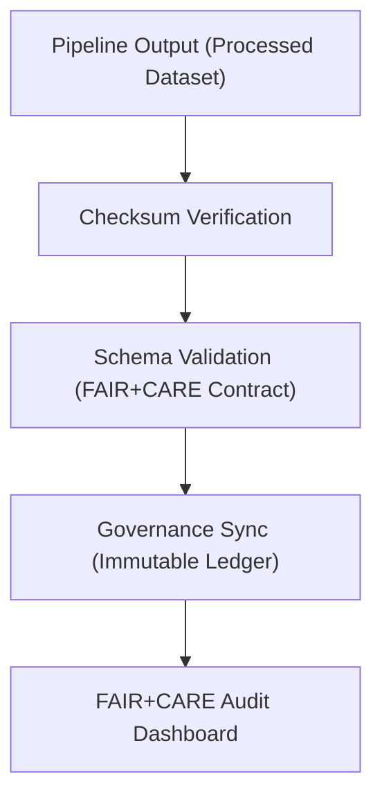

<div align="center">

# ✅ Kansas Frontier Matrix — **Pipeline Validation & Governance Synchronization**
`src/pipelines/validation/README.md`

**Purpose:** Defines the data and workflow validation routines that ensure every pipeline stage in the **Kansas Frontier Matrix** meets FAIR+CARE standards, schema integrity, and governance compliance.  
Implements reproducible validation, checksum verification, and governance synchronization for all processed datasets.

[](../../../../.github/workflows/pipeline-validate.yml)  
[](../../../../docs/standards/faircare-validation.md)  
[](../../../../docs/architecture/repo-focus.md)

</div>

---

## 📚 Overview

The **Pipeline Validation Layer** ensures that every ETL, AI, and governance workflow produces verifiable, schema-compliant, and ethically sound outputs.  
It enforces reproducibility through checksum verification, schema validation, and FAIR+CARE compliance audits, with all results logged into the Immutable Governance Ledger.

**Core Objectives:**
- 🧩 Validate datasets and outputs against FAIR+CARE ethical criteria  
- 🧮 Verify file integrity through checksum and hash validation  
- 🧾 Validate schema compliance against `data-contract-v3.json`  
- ⚖️ Register validation events in Immutable Governance Ledger  
- 🔍 Generate transparency and provenance telemetry for audit review  

---

## 🗂️ Directory Layout

```plaintext
src/pipelines/validation/
├── README.md                     # This file — validation and governance documentation
│
├── checksum_verify.py             # Verifies SHA-256 integrity of datasets and files
├── schema_validate.py             # Checks schema alignment with KFM Data Contract v3
└── governance_sync.py             # Pushes validation and audit data to Immutable Governance Ledger
```

**File Descriptions:**

- **`checksum_verify.py`** — Validates file integrity for all pipeline outputs and logs verified signatures.  
- **`schema_validate.py`** — Ensures datasets conform to `data-contract-v3.json` and FAIR+CARE field requirements.  
- **`governance_sync.py`** — Synchronizes validation results, telemetry, and lineage data with the Immutable Governance Ledger.

---

## ⚙️ Example Workflows

### 🔒 Run Checksum Verification
```bash
python src/pipelines/validation/checksum_verify.py \
  --input data/processed/noaa_contextualized.geojson \
  --manifest releases/v9.4.0/manifest.zip
```

**Output Example:**
```json
{
  "file": "data/processed/noaa_contextualized.geojson",
  "checksum_sha256": "b9e21e7f113e4125c59b3d8f75e82d46f8f23a83a0e67abdc85cc19de91a7fcb",
  "verified": true,
  "timestamp": "2025-11-02T00:00:00Z"
}
```

---

### 📜 Schema Validation
```bash
python src/pipelines/validation/schema_validate.py \
  --input data/processed/noaa_contextualized.geojson \
  --contract docs/contracts/data-contract-v3.json
```

**Output Example:**
```json
{
  "dataset": "noaa_contextualized.geojson",
  "schema_status": "valid",
  "missing_fields": [],
  "faircare_alignment": ["Findable", "Accessible", "Ethics"],
  "validated_by": "schema_validate.py",
  "timestamp": "2025-11-02T00:00:00Z"
}
```

---

### ⚖️ Governance Synchronization
```bash
python src/pipelines/validation/governance_sync.py \
  --input reports/pipelines/validation-summary.json \
  --ledger reports/audit/governance-ledger.json
```

**Ledger Update Example:**
```json
{
  "event": "pipeline_validation",
  "pipeline": "noaa_enrichment_v1",
  "checksum_verified": true,
  "schema_validated": true,
  "governance_hash": "a1f7c8e2b93c4d76e1f3a5d9c65e8b2f7d9c2d3a4f1e5a6b9e8b1c2d3f4a5b6",
  "timestamp": "2025-11-02T00:00:00Z"
}
```

---

## 🧩 FAIR+CARE Validation Integration

| Validation Step | FAIR Principle | CARE Principle | Output |
|------------------|----------------|----------------|---------|
| **Checksum Verification** | Traceable / Reproducible | Responsibility | `reports/pipelines/checksum-validation.json` |
| **Schema Validation** | Interoperable / Reusable | Ethics | `reports/pipelines/schema-validation.json` |
| **Governance Sync** | Transparent / Accountable | Authority | `reports/audit/governance-ledger.json` |

Governance artifacts and telemetry linked to:
```
releases/v9.4.0/focus-telemetry.json
reports/audit/governance-ledger.json
```

---

## 🔗 Validation Governance Workflow



**Workflow Summary:**
1. Each dataset verified against checksums for reproducibility.  
2. Schema and ethical compliance validated under FAIR+CARE rules.  
3. Governance ledger synchronized with validation and telemetry data.  
4. FAIR+CARE audit dashboards updated for transparency.  

---

## 🧠 Telemetry & Provenance Logging

All validation events are automatically captured in governance telemetry with JSON-LD provenance fields.

Telemetry Schema:  
`schemas/telemetry/pipelines-telemetry-v1.json`

Telemetry Outputs:
```
reports/pipelines/validation-events.json
reports/audit/governance-ledger.json
releases/v9.4.0/focus-telemetry.json
```

---

## 🧩 Standards & Compliance Mapping

| Standard | Purpose | Implementation |
|-----------|----------|----------------|
| **MCP-DL v6.4.3** | Documentation-driven validation governance | This README + validation scripts |
| **FAIR+CARE** | Ethical validation and reproducibility assurance | Validation + governance sync |
| **ISO 19115** | Metadata structure and lineage validation | Schema and contract validation |
| **ISO 23894** | AI and pipeline lifecycle risk management | FAIR+CARE audit validation |
| **DCAT / JSON-LD** | Metadata interoperability | Provenance sync via governance ledger |

---

## 🛡️ Security, Integrity & Observability

- **Integrity:** Every file and report signed via SHA-256 and stored with audit metadata.  
- **Provenance:** Validation results exported as JSON-LD with FAIR+CARE fields.  
- **Reproducibility:** Automated validation ensures deterministic pipeline outcomes.  
- **Governance:** Immutable Ledger guarantees traceability and ethics alignment.  

Governance Reports:
```
reports/pipelines/checksum-validation.json
reports/pipelines/schema-validation.json
reports/audit/governance-ledger.json
```

---

## 🧾 Version History

| Version | Date | Author | Summary |
|----------|------|---------|----------|
| v9.4.0 | 2025-11-02 | @kfm-data | Added full validation workflow, FAIR+CARE schema integration, and governance synchronization. |
| v9.3.3 | 2025-11-01 | @kfm-etl | Improved checksum automation and telemetry event logging. |
| v9.3.2 | 2025-10-29 | @bartytime4life | Enhanced FAIR+CARE validation logic with ethics scoring. |
| v9.3.1 | 2025-10-27 | @kfm-architecture | Integrated Immutable Ledger update pipeline. |
| v9.3.0 | 2025-10-25 | @kfm-governance | Established validation and audit synchronization under MCP-DL v6.4.3. |

---

<div align="center">

**Kansas Frontier Matrix — Ethical Validation Framework for Reproducible Science**  
*“Every dataset verified. Every schema validated. Every process governed.”* 🔗  
📍 `src/pipelines/validation/README.md` — FAIR+CARE-certified documentation for pipeline validation, checksum verification, and governance synchronization within the Kansas Frontier Matrix.

</div>
