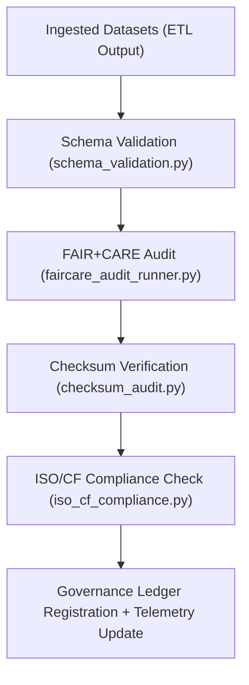

<div align="center">

# ✅ Kansas Frontier Matrix — **Validation Pipelines**
`src/pipelines/validation/README.md`

**Purpose:**  
FAIR+CARE-certified validation suite for schema auditing, ethics evaluation, and checksum verification across all Kansas Frontier Matrix (KFM) workflows.  
This framework ensures that every dataset, AI output, and metadata artifact meets FAIR+CARE and ISO governance requirements before publication.

[](../../../../docs/standards/faircare-validation.md)
[](../../../../LICENSE)
[](../../../../docs/architecture/repo-focus.md)

</div>

---

## 📚 Overview

The `src/pipelines/validation/` directory contains **automated schema and FAIR+CARE validation pipelines** for ensuring integrity, accessibility, and reproducibility across KFM’s datasets and governance artifacts.  
Validation scripts operate autonomously within continuous integration (CI) and Focus Mode governance workflows.

### Core Responsibilities
- Validate schemas for tabular, geospatial, and AI-generated data.  
- Perform FAIR+CARE ethical audits and reproducibility scoring.  
- Compute and verify checksums to ensure data integrity.  
- Register validation results into provenance-ledger governance systems.  

---

## 🗂️ Directory Layout

```plaintext
src/pipelines/validation/
├── README.md                              # This file — documentation for validation pipelines
│
├── schema_validation.py                   # Validates dataset schemas against KFM data contracts
├── faircare_audit_runner.py               # Executes FAIR+CARE ethical audits and accessibility reviews
├── checksum_audit.py                      # Computes and verifies SHA-256 checksums for reproducibility
├── iso_cf_compliance.py                   # Confirms CF, ISO, and metadata standard alignment
└── metadata.json                          # Provenance, checksum, and governance metadata
```

---

## ⚙️ Validation Workflow



### Workflow Description
1. **Schema Validation:** Confirms structure, field types, and JSON schema compliance.  
2. **FAIR+CARE Audit:** Evaluates ethics, accessibility, and community governance principles.  
3. **Checksum Verification:** Ensures data consistency across ETL and processed layers.  
4. **Standards Compliance:** Validates metadata alignment with ISO 19115 and CF conventions.  
5. **Governance Logging:** Synchronizes validation outputs to blockchain-based provenance ledgers.  

---

## 🧩 Example Validation Metadata Record

```json
{
  "id": "src_validation_pipeline_v9.5.0_2025Q4",
  "pipelines_executed": [
    "schema_validation.py",
    "checksum_audit.py",
    "faircare_audit_runner.py"
  ],
  "datasets_validated": 184,
  "checksum_verified": true,
  "fairstatus": "certified",
  "iso_cf_compliance": true,
  "governance_registered": true,
  "telemetry_ref": "releases/v9.5.0/focus-telemetry.json",
  "governance_ref": "reports/audit/ai_src_validation_ledger.json",
  "created": "2025-11-02T23:59:00Z",
  "validator": "@kfm-validation"
}
```

---

## 🧠 FAIR+CARE Governance Matrix

| Principle | Implementation |
|------------|----------------|
| **Findable** | Validation reports indexed by dataset ID and governance ledger entry. |
| **Accessible** | Results available in open JSON format for governance dashboards. |
| **Interoperable** | Compliance verified across FAIR+CARE, ISO 19115, and DCAT 3.0 schemas. |
| **Reusable** | Validation outputs stored for long-term audit reproducibility. |
| **Collective Benefit** | Promotes transparent ethics and reproducibility in open science. |
| **Authority to Control** | FAIR+CARE Council certifies validation and governance registration. |
| **Responsibility** | Validators maintain complete checksum and FAIR+CARE trace logs. |
| **Ethics** | All data audited for ethical compliance and equitable governance. |

Audit records preserved in:  
`reports/audit/ai_src_validation_ledger.json` • `reports/fair/src_validation_summary.json`

---

## ⚙️ Validation Pipelines Summary

| Pipeline | Purpose | FAIR+CARE Function |
|-----------|----------|--------------------|
| `schema_validation.py` | Validates schema and contract conformity. | FAIR+CARE data standardization. |
| `faircare_audit_runner.py` | Executes FAIR+CARE ethics and governance audit. | Ethical validation and certification. |
| `checksum_audit.py` | Ensures file integrity and reproducibility. | FAIR+CARE integrity assurance. |
| `iso_cf_compliance.py` | Confirms ISO/CF metadata adherence. | Standards interoperability. |

All validation pipelines automated via `validation_pipelines_sync.yml`.

---

## ⚖️ Governance & Provenance Integration

| Record | Description |
|---------|-------------|
| `metadata.json` | Records validation lineage and governance synchronization details. |
| `data/reports/audit/data_provenance_ledger.json` | Logs validation lineage, checksums, and certification. |
| `data/reports/fair/data_care_assessment.json` | Contains FAIR+CARE evaluation summaries. |
| `releases/v9.5.0/manifest.zip` | Global registry of validated checksums for reproducibility. |

Governance updates triggered automatically during CI/CD runs.

---

## 🧾 Retention Policy

| File Type | Retention Duration | Policy |
|------------|--------------------|--------|
| Validation Reports | 365 days | Retained for reproducibility and FAIR+CARE certification. |
| FAIR+CARE Audits | Permanent | Archived for ethical governance continuity. |
| Checksums | Permanent | Maintained for provenance and ledger audits. |
| Metadata | Permanent | Preserved for traceability and governance lineage. |

Cleanup handled via `validation_pipelines_cleanup.yml`.

---

## 🧾 Internal Use Citation

```text
Kansas Frontier Matrix (2025). Validation Pipelines (v9.5.0).
FAIR+CARE-certified validation system for schema auditing, ethics compliance, and reproducibility verification.
Ensures transparent, ethical, and ISO-aligned automation under MCP-DL v6.3.
```

---

## 🧾 Version Notes

| Version | Date | Notes |
|----------|------|--------|
| v9.5.0 | 2025-11-02 | Added ISO/CF compliance pipeline and FAIR+CARE audit automation. |
| v9.3.2 | 2025-10-28 | Enhanced governance linkage and checksum verification. |
| v9.3.0 | 2025-10-26 | Established validation pipelines for schema, checksum, and FAIR+CARE ethics certification. |

---

<div align="center">

**Kansas Frontier Matrix** · *Validation × FAIR+CARE Ethics × Provenance Integrity*  
[🔗 Repository](https://github.com/bartytime4life/Kansas-Frontier-Matrix) • [🧭 Docs Portal](../../../../docs/) • [⚖️ Governance Ledger](../../../../docs/standards/governance/)

</div>

