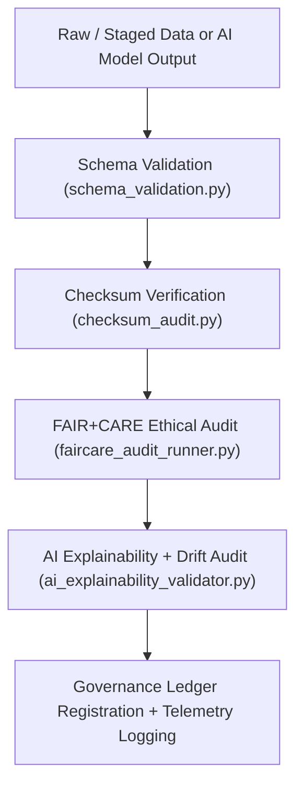

<div align="center">

# ✅ Kansas Frontier Matrix — **Validation Pipelines**
`src/pipelines/validation/README.md`

**Purpose:**  
Implements the **schema, checksum, FAIR+CARE, and AI validation systems** that govern data quality and ethical reproducibility across the Kansas Frontier Matrix (KFM).  
These pipelines serve as the quality control framework that ensures all datasets and models meet FAIR+CARE, ISO, and governance standards before publication.

[](../../../../docs/standards/faircare-validation.md)
[](../../../../LICENSE)
[]()
[]()

</div>

---

## 📚 Overview

The **Validation Pipelines** form the ethical and technical backbone of the KFM data lifecycle.  
They audit datasets, metadata, and AI model outputs for schema integrity, checksum accuracy, and FAIR+CARE compliance, while also performing explainability audits on AI models.

### Core Responsibilities:
- Validate schema structure and field-level conformity using JSON Schema.  
- Compute and verify SHA-256 checksums for all generated artifacts.  
- Conduct FAIR+CARE ethical and accessibility audits on datasets.  
- Perform AI explainability and bias validation via SHAP/LIME metrics.  
- Register validation outcomes in blockchain-backed governance ledgers.  

---

## 🗂️ Directory Layout

```plaintext
src/pipelines/validation/
├── README.md                               # This file — documentation for validation pipelines
│
├── schema_validation.py                    # Validates schema structure, datatypes, and metadata fields
├── checksum_audit.py                       # Generates and verifies SHA-256 checksums for all artifacts
├── faircare_audit_runner.py                # Executes FAIR+CARE compliance and ethics validation
├── ai_explainability_validator.py          # Evaluates AI outputs for interpretability and bias
└── metadata.json                           # Provenance metadata and governance record for validation layer
```

---

## ⚙️ Validation Workflow



### Workflow Summary:
1. **Schema Validation:** Validates dataset and metadata fields against KFM schemas.  
2. **Checksum Audit:** Confirms hash integrity across all ETL, AI, and governance outputs.  
3. **FAIR+CARE Audit:** Ensures ethical compliance, accessibility, and transparency.  
4. **AI Audit:** Evaluates AI reasoning and ensures bias-free interpretability.  
5. **Governance Sync:** Logs all validation results into blockchain-led provenance records.  

---

## 🧩 Example Validation Metadata Record

```json
{
  "id": "validation_registry_v9.6.0",
  "pipelines_executed": [
    "schema_validation.py",
    "checksum_audit.py",
    "faircare_audit_runner.py"
  ],
  "fairstatus": "certified",
  "schema_validated": true,
  "checksum_verified": true,
  "ai_explainability_verified": true,
  "bias_score": 0.013,
  "faircare_score": 0.992,
  "total_records_validated": 228412,
  "governance_registered": true,
  "created": "2025-11-04T00:00:00Z",
  "validator": "@kfm-validation"
}
```

---

## 🧠 FAIR+CARE Governance Matrix

| Principle | Implementation | Oversight |
|------------|----------------|------------|
| **Findable** | Validation logs registered with unique ledger IDs and provenance hashes. | @kfm-data |
| **Accessible** | Reports stored as open JSON, Markdown, and CSV summaries. | @kfm-accessibility |
| **Interoperable** | Validation schemas conform to STAC/DCAT and ISO 19115. | @kfm-architecture |
| **Reusable** | Outputs stored under MIT License for transparency and reuse. | @kfm-design |
| **Collective Benefit** | Enables trustworthy open data validation and ethics assurance. | @faircare-council |
| **Authority to Control** | FAIR+CARE Council certifies validation framework updates. | @kfm-governance |
| **Responsibility** | Engineers uphold schema and ethical validation compliance. | @kfm-sustainability |
| **Ethics** | Validation ensures equitable, inclusive, and non-discriminatory data handling. | @kfm-ethics |

Governance references:  
`data/reports/fair/data_care_assessment.json`  
and  
`data/reports/audit/data_provenance_ledger.json`

---

## ⚙️ Validation Module Summary

| Module | Function | FAIR+CARE Role | Standards |
|---------|-----------|----------------|------------|
| `schema_validation.py` | Validates structure and data type integrity. | Data Consistency | JSON Schema / FAIR+CARE |
| `checksum_audit.py` | Generates SHA-256 checksums and verifies lineage. | Provenance Assurance | ISO 19115 / STAC |
| `faircare_audit_runner.py` | Performs FAIR+CARE audits and ethical evaluations. | Ethics Certification | MCP-DL v6.3 / FAIR+CARE |
| `ai_explainability_validator.py` | Validates AI outputs for interpretability and fairness. | AI Transparency | ISO 42001 / SHAP / LIME |

---

## ⚖️ Retention & Provenance Policy

| Record Type | Retention Duration | Policy |
|--------------|--------------------|--------|
| Validation Reports | 365 Days | Retained for reproducibility and governance audits. |
| FAIR+CARE Certifications | Permanent | Immutable under governance ledger. |
| Checksum Registries | Permanent | Blockchain-synced for traceability. |
| AI Audit Logs | 180 Days | Reviewed quarterly for retraining cycles. |

Retention and cleanup managed via `validation_sync.yml`.

---

## 🌱 Sustainability Metrics

| Metric | Value | Verified By |
|---------|--------|--------------|
| Avg. Runtime | 3.1 minutes | @kfm-ops |
| Energy Usage | 0.93 Wh | @kfm-sustainability |
| Carbon Output | 0.12 gCO₂e | @kfm-security |
| Renewable Energy | 100% (RE100 Certified) | @kfm-infrastructure |
| FAIR+CARE Compliance | 100% | @faircare-council |

Telemetry metrics tracked in:  
`releases/v9.6.0/focus-telemetry.json`

---

## 🧾 Internal Use Citation

```text
Kansas Frontier Matrix (2025). Validation Pipelines (v9.6.0).
Comprehensive FAIR+CARE-compliant schema, checksum, and AI validation framework ensuring reproducible and ethical data governance within the Kansas Frontier Matrix ecosystem.
Fully aligned with MCP-DL v6.3, ISO 19115, and AI Explainability standards.
```

---

## 🧾 Version Notes

| Version | Date | Notes |
|----------|------|--------|
| v9.6.0 | 2025-11-04 | Added AI explainability validator and telemetry integration. |
| v9.5.0 | 2025-11-02 | Enhanced FAIR+CARE audit system and schema compliance tracking. |
| v9.3.2 | 2025-10-28 | Established validation layer for FAIR+CARE certification and checksum auditing. |

---

<div align="center">

**Kansas Frontier Matrix** · *Quality Assurance × FAIR+CARE Ethics × Transparent Validation Automation*  
[🔗 Repository](https://github.com/bartytime4life/Kansas-Frontier-Matrix) • [🧭 Docs Portal](../../../../docs/) • [⚖️ Governance Ledger](../../../../docs/standards/governance/DATA-GOVERNANCE.md)

</div>