<div align="center">

# ✅ Kansas Frontier Matrix — **Validation Pipelines (v11 LTS)**  
`src/pipelines/validation/README.md`

**Purpose:**  
Operate the **schema, checksum, FAIR+CARE, sovereignty, and AI audit pipelines** that guarantee data quality, ethical compliance, and reproducibility across KFM v11.  
These pipelines form an **auditable quality-control backbone** so every dataset, model, and narrative meets FAIR+CARE, ISO, and governance standards **before promotion or release**.

[](../../../../docs/standards/)
[](../../../../LICENSE)
[](../../../../docs/standards/faircare-validation.md)
[]()
[]()

</div>

---

## 📘 1. Overview

The **Validation Pipelines** enforce KFM’s **governance**, **quality**, and **reproducibility** standards.

They verify:

- **Schema integrity** and metadata completeness  
- **Checksum lineage** (sha256 for all artifacts)  
- **FAIR+CARE compliance & sovereignty rules**  
- **AI explainability, bias, and drift**  
- **Contract adherence** (KFM-PDC v11)  

Then they:

- **Register proofs** to the governance ledger(s)  
- Write **PROV-O + OpenLineage** lineage  
- **Emit telemetry** for reliability & sustainability dashboards  
- Provide **Focus Mode v3** with quality and ethics context flags  

Validation is the **gate** between “work-in-progress” and “governed KFM assets.”

---

## 🗂️ 2. Directory Layout (v11)

```text
src/pipelines/validation/
│
├── README.md                      # This document
│
├── schema_validation.py           # Data/model schema conformance (JSON Schema / Pydantic)
├── checksum_audit.py              # SHA-256 generation and verification
├── faircare_audit_runner.py       # FAIR+CARE & sovereignty audits
├── ai_explainability_validator.py # Explainability, bias, and drift evaluations
└── metadata.json                  # Validation pipeline provenance & registry metadata
```

---

## ⚙️ 3. Validation Workflow (v11)

```mermaid
flowchart LR
    A["Raw or Staged Artifact"] --> B["📐 Schema Validation"]
    B --> C["🔐 Checksum Verification"]
    C --> D["🧩 FAIR+CARE & Sovereignty Audit"]
    D --> E["🤖 AI Explainability & Drift Audit"]
    E --> F["🏛 Governance Ledger Registration · 📡 Telemetry Export"]
```



### Summary

1. **Schema Validation** — structural and field-level checks (JSON Schema / Pydantic).  
2. **Checksum Audit** — sha256 lineage confirmation for every output artifact.  
3. **FAIR+CARE & Sovereignty Audit** — ensures ethical, accessible, and sovereign-safe data.  
4. **AI Audit** — reasonability, explainability, bias & drift checks (SHAP/LIME/other XAI).  
5. **Governance & Telemetry** — writes proofs to governance ledgers, updates lineage, and emits telemetry.

---

## 🧩 4. Example Validation Metadata Record (v11)

```json
{
  "id": "validation_registry_v11.0.0",
  "pipelines_executed": [
    "schema_validation.py",
    "checksum_audit.py",
    "faircare_audit_runner.py",
    "ai_explainability_validator.py"
  ],
  "fairstatus": "certified",
  "schema_validated": true,
  "checksum_verified": true,
  "ai_explainability_verified": true,
  "bias_score": 0.010,
  "faircare_score": 0.996,
  "total_records_validated": 297540,
  "governance_registered": true,
  "created": "2025-11-24T00:00:00Z",
  "validator": "@kfm-validation"
}
```

---

## 🧠 5. FAIR+CARE Governance Matrix

| Principle | Implementation | Oversight |
|-----------|----------------|-----------|
| **Findable** | Validation outputs indexed with unique ledger & checksum IDs. | `@kfm-data` |
| **Accessible** | Reports (JSON/CSV/markdown) available for internal/public review as appropriate. | `@kfm-accessibility` |
| **Interoperable** | Aligns with ISO 19115, STAC 1.0, DCAT 3.0, OWL-Time, CIDOC-CRM. | `@kfm-architecture` |
| **Reusable** | MIT-licensed outputs for community validation & reuse. | `@kfm-design` |
| **Collective Benefit** | Transparent quality audits build public trust. | `@faircare-council` |
| **Authority to Control** | Council-governed rule updates & overrides tracked in ledgers. | `@kfm-governance` |
| **Responsibility** | Engineering maintains schemas et al. and responds to flagged issues. | `@kfm-sustainability` |
| **Ethics** | Bias, inclusivity, and accessibility checks performed for critical datasets/models. | `@kfm-ethics` |

Governance records:

- `data/reports/fair/data_care_assessment.json`  
- `data/reports/audit/data_provenance_ledger.json`

---

## 🧮 6. Validation Modules Summary

| Module | Function | FAIR+CARE Role | Standards |
|--------|----------|----------------|-----------|
| `schema_validation.py` | Data/model schema integrity checks | Data Integrity | JSON Schema · ISO 19115 |
| `checksum_audit.py` | SHA-256 lineage verification | Provenance | STAC · DCAT · PROV-O |
| `faircare_audit_runner.py` | FAIR+CARE + sovereignty compliance | Ethics Certification | MCP-DL v6.3 |
| `ai_explainability_validator.py` | Explainability & drift audit | Transparency | SHAP · LIME · XAI tools |

---

## ⚖️ 7. Retention & Provenance Policy

| Record Type | Retention | Policy |
|-------------|-----------|--------|
| Validation Reports | 365 days | Kept for reproducibility & internal/public audits. |
| FAIR+CARE Certifications | Permanent | Anchored in governance ledgers (optionally on-chain). |
| Checksum Registries | Permanent | Stored in provenance logs & manifests. |
| AI Audit Logs | 180 days | Rotated per AI retraining & model-card update cycles. |

Retention automated via `.github/workflows/validation_sync.yml`.

---

## 🌿 8. Sustainability Metrics (Q4 2025, Example)

| Metric | Value | Verified By |
|--------|-------|-------------|
| Avg. Runtime | 2.7 min | `@kfm-ops` |
| Energy Usage | 0.88 Wh | `@kfm-sustainability` |
| Carbon Output | 0.09 g CO₂e | `@kfm-security` |
| Renewable Energy | 100% (RE100) | `@kfm-infrastructure` |
| FAIR+CARE Compliance | 100% | `@faircare-council` |

Telemetry reference:

```
../../../../releases/v11.0.0/validation-telemetry.json
```

---

## 🧾 9. Internal Citation

```text
Kansas Frontier Matrix (2025). Validation Pipelines (v11.0.0).
Automated schema, checksum, FAIR+CARE, sovereignty, and AI explainability validation
ensuring transparent, reproducible, and ethical governance across the Kansas Frontier Matrix.
Compliant with MCP-DL v6.3 · ISO 19115 · Diamond⁹ Ω / Crown∞Ω Ultimate Certification.
```

---

## 🕰️ 10. Version History

| Version | Date | Author | Summary |
|---------|------|--------|---------|
| **v11.0.0** | 2025-11-24 | `@kfm-validation` | Upgraded to KFM-MDP v11; added sovereignty checks, telemetry v11, Data Contracts v11, and OpenLineage v2.5 integration. |
| **v10.1.0** | 2025-11-10 | `@kfm-validation` | Streaming validations, improved STAC/DCAT checks, enhanced energy metrics export. |
| **v10.0.0** | 2025-11-08 | `@kfm-validation` | Integrated AI explainability gates and governance proof sync. |
| **v9.7.0** | 2025-11-06 | `@kfm-validation` | Telemetry v3 schema; ISO-aligned automation hooks. |

---

<div align="center">

**Kansas Frontier Matrix**  
*Quality Assurance × FAIR+CARE Ethics × Sovereignty-Safe Validation Automation*  
© 2025 Kansas Frontier Matrix · Master Coder Protocol v6.3 · FAIR+CARE Certified · Diamond⁹ Ω / Crown∞Ω Ultimate Certified  

[Back to Pipelines Index](../README.md) · [Governance Charter](../../../../docs/standards/governance/ROOT-GOVERNANCE.md)

</div>