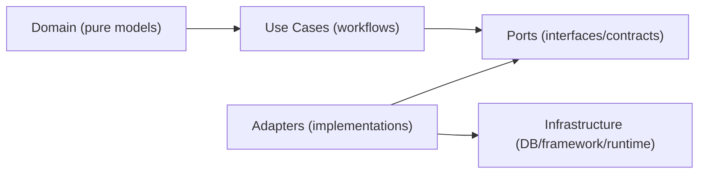

# 🔌 KFM Ports (Interfaces / Contracts)

Welcome to `src/ports/`.

This directory is the **contract surface** between KFM’s **core logic** (Domain + Use Cases) and the **outside world** (datastores, frameworks, network services, auth providers, search engines, queues, etc.).

In KFM’s architecture, the Integration & Interface layer defines **interfaces** (ports) and **adapters** (implementations) so that **core logic depends only on interfaces**, not on infrastructure. This layer is also the practical **“trust membrane”**: all access to data/functions must flow through governed interfaces where validation and permission checks can be enforced consistently. 🛡️ [oai_citation:2‡Kansas Frontier Matrix (KFM) Comprehensive Guide.pdf](sediment://file_000000004530722f96d93b826296d578)

---

## 🧭 What “Ports” Mean Here

A **port** is an interface (contract) that describes *what the system needs* (or *what it offers*) without committing to *how it’s implemented*.

Examples:
- A `ParcelRepository` port describes how Use Cases load/store parcels.
- A `PolicyDecisionPoint` port describes how authorization decisions are requested.
- A `SearchIndex` port describes search operations without binding to OpenSearch/Elasticsearch.
- A `ProvenanceWriter` port describes how provenance is recorded without binding to Postgres/Neo4j.

Adapters (infrastructure implementations) plug into these ports.

---

## ✅ What Belongs in `src/ports/`

Use this directory for **pure contracts**:

| Category | What it is | Typical artifacts |
|---|---|---|
| Repository ports | Storage-agnostic persistence access | `*Repository` interfaces |
| External service ports | Calls to third-party or internal services | `*Client` / `*Gateway` interfaces |
| Policy & governance ports | AuthZ/authN, redaction, governance review triggers | PDP/PEP interfaces, redaction policies |
| Observability ports | Logging, metrics, tracing abstraction (if needed) | `TelemetrySink`, `AuditLogger` |
| Eventing ports | Pub/sub, queues, workflows | `EventBus`, `QueuePublisher` |

### 🚫 What does *not* belong here
- Database drivers, ORM models, SQL, Cypher
- HTTP controllers / FastAPI routers
- GraphQL resolvers
- React/UI code
- Concrete adapters (PostGIS/Neo4j/OpenSearch/etc.)

> [!IMPORTANT]
> Ports must stay **framework-free** and **storage-free**. They are contracts, not implementations.
> This protects the “swap adapters without rewriting core logic” principle and preserves the trust membrane.  [oai_citation:3‡Kansas Frontier Matrix (KFM) Comprehensive Guide.pdf](sediment://file_000000004530722f96d93b826296d578)

---

## 🧱 Dependency Rules (Non‑Negotiable)

**Allowed dependencies:**
- Ports may reference **Domain types** (entities/value objects), because contracts must describe real business concepts.
- Use Cases may depend on ports.

**Forbidden dependencies:**
- Ports must not import infrastructure/framework modules (DB clients, HTTP frameworks, cloud SDKs, UI libs).

### Mermaid view of the dependency direction



---

## 🗂️ Suggested Sub-Layout

This repo’s exact module layout may vary, but **keep contracts grouped by intent**:

```text
src/ports/
  README.md
  repositories/
    parcel_repository.*
    storynode_repository.*
    dataset_repository.*
  policy/
    authorization_port.*
    redaction_port.*
  search/
    search_port.*
  provenance/
    provenance_port.*
  events/
    event_bus_port.*
  telemetry/
    audit_log_port.*
```

> [!NOTE]
> The goal is discoverability: when a contributor asks “where is the contract for X?”, the answer should be “in `src/ports/<domain>/...`”.

---

## 🧪 Contract Quality Standards

Ports are “small but strict.” They should be:

- **Minimal:** only what the Use Case needs
- **Explicit:** types are concrete; semantics documented
- **Deterministic:** avoid hidden side effects
- **Testable:** easy to mock/fake in unit tests
- **Governed-by-default:** make provenance/sensitivity possible, not optional

KFM’s broader QA approach emphasizes enforceable contracts and CI checks (schemas, API diffs, policy tests) as first-class gates; treat **port changes** with the same seriousness, because they cascade into adapters, APIs, and governance.  [oai_citation:4‡Kansas Frontier Matrix engineering and documentation advancement report.pdf](sediment://file_00000000527871fdb502fae188c898b4) [oai_citation:5‡Kansas Frontier Matrix engineering and documentation advancement report.pdf](sediment://file_00000000527871fdb502fae188c898b4)

---

## 🧩 Error Handling Convention

Prefer explicit domain errors over “random exceptions.”

A good pattern:
- Return `None` for “not found” where appropriate
- Return a typed `Result[T, E]` / `Either`-style structure (language dependent) for recoverable errors
- Reserve exceptions for programmer errors (invariants) or unexpected failures

Document semantics in docstrings/comments at the interface boundary.

---

## 🧷 Versioning & Change Management

Ports are **shared dependencies**.

When changing a port:
1. **Additive first** (new methods / fields) whenever possible.
2. Mark removals as deprecated (with a documented migration window).
3. Update any fakes/mocks and contract tests.
4. Update adapters (infrastructure layer) *after* port change lands.
5. Ensure API-layer contracts (OpenAPI/GraphQL) remain compatible when relevant.  [oai_citation:6‡Kansas Frontier Matrix engineering and documentation advancement report.pdf](sediment://file_00000000527871fdb502fae188c898b4)

> [!CAUTION]
> Breaking a port is often worse than breaking an API route because it breaks internal composition and governance enforcement.

---

## ✅ How to Add a New Port (Checklist)

- [ ] Confirm the Use Case can’t be expressed using an existing port
- [ ] Create the interface in the correct subfolder
- [ ] Keep it small (start with the minimum operations)
- [ ] Ensure no infrastructure/framework imports exist
- [ ] Add a fake/mock adapter for unit tests
- [ ] Add contract tests if semantics are non-trivial
- [ ] If governance/sensitivity applies, include the necessary fields/parameters to support enforcement
- [ ] Implement the real adapter in the infrastructure layer (not here)

---

## 🧾 Examples

<details>
<summary><strong>Example (Python)</strong></summary>

```python
from __future__ import annotations
from dataclasses import dataclass
from typing import Protocol, Sequence, Optional

# NOTE: Import domain models/value objects only (no DB/framework imports).
# from src.domain.parcels import Parcel, ParcelId

@dataclass(frozen=True)
class ParcelId:
    value: str

@dataclass(frozen=True)
class Parcel:
    id: ParcelId
    # geometry, attributes, provenance refs, etc.

class ParcelRepository(Protocol):
    async def get(self, parcel_id: ParcelId) -> Optional[Parcel]:
        """Return a parcel by id, or None if not found."""
        ...

    async def upsert(self, parcel: Parcel) -> None:
        """Create or update a parcel in the system of record."""
        ...

    async def search_by_bbox(
        self,
        *,
        west: float,
        south: float,
        east: float,
        north: float,
        limit: int = 100,
    ) -> Sequence[Parcel]:
        """Spatial query. Semantics (CRS, bbox rules) must be documented here."""
        ...
```
</details>

<details>
<summary><strong>Example (TypeScript)</strong></summary>

```ts
// NOTE: Keep ports free of framework/runtime coupling.
// Import only domain types.
export interface ParcelId { value: string; }

export interface Parcel {
  id: ParcelId;
  // geometry, attributes, provenance refs, etc.
}

export interface ParcelRepository {
  get(id: ParcelId): Promise<Parcel | null>;
  upsert(parcel: Parcel): Promise<void>;
  searchByBbox(args: {
    west: number; south: number; east: number; north: number; limit?: number;
  }): Promise<Parcel[]>;
}
```
</details>

---

## 🔒 Governance Note

Because ports form part of KFM’s “trust membrane,” they are a natural place to:
- standardize **provenance hooks**
- standardize **sensitivity classifications**
- standardize **policy decision requests**
- prevent bypass paths that would allow clients/components to touch raw stores directly

If you think a port could leak sensitive location detail or culturally restricted knowledge, **generalize/redact at the contract boundary** and route the full-resolution handling through a governed workflow.

---

## 📌 Summary

**Ports are the contracts that keep KFM modular, governable, and testable.**
If you’re unsure where something should go:
- If it’s an interface → it belongs here.
- If it’s a concrete implementation → it belongs in infrastructure/adapters.
- If it’s business meaning → it belongs in domain/use cases.