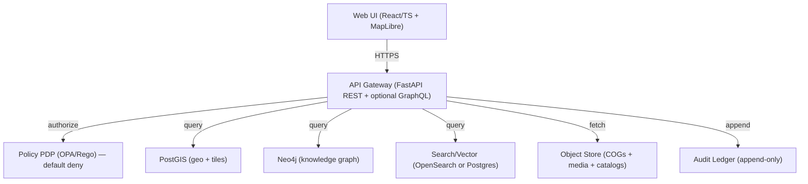
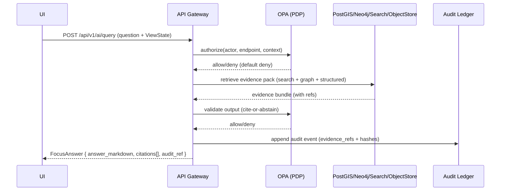

<!--
File: src/server/README.md
KFM governed artifact note:
- This README documents the trust membrane component; keep it accurate.
- If behavior changes, update this README AND the relevant OpenAPI/policy/tests.
-->

# 🧭 KFM Server — Governed API Gateway (Trust Membrane)


%20%2B%20optional%20GraphQL-brightgreen)


-informational)


> **Directory:** `src/server/`  
> **Role:** KFM’s *governed* backend service: the **only** approved path for UI/clients/AI to access data, stories, and evidence.

---

## Table of contents

- [What this server does](#what-this-server-does)
- [Non-negotiables](#non-negotiables)
- [Architecture](#architecture)
- [Repo layout](#repo-layout)
- [Local quickstart](#local-quickstart)
- [Configuration](#configuration)
- [API contracts](#api-contracts)
- [Policy-as-code](#policy-as-code)
- [Data zones, catalogs, and evidence](#data-zones-catalogs-and-evidence)
- [Audit ledger](#audit-ledger)
- [Testing & CI](#testing--ci)
- [Observability](#observability)
- [Security](#security)
- [Operations runbook](#operations-runbook)
- [How to add a new endpoint (clean layers)](#how-to-add-a-new-endpoint-clean-layers)
- [Troubleshooting](#troubleshooting)

---

## What this server does

This service implements KFM’s **trust membrane**:

- **REST API (FastAPI)** and **OpenAPI** at `http://localhost:8000/docs` (dev).
- **Optional GraphQL** endpoint (when enabled) for nested queries.
- **Policy enforcement via OPA** (fail-closed / default deny).
- **Serves only processed, cataloged data** (never raw/work intermediates).
- **Evidence-first responses**: data/story/AI outputs include **resolvable citations** and **audit references**.
- **Audit logging**: append-only audit events for traceability (tamper-evident hashing recommended).

> [!NOTE]
> This folder is documented to the KFM Next‑Gen blueprint. If your implementation differs, treat that as a governance issue: **either update code to match invariants** or **explicitly document + test the deviation**.

---

## Non-negotiables

> [!IMPORTANT]
> These invariants are design contracts — **not optional**:
>
> 1) **No UI direct DB access.** All reads/writes cross the trust membrane via API + policy.  
> 2) **Policy checks fail-closed.** If the system is uncertain, access is denied.  
> 3) **Processed-only serving.** The API is only allowed to serve from the processed truth path.  
> 4) **No promotion without STAC/DCAT/PROV + validation gates.**  
> 5) **Focus Mode must cite-or-abstain** and every answer includes an **`audit_ref`**.  
> 6) **Audit + provenance are produced as part of the normal request path** (not as an afterthought).

> [!WARNING]
> **Sensitive locations / culturally restricted knowledge:** publish a generalized derivative for general audiences and store precise data under restricted access. Maintain separate provenance chains for the transformation/redaction step.

---

## Architecture

### C4-ish container view



### Request flow invariants

- UI → API Gateway → OPA authorize → stores fetch → OPA (optional output validation) → Audit append → response.
- Backend logic must call storage **only through repository interfaces (ports)** — no “reach around” to direct drivers.

### Focus Mode (sequence)



---

## Repo layout

> [!NOTE]
> The clean-layered layout below is the *expected* structure for KFM backend code. If names differ in your repo, keep the *layering* and dependency direction intact.

### Suggested / expected structure (Clean Architecture)

```text
src/server/
  README.md                  # (this file)
  app/
    main.py                  # FastAPI app factory, middleware wiring, router registration
  api/
    routes/                  # HTTP endpoints grouped by domain (datasets, layers, stories, evidence, ai)
    schemas/                 # Pydantic request/response models (API boundary DTOs)
    deps/                    # FastAPI dependencies (auth context, repo wiring)
    middleware/              # correlation-id, authn/z, CORS, rate limits, etc.
  domain/
    models/                  # pure domain entities/value objects
    errors/                  # domain errors (no HTTP here)
  usecases/
    *                         # workflows: resolve evidence, fetch layer descriptor, run Focus Mode, etc.
  ports/
    repositories.py          # Protocols/interfaces (PostGISRepo, GraphRepo, CatalogRepo, AuditRepo…)
    policy.py                # PolicyClient interface
  adapters/
    opa_client.py            # OPA adapter implementing PolicyClient
    object_store.py          # object store adapter (catalogs, COGs, media)
  infrastructure/
    postgis_repo.py          # concrete repos
    neo4j_repo.py
    search_repo.py
    audit_repo.py
  policy_contracts/
    input_schemas/           # schemas for OPA input bundles (actor/request/answer)
  tests/
    unit/
    integration/
    contract/
    e2e/                     # optional (often lives at repo root, but can be referenced)
  scripts/
    export_openapi.py        # export OpenAPI snapshot (if used)
    export_schema.py         # export GraphQL schema (if GraphQL enabled)
```

---

## Local quickstart

### Docker Compose (recommended)

```bash
# from repo root
cp .env.example .env
docker compose up --build
```

Common dev ports (canonical baseline):

| Service | Default port(s) |
|---|---|
| API | `8000` (`/docs`) |
| Web UI | `3000` |
| PostGIS | `5432` |
| Neo4j | `7474` (browser), `7687` (bolt) |
| OpenSearch | `9200` |
| OPA | `8181` |

### Smoke test checklist

- [ ] `http://localhost:8000/docs` loads OpenAPI docs  
- [ ] Health endpoint returns OK (see `/healthz` below)
- [ ] Toggle a map layer and open provenance panel in UI (if UI running)
- [ ] Run one Focus Mode query and verify:
  - citations are present **or** abstention is returned
  - `audit_ref` exists
  - each citation is resolvable via evidence endpoints

---

## Configuration

### `.env` and secrets

- Copy `.env.example` → `.env` for local dev.
- **Never** commit secrets.
- Prefer Vault/secret manager for prod; mount secrets as env vars at runtime.

### Environment variables (typical)

> [!NOTE]
> The authoritative list should be in `.env.example` and in deployment manifests. Keep this table updated.

| Variable | Purpose | Example |
|---|---|---|
| `KFM_ENV` | environment name | `dev` / `staging` / `prod` |
| `KFM_LOG_LEVEL` | logging verbosity | `INFO` |
| `POSTGIS_DSN` | PostGIS connection string | `postgresql+psycopg://...` |
| `NEO4J_URI` | Neo4j Bolt URI | `bolt://neo4j:7687` |
| `NEO4J_USER` / `NEO4J_PASSWORD` | Neo4j creds | `neo4j` / `...` |
| `OPENSEARCH_URL` | OpenSearch URL | `http://opensearch:9200` |
| `OPA_URL` | OPA base URL | `http://opa:8181` |
| `OBJECT_STORE_ENDPOINT` | S3/MinIO endpoint | `http://minio:9000` |
| `OBJECT_STORE_BUCKET` | bucket name | `kfm-artifacts` |
| `CORS_ORIGINS` | allowed origins | `http://localhost:3000` |
| `AUTH_MODE` | auth strategy | `none` / `jwt` / `oauth` |
| `RATE_LIMIT_MODE` | rate limiting | `off` / `local` / `redis` |

---

## API contracts

### Contract-first rule

- **OpenAPI is a governed artifact.** Treat it like code: review, versioning, and contract tests.
- For `/api/v1`, prefer a **no-breaking-change** policy. Use `/api/v2` for breaking changes.

### Focus Mode endpoint (documented minimum)

`POST /api/v1/ai/query`

**Request (FocusQuery):**
- `question`
- `context`: `{ time_range, bbox, active_layers, story_node_id }`

**Response (FocusAnswer):**
- `answer_markdown`
- `citations[]`
- `audit_ref`

#### Citation object (recommended)

- `id`
- `kind`: `dcat | stac | prov | doc | graph`
- `ref`: resolvable reference (e.g., `prov://...`)
- `locator`: page/span/geometry/time locator
- `note` (optional)

> [!IMPORTANT]
> Acceptance criterion: given any `citation.ref` in a FocusAnswer, the UI can resolve it to a human-readable evidence view in ≤ 2 API calls.

---

## Policy-as-code

### OPA integration expectations

- **Default deny** (fail closed).
- Every request crossing the trust membrane must run:
  1) auth (if enabled)
  2) authorize (OPA)
  3) shape/redact response (policy-driven)
  4) audit append
  5) output validation (for Focus Mode; cite-or-abstain)

### Cite-or-abstain policy (illustrative Rego)

```rego
package kfm.ai

default allow := false

allow if {
  input.answer.has_citations == true
  input.answer.sensitivity_ok == true
}
```

### Policy input schema (illustrative)

```json
{
  "actor":   {"role":"public|reviewer|admin", "attributes": {}},
  "request": {"endpoint":"/api/v1/ai/query", "context": {}},
  "answer":  {"text":"...", "has_citations":true, "citations":[...], "sensitivity_ok":true}
}
```

---

## Data zones, catalogs, and evidence

### Truth path: Raw → Work → Processed

- **Raw zone:** immutable capture (append-only, checksums, license captured).
- **Work zone:** repeatable transforms + QA staging (PROV activities, QA reports).
- **Processed zone:** query-ready + indexed + served via API (DCAT/STAC/PROV + signed policy labels).

> [!IMPORTANT]
> The server **must** serve from **processed catalogs** and must treat provenance as a first-class query object.

### Catalog standards (minimum)

- **DCAT:** dataset-level metadata (license, publisher, spatial/temporal coverage, etc.)
- **STAC:** geospatial assets for map/timeline rendering (Collections + Items)
- **PROV:** transformation lineage (raw → work → processed)

### Evidence resolvers

Every provenance/citation reference must be resolvable via an API endpoint, including (recommended schemes):

- `prov://…` (lineage)
- `stac://…` (assets)
- `dcat://…` (dataset metadata)
- `doc://…` (documents/sections/chunks)
- `graph://…` (graph entities/relationships)

---

## Audit ledger

### Requirements

- Append an audit record for:
  - dataset/story access (as required by policy)
  - promotions / catalog updates
  - Focus Mode queries (always)

### Recommended implementation characteristics

- Append-only store (Postgres table is a common baseline)
- Tamper-evident chaining (`prev_hash` → `event_hash`)
- Periodic checkpoints to object storage with checksums
- Tie audit identifiers to PROV-O identifiers where feasible for interoperability

---

## Testing & CI

### Minimum test pyramid

- **Unit:** use cases, policy client decisions, validators (mock ports)
- **Integration:** PostGIS queries/tiles, Neo4j queries, OPA adapter calls
- **Contract:** OpenAPI schema snapshot checks; GraphQL schema breaking-change checks (if enabled)
- **End-to-end smoke:** UI loads map, toggles layers, evidence resolves, Focus Mode query + audit lookup

### CI “gates” (must stay green)

- [ ] Validate governed Markdown/Story Nodes (repo-level)
- [ ] Validate STAC/DCAT/PROV for dataset changes (repo-level)
- [ ] Run OPA unit tests (default deny, cite-or-abstain)
- [ ] Run server unit + integration tests
- [ ] Contract tests for API responses including provenance bundles + policy redaction

---

## Observability

### What to log (minimum)

- Correlation/request IDs (propagate across API → stores → OPA)
- Policy decision outcomes (allow/deny + reason code)
- Audit references returned to clients
- Slow queries and downstream timeouts (store + OPA)

### Tracing/metrics

- Prefer OpenTelemetry for standardized traces + metrics + log correlation.
- Instrument:
  - request lifecycle (middleware)
  - OPA calls
  - DB calls (PostGIS/Neo4j/OpenSearch)
  - Focus Mode retrieval + validation stages

---

## Security

### Baseline expectations

- Secrets never committed; use vault/secret manager in prod.
- Rate limit public endpoints and respect provider limits (for any upstream calls).
- Validate inputs; reject invalid geometry/time ranges; keep strict schemas.
- For sensitive data:
  - restrict precise geometry and serve generalized derivatives when needed
  - require explicit grants/roles for restricted artifacts
  - add regression tests that prove restricted geometry cannot leak

> [!WARNING]
> If policy is uncertain, **deny**. This is the “fail-closed” posture.

---

## Operations runbook

### Health checks

- `GET /healthz` for API
- Readiness includes:
  - store connectivity checks (PostGIS/Neo4j/Search/ObjectStore)
  - OPA policy bundle loaded check

### Backups (recommended)

- PostGIS: daily backups; test restores quarterly
- Object store: versioning on; immutable retention for catalogs and audit checkpoints
- Neo4j: backup schedule aligned with rebuild strategy (graph can be rebuildable from canonical catalogs)

### Incident response (minimum SOPs)

- **Data leak:** deny via policy toggle; rotate creds; withdraw affected artifacts; publish redacted derivative
- **AI unsafe output:** disable `/api/v1/ai/query` via policy; preserve audit logs; fix policy/validator/prompt; add regression test
- **Corrupted processed artifacts:** verify checksums; roll back to previous dataset version; rebuild indexes

> [!IMPORTANT]
> Maintain an **emergency deny switch** in policy that can disable public endpoints / Focus Mode **without deploying code**.

---

## How to add a new endpoint (clean layers)

> [!TIP]
> The goal is to keep domain/use cases pure and enforce governance at the membrane.

1) **Domain**  
   - Add/extend domain model(s) and invariants in `domain/`.

2) **Ports (interfaces)**  
   - Add required repository/policy method signatures in `ports/` (Protocols / interfaces).

3) **Use case**  
   - Implement workflow in `usecases/` using ports only (no DB/HTTP dependencies).

4) **Infrastructure adapter**  
   - Implement the port in `infrastructure/` (PostGIS/Neo4j/Search/ObjectStore/etc.).

5) **API route + schemas**  
   - Add route in `api/routes/` with request/response DTOs.
   - Add policy check(s) before store calls and response shaping/redaction.

6) **Policy**  
   - Update OPA policy module(s) and add unit tests (default deny path included).

7) **Audit + evidence**  
   - Ensure endpoint response includes provenance refs when applicable.
   - Append audit events where required by policy.

8) **Tests**  
   - Unit tests for use case
   - Integration tests for repo adapters
   - Contract tests for OpenAPI changes
   - If new citations: evidence resolution tests

---

## Troubleshooting

### Docker ports / conflicts

- Postgres usually binds `5432`; Neo4j uses `7474/7687`; API uses `8000`; UI uses `3000`.
- If you have local services on those ports, stop them or remap in `docker-compose.yml`.

### “It started but I get 403/deny”

- This is expected when policy fails closed. Check:
  - OPA is running and has the policy bundle loaded
  - The request includes correct actor context (role/claims)
  - The endpoint has proper policy input construction
  - For Focus Mode: citations missing → policy should deny unless abstaining response is returned

---

## Done criteria for server changes (PR checklist)

- [ ] Any behavior change is reflected in **OpenAPI** (or explicitly out of contract)
- [ ] Policy tests updated (default deny path still enforced)
- [ ] Audit behavior preserved (or deliberately updated + documented)
- [ ] Evidence refs remain resolvable (no “dead citations”)
- [ ] Unit + integration + contract tests pass
- [ ] No bypass of ports/repositories (keep clean-layer dependency direction)


