# 🧭 KFM Server — API Boundary (`src/server/`)


> **This folder is the *only* sanctioned path from UI → data.**  
> If it isn’t exposed through a contracted API here, it doesn’t exist to the client. ✅

---

## ✨ What this is

`src/server/` contains the **Kansas Frontier Matrix (KFM)** server-side API implementation: the governed boundary that exposes evidence (datasets, features, stories, graph queries, tiles, etc.) to the UI **only through explicit contracts**.

This layer is responsible for:

- 🧩 **Contract-first interfaces**: OpenAPI + optional GraphQL schemas are first-class artifacts.
- 🛡️ **Governance enforcement**: access control, redaction, classification rules, sensitive location handling.
- 🧾 **Provenance respect**: APIs should serve **cataloged** (STAC/DCAT/PROV) and traceable outputs.
- 🗺️ **Map-friendly delivery**: endpoints suitable for map UI (GeoJSON, vector tiles, summaries, search).
- 🤖 **AI endpoints (optional)**: “Focus Mode” / assistant features via local models (Ollama) or external APIs (OpenAI), always with guardrails + logs.

---

## 🧱 Non‑negotiables (read this before coding)

### 1) 🚫 API Boundary Rule
The frontend **must never** talk to PostGIS / Neo4j directly.  
All data access flows through **this** API boundary.

### 2) 🧾 Evidence-first pipeline ordering
KFM’s “truth path” is:

**ETL → Catalogs (STAC/DCAT/PROV) → Graph → API → UI → Story Nodes → Focus Mode**

No layer should leapfrog earlier contracts.

### 3) 📜 Contracts are real
If you change behavior, you must update:
- the **contract artifact** (OpenAPI/GraphQL), and
- the **contract tests** (or introduce a version bump).

---

## 🗺️ System flow (high level)

```mermaid
flowchart LR
  subgraph Data
    A["Raw Sources 📦"] --> B["ETL + Normalization 🧪"]
    B --> C["STAC/DCAT Catalogs 🗂️"]
    C --> D["PROV Lineage 🧾"]
  end

  C --> G["Neo4j Graph 🕸️ (refs back to catalogs)"]
  G --> H["API Layer 🧱 (contracts + redaction)"]
  H --> I["Map UI 🌍 (React · MapLibre · optional Cesium)"]
  I --> J["Story Nodes 📚 (governed narratives)"]
  J --> K["Focus Mode 🎯 (context bundle)"]
```



---

## 📁 What lives here

> The exact file names can evolve, but **the responsibilities below should not**.

```text
src/server/
├── README.md                    # you are here 📍
├── main.py                      # app bootstrap (FastAPI) 🚀
├── routes/                      # REST routers / controllers 🧭
├── graphql/                     # schema + resolvers (optional) 🕸️
├── contracts/                   # OpenAPI YAML + GraphQL SDL 📜
├── services/                    # business logic (domain rules) 🧠
├── repositories/                # data access abstractions 🗄️
├── db/                          # PostGIS/Neo4j adapters + sessions 🧰
├── policy/                      # governance checks (OPA integration, etc.) 🛡️
├── schemas/                     # Pydantic models / DTOs 🧩
└── tests/                       # unit + integration + contract tests 🧪
```

---

## 🚀 Quickstart (Docker Compose recommended)

From the **repo root** (not inside `src/server/`):

1) **Create your env file**
```bash
cp .env.example .env
```

2) **Start the full stack**
```bash
docker-compose up --build
# (or) docker compose up --build
```

3) **Open the API docs**
- Swagger / OpenAPI UI: `http://localhost:8000/docs`
- GraphQL (if enabled): `http://localhost:8000/graphql`

4) **(Optional) Explore databases**
- PostGIS: `localhost:5432`
- Neo4j Browser UI: `http://localhost:7474`
- Neo4j Bolt: `localhost:7687`

> 🧠 Tip: If the API starts before DB is ready, rerun `docker-compose up` or verify `depends_on` in your compose file.

---

## 🧑‍💻 Run server without Docker (local dev)

> Use this if you know what you’re doing and want a tight feedback loop.

```bash
cd src/server

# create & activate your venv (example)
python -m venv .venv
source .venv/bin/activate

# install deps (adjust to your repo’s actual dependency tooling)
pip install -r requirements.txt

# run FastAPI (assuming main.py exposes `app`)
uvicorn main:app --reload --host 0.0.0.0 --port ${FASTAPI_PORT:-8000}
```

---

## ⚙️ Configuration (.env essentials)

These names reflect the expected KFM stack wiring. Keep secrets out of git. ✅

| Variable | Example | Purpose |
|---|---:|---|
| `FASTAPI_PORT` | `8000` | API port exposed to host |
| `WEB_PORT` | `3000` | Frontend dev server port |
| `REACT_APP_API_URL` | `http://localhost:8000` | Frontend points here |
| `POSTGRES_USER` | `postgres` | PostGIS username |
| `POSTGRES_PASSWORD` | `postgres` | PostGIS password |
| `POSTGRES_DB` | `postgres` | PostGIS database |
| `NEO4J_AUTH` | `neo4j/test` | Neo4j auth (`user/pass`) |
| `OPENAI_API_KEY` | `...` | (Optional) external AI provider |
| `OLLAMA_MODEL` | `llama2:7b` | (Optional) local model name |
| `AI_BACKEND_URL` | `http://host.docker.internal:11434` | (Optional) Ollama endpoint |
| `ENABLE_OPA` | `true` | (Optional) enable policy checks |

> 🔐 **Never** commit API keys, tokens, or credentials. Use `.env` and secret managers in CI.

---

## 🧭 API contracts

### 📜 Where contracts live
Contracts belong in:

- `src/server/contracts/`  
  - OpenAPI YAML/JSON (REST)
  - GraphQL SDL (if used)

### ✅ Contract-first workflow
When you add/change an endpoint:

1. **Update / add contract** (OpenAPI/GraphQL)
2. **Implement route/resolver**
3. **Add tests** (unit + integration + contract tests)
4. **Ensure governance hooks are enforced**
5. **Keep backward compatibility** or **version** the API

> 🧨 Breaking changes require explicit versioning (e.g., `/v2/...`) or a deprecation plan.

---

## 🧪 Testing

### Run tests in Docker
```bash
docker-compose exec api pytest
```

### Run tests locally
```bash
cd src/server
pytest
```

### What we test (minimum)
- ✅ Service/unit tests (domain logic)
- ✅ Integration tests (routes + DB adapters)
- ✅ Contract tests (responses match OpenAPI/GraphQL expectations)

---

## 🛡️ Governance & security expectations

This layer is where we **enforce trust**:

- 🧾 **Provenance awareness**: return identifiers and links back to catalog artifacts when possible.
- 🧼 **Redaction**: sensitive fields (PII, sensitive locations) must be filtered or generalized.
- 🧭 **Policy checks**: routes handling restricted datasets must gate access via policy checks.
- 📚 **AI endpoints**:
  - must not produce “freeform facts” without evidence references,
  - must log queries and outputs (for audit/provenance),
  - must respect dataset classifications and sovereignty rules.

> If you’re unsure whether something is sensitive, treat it as sensitive until reviewed. ⚖️

---

## 🧩 Adding a new endpoint (golden path)

### 1) Start with the contract 📜
- Add/extend OpenAPI in `src/server/contracts/`
- If GraphQL: update SDL + resolver signatures

### 2) Implement the handler 🧭
- Add a router/controller in `routes/`
- Validate inputs (Pydantic models)
- Delegate logic to `services/` (keep routes thin)

### 3) Touch data through repositories 🗄️
- PostGIS queries via repository/adapter
- Neo4j queries via adapter (Cypher)

### 4) Enforce governance 🛡️
- Call policy checks before returning data
- Apply redaction/classification rules

### 5) Add tests 🧪
- Unit tests for services
- Integration tests for endpoint behavior
- Contract test updates (non-negotiable)

---

## 🧯 Troubleshooting

### ❌ API container won’t start
```bash
docker-compose logs api
```
Common causes:
- DB not ready yet → rerun `docker-compose up`
- Wrong env vars → verify `.env`
- Missing volume permissions → ensure mounted directories are writable

### 🔌 Port conflicts
If you already run local Postgres/Neo4j:
- Change host mappings in `docker-compose.yml` or `.env`
- Typical ports: `5432`, `7474`, `7687`, `8000`, `3000`

### ♻️ Hot reload not working
- Ensure compose mounts the code directory
- Ensure Uvicorn runs with `--reload`

---

## 🔗 Related docs (repo-root links)

From here (`src/server/`), these are typically:

- `../../docs/MASTER_GUIDE_v13.md` (repo source-of-truth)
- `../../docs/templates/` (governed templates, incl. API contract extension)
- `../../docs/architecture/` (design blueprints / ADRs)
- `../../schemas/` (machine-validated schemas)

---

## ✅ Definition of “done” for server work

A change is not “done” until it has:

- 📜 updated contract artifacts (if applicable)
- 🧪 tests that pass locally and in CI
- 🛡️ governance checks preserved or improved
- 🧾 provenance/traceability not regressed
- 🧹 no secrets or sensitive data introduced

---

### 🏁 You’re ready
If you can start the stack, hit `/docs`, and run tests — you’re in business. 🚜✨