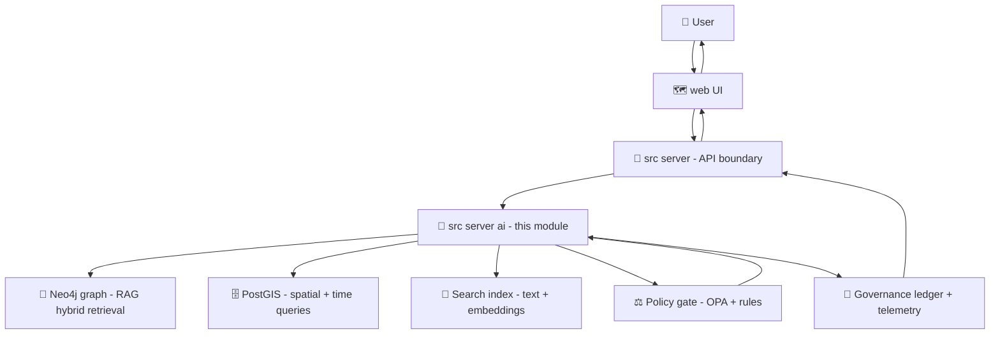

# 🤖🧭 KFM Server AI Module (`src/server/ai`)


This folder contains **KFM’s AI layer** inside the **governed API boundary** (`src/server/`).  
It powers **Focus Mode** (the evidence-backed, citation-required assistant) and any **AI/analysis services** that surface through the API and UI.

> [!IMPORTANT]
> **Focus Mode is not “chat over the internet.”** It is an **evidence-first** system that must only speak from cataloged, provenance-linked sources (STAC/DCAT/PROV + graph IDs). If it can’t cite it, it should **refuse or clearly state uncertainty** 🧾✅

---

## 🧭 Quick Navigation

- [What belongs here](#-what-belongs-here)
- [Non-negotiables](#-non-negotiables)
- [High-level architecture](#-high-level-architecture)
- [Focus Mode: request/response contract expectations](#-focus-mode-requestresponse-contract-expectations)
- [Core components](#-core-components)
- [Governance & safety gates](#-governance--safety-gates)
- [Observability & provenance](#-observability--provenance)
- [Recommended module layout](#-recommended-module-layout)
- [Development checklist](#-development-checklist)
- [Testing strategy](#-testing-strategy)
- [Roadmap hooks](#-roadmap-hooks)
- [Design references](#-design-references)

---

## ✅ What belongs here

### This module **does** ✅
- **Focus Mode orchestration**: parse question + UI context → retrieve governed evidence → generate answer → attach citations → run policy checks → return response.
- **Hybrid retrieval / RAG orchestration**: coordinate **Neo4j**, **PostGIS**, and unstructured search to assemble grounded context.
- **Citation + provenance assembly**: produce machine-readable citations linking to:
  - STAC Items / Collections (geospatial assets)
  - DCAT datasets (catalog discoverability)
  - PROV activities/bundles (lineage + reproducibility)
  - Graph entity IDs (Neo4j nodes/relationships)
- **Explainability hooks**: provide “audit panel” artifacts (what influenced the answer, governance flags, etc.).
- **AI agent utilities** (optional, guarded): Watcher–Planner–Executor (W–P–E) style agents for *routine checks/fixes* that are **idempotent**, **traceable**, and **kill-switchable** 🧯.

### This module **does not** ❌
- Run ETL pipelines or transform raw data (**that lives in** `src/pipelines/`).
- Build or mutate the knowledge graph directly (**that lives in** `src/graph/`).
- Bypass contracts or let the UI touch Neo4j (**never**).
- Ship UI logic (**that lives in** `web/`).
- Publish narrative truth directly (Story Nodes are governed artifacts under `docs/reports/story_nodes/`).

---

## 🔒 Non-negotiables

These are KFM invariants that this module must enforce (or assume upstream enforcement and **fail closed** if violated):

1. **Pipeline ordering is absolute** 🧱  
   ETL → Catalogs (STAC/DCAT/PROV) → Graph → API → UI → Story Nodes → Focus Mode  
   AI features must **not** leapfrog or bypass earlier stages.

2. **API boundary rule** 🚧  
   The UI must never query Neo4j directly. Everything routes through the governed API (`src/server/`).

3. **Evidence-first narrative** 🧾  
   - **Every claim must be citeable.**
   - If the system cannot derive the answer from available evidence, it must **refuse** or respond with **explicit uncertainty**.

4. **Sovereignty + classification propagation** 🛡️  
   No output can be less restricted than its inputs. If any evidence is sensitive, output must be **redacted, generalized, withheld, or policy-reviewed**.

5. **Advisory-only by default** 🧑‍⚖️  
   Focus Mode provides guidance and summaries; it does **not** autonomously take consequential action. Any “agent” capability must be:
   - gated by policy,
   - fully logged,
   - reviewable,
   - kill-switchable.

---

## 🏗 High-level architecture



**Key idea:** the AI layer is an **orchestrator**. It’s allowed to be “smart,” but only inside **hard guardrails** (contracts + provenance + policy).

---

## 🧠 Focus Mode request/response contract expectations

> [!NOTE]
> The actual schemas live in `src/server/contracts/` (contract-first).  
> This section describes **expected shape & semantics** (not a hard-coded schema).

### ✅ Request should carry
- `question`: user text
- `ui_context` (optional but preferred):
  - `bbox` / `geometry` (current map view)
  - `time_range` (timeline selection)
  - `active_layers` (layer IDs)
  - `selected_entities` (graph IDs, feature IDs)
  - `story_node_id` (if in Story Mode)
  - `user_role` / `policy_context` (classification tier, permissions)

### ✅ Response should include
- `answer_markdown`: the human-readable narrative
- `citations[]`: structured list (required for factual content)
  - `source_type`: `stac|dcat|prov|graph|external`
  - `source_id`: stable ID / URL / canonical reference
  - `excerpt` (short) + `locator` (page/section/feature ID)
  - `spatiotemporal_hint` (bbox/time) when applicable
  - `confidence` / `uncertainty` (when applicable)
- `governance`:
  - `classification`: output tier
  - `redactions[]`: what was removed/generalized and why
  - `policy_decisions[]`: policy rule IDs that fired
- `audit` (optional but recommended):
  - retrieval plan summary (which stores were queried)
  - top evidence weights / influences
  - flags (sensitive locations, missing provenance, etc.)
- `ui_actions` (optional):
  - suggestions the UI can offer (fly-to bbox, highlight entity, open dataset card, open Story Node)
  - ⚠️ must be suggestions only, not implicit action

---

## 🧩 Core components

### 1) 🔍 Query understanding & intent parsing
- Identify **entities** (people, places, events), **time constraints**, **spatial constraints**, and **requested operation** (explain layer, compare periods, summarize entity, etc.).
- Convert parsed intent into a **retrieval plan**.

### 2) 🧠 Hybrid retrieval (RAG done right)
Focus Mode should combine:
- **Graph queries (Neo4j)** for relationship traversal, disambiguation, and multi-hop context.
- **Spatial/temporal queries (PostGIS)** for numeric + geometry filtering.
- **Unstructured search** (documents, OCR text, Story Nodes, dataset descriptions).

Caching is encouraged for responsiveness ✅ (but caches must be provenance-safe and policy-aware).

### 3) 🧾 Evidence packaging & citation building
- Assemble a **bounded evidence bundle** (token budget + relevance).
- Normalize evidence into a common internal representation:
  - `fact` / `quote` / `measurement`
  - stable IDs and links to catalog/graph items
  - classification tags
- Build structured citations and “human-friendly” citations (footnotes / inline refs).

### 4) ✍️ Answer synthesis (LLM or hybrid)
- Generate narrative only from the evidence bundle.
- Clearly separate:
  - **facts** (must cite)
  - **interpretation / hypothesis** (label as interpretation)
  - **unknowns** (admit uncertainty)

### 5) ⚖️ Policy enforcement (hard gate)
- Before returning:
  - validate “every claim has a citation” (or output is clearly non-factual)
  - apply redaction/generalization for sensitive coordinates
  - ensure classification propagation
- If policy fails: **refuse**, or return a redacted response with an explanation.

---

## ⚖️ Governance & safety gates

### 🧰 OPA / policy-as-code (recommended pattern)
- Treat policy decisions as first-class outputs:
  - record which rules fired
  - attach decisions to the governance ledger
  - surface governance flags to the UI audit panel

### 🔐 Threat model basics (what to defend against)
- Prompt injection via untrusted documents
- Data exfiltration (sensitive locations, personal data, restricted layers)
- “Hallucinated certainty” (claims without provenance)
- Undocumented agent actions

### 🧯 Agent safety (W–P–E, optional)
If/when W–P–E agents are enabled in this folder:
- every operation uses an **idempotency key** ✅
- every operation is logged with a **commit seed** (replayable determinism)
- include an **immediate kill-switch** (single config flag disables agent actions)
- agents never “auto-merge” without governance-approved workflow

---

## 📈 Observability & provenance

### 📜 Governance ledger logging (required)
At minimum, record:
- question, context (role + bbox/time where relevant)
- evidence IDs retrieved
- policy decisions + redactions
- response hash / run ID
- model/provider metadata (for reproducibility)
- performance metrics (latency, cache hit, query counts)

### 🧪 Reproducibility footprint
For any AI/analysis output that becomes a **first-class evidence artifact**:
- store in `data/processed/...`
- catalog it (STAC/DCAT)
- capture lineage (PROV: inputs, method/model, params, confidence metrics)
- only then expose via governed APIs

---

## 🗂 Recommended module layout

> [!TIP]
> This is a **suggested** layout. Keep it modular and aligned with contract-first + policy-first principles.

```text
src/server/ai/
├── 📄 README.md                          # 📘 AI subsystem overview: Focus Mode flow, safety gates, and ops toggles
├── 🔎 focus/                             # Focus Mode orchestrator + handlers (API-facing entrypoints)
│   ├── 🎛️📄 focus.controller.(ts|py)      # Controller/route handler: request parsing, auth, wiring to service
│   ├── 🧠📄 focus.service.(ts|py)          # Orchestrates retrieval → answer → citations → policy checks → receipts
│   └── 📐🛡️📄 focus.schemas.(ts|py)        # Runtime validators (NOT contract source-of-truth; guards unsafe inputs/outputs)
├── 🧲 retrieval/                         # RAG orchestration (graph + postgis + search) with bounded query planning
│   ├── 🧭📄 plan.(ts|py)                  # Retrieval plan builder (what to query, limits, ordering, caching hints)
│   ├── 🕸️🔌📄 neo4j.adapter.(ts|py)        # Neo4j retrieval adapter (read-only queries, batching, timeouts)
│   ├── 🗺️🔌📄 postgis.adapter.(ts|py)      # PostGIS retrieval adapter (spatial filters, bbox queries, aggregates)
│   └── 🔎🔌📄 search.adapter.(ts|py)       # Search adapter (full-text/semantic search; safe query shaping)
├── 📚 citations/                         # Citation manager + provenance linking (evidence-first output)
│   ├── 📚🧾📄 buildCitations.(ts|py)       # Builds citation list/footnotes from retrieved sources (dedupe, format, ordering)
│   └── 📎🧬📄 evidenceBundle.(ts|py)       # Creates/links evidence bundle (artifacts, manifests, PROV/DCAT/STAC refs)
├── 🛡️ policy/                            # Policy client + enforcement helpers (fail-closed where required)
│   ├── ⚖️🔌📄 opa.client.(ts|py)           # OPA client wrapper (bundle/version pinning, decision caching, timeouts)
│   └── 🔒🧹📄 redaction.(ts|py)            # Redaction helpers (apply obligations; strip secrets/PII; safe logging)
├── 🧾 xai/                                # Audit traces / explainability payloads (bounded; no hidden chain-of-thought)
│   └── 🧾📄 auditPayload.(ts|py)           # Builds explainability/audit payload (inputs used, citations, policy outcomes)
├── 🤖 agents/                             # Watcher–Planner–Executor agents (guarded + optional; kill-switchable)
│   ├── 👀📄 watcher.(ts|py)                # Watcher: monitors signals/events and emits tasks/alerts (policy-gated)
│   ├── 🧭📄 planner.(ts|py)                # Planner: produces structured plans (reviewable; schema-bound)
│   ├── 🏃📄 executor.(ts|py)               # Executor: runs bounded actions (idempotent where possible; produces receipts)
│   └── 🧯📄 killSwitch.(ts|py)             # Kill switch + feature flags (disable agents quickly; safety override)
└── 🧪 tests/                              # Tests for safety, citations, and deterministic behavior
    ├── ✅🧪📄 focus.golden.test.(ts|py)     # Golden tests for Focus Mode outputs (format + citations + redaction)
    ├── 🛡️🧪📄 policy.enforcement.test.(ts|py) # Ensures policy decisions/obligations are applied correctly
    └── 📚🧪📄 citations.required.test.(ts|py) # Ensures citations are required and resolve to evidence bundles
```

---

## ✅ Development checklist

When touching `src/server/ai`, you should be able to answer “yes” to:

- [ ] Did I update the **API contract** first (or confirm it doesn’t change)? (`src/server/contracts/`)
- [ ] Does the response include **structured citations** for factual claims?
- [ ] Are sensitive locations/PII handled (redacted/generalized/refused)?
- [ ] Does classification propagate correctly (no downgrades)?
- [ ] Are policy decisions logged (OPA decisions surfaced + recorded)?
- [ ] Are new models/tools documented (model card + risk notes if applicable)?
- [ ] Do tests include at least one **golden** Q&A case for the change?

---

## 🧪 Testing strategy

### 1) Contract tests (must pass)
- CI should verify every endpoint matches its contract (OpenAPI/GraphQL).

### 2) Golden Q&A tests (high value)
- Fixed prompt + fixed evidence bundle → deterministic expected answer structure
- Validate:
  - citations present
  - refusal behavior correct
  - redactions stable

### 3) Policy tests
- “No citation → fail closed”
- “Sensitive input evidence → output classification >= input classification”
- “Protected bbox → generalized coordinates / refusal”

### 4) Retrieval tests
- Neo4j query plan correctness
- PostGIS bbox/time queries correct
- Ranking doesn’t ignore UI context

---

## 🧭 Roadmap hooks

These are “next layer” AI capabilities that should plug into this module cleanly:

- **📍 Geotagged Pulse Threads**: real-time/near-real-time micro-updates tied to location/time, with provenance and governance.
- **🧠 Conceptual Attention Nodes**: meaning-level indexing to connect ideas across layers, Story Nodes, and datasets.
- **🧬 Narrative pattern detection**: anomaly detection, change detection, “what’s unusual here?” that is still evidence-backed.
- **🧯 Provenance-first CI agents**: bots that open PRs for safe, low-risk maintenance tasks under strict policies.

Keep these as **opt-in extensions** with contracts + policy gates from day one.

---

## 📚 Design references

If you’re implementing or modifying this module, these are the “north star” docs to keep aligned with:

- **Master Guide / Pipeline Ordering (v13)** — contract-first + evidence-first + governance gates
- **AI System Overview** — Focus Mode behavior, hybrid retrieval, XAI audit panel, citations
- **Architecture / Features / Design** — W–P–E safety model, policy constraints
- **Data Intake Guide** — API → PostGIS patterns + ingestion expectations
- **UI System Overview** — how the UI consumes Focus Mode (context, audit panel, offline packs)
- **Latest Ideas & Future Proposals** — agent kill-switch, idempotency, CI policy pack concepts
- **Innovative Concepts + Additional Ideas** — Pulse Threads, conceptual attention nodes, narrative detection
- **Reference libraries (AI / geospatial / data / languages)** — deep background for implementation patterns

---

### 🧾 One-line rule of thumb

> **If it can’t be traced, it can’t be said.** ✅🧠🧾
